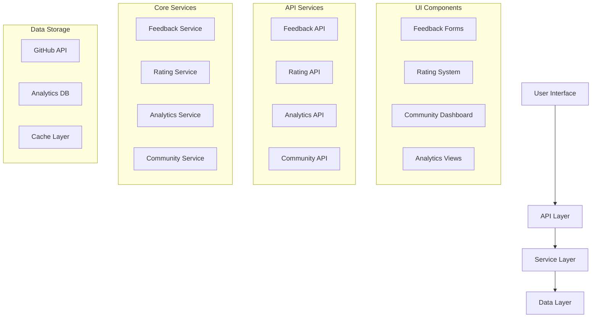

# Technical Design Document (TDD)
## Community Feedback Integration Platform

### System Overview
The Community Feedback Integration Platform is a comprehensive system designed to facilitate community engagement, feedback collection, and contribution management for the PM Tools Templates repository.

### Architecture Overview


### Technical Requirements

#### 1. Frontend Components
* Feedback System:
  - Interactive feedback forms
  - Real-time validation
  - Rich text editor support
  - File attachment handling
  - Mobile responsiveness

* Rating System:
  - 5-star rating component
  - Category-specific ratings
  - Rating analytics display
  - Historical trend views
  - User rating management

* Community Dashboard:
  - Activity feeds
  - Contribution metrics
  - Recognition badges
  - Leaderboards
  - Event calendar

#### 2. Backend Services

* Feedback Service:
  - Submission processing
  - Categorization engine
  - Notification system
  - Response management
  - Analytics integration

* Rating Service:
  - Rating calculations
  - Trend analysis
  - Category management
  - Data aggregation
  - Cache management

* Community Service:
  - User management
  - Badge system
  - Event handling
  - Voting mechanism
  - Contribution tracking

#### 3. Data Layer

* GitHub Integration:
  - Issue management
  - Discussion integration
  - User authentication
  - Repository access
  - Webhook processing

* Analytics Storage:
  - Time-series data
  - User metrics
  - Performance data
  - Usage statistics
  - Trend analysis

* Cache Layer:
  - Response caching
  - Rate limiting
  - Session management
  - Real-time updates
  - Performance optimization

### API Specifications

#### 1. Feedback API
```yaml
/feedback:
  post:
    description: Submit new feedback
    parameters:
      - template_id: string
      - feedback_type: string
      - content: string
      - attachments: array
    responses:
      200: Feedback submitted
      400: Invalid input
      500: Server error

/feedback/{id}:
  get:
    description: Retrieve feedback
    parameters:
      - id: string
    responses:
      200: Feedback details
      404: Not found
```

#### 2. Rating API
```yaml
/ratings:
  post:
    description: Submit rating
    parameters:
      - template_id: string
      - rating: number
      - category: string
    responses:
      200: Rating submitted
      400: Invalid input

/ratings/analytics:
  get:
    description: Get rating analytics
    parameters:
      - template_id: string
      - timeframe: string
    responses:
      200: Analytics data
```

#### 3. Community API
```yaml
/community/contributions:
  get:
    description: Get contribution data
    parameters:
      - user_id: string
      - timeframe: string
    responses:
      200: Contribution data

/community/events:
  post:
    description: Create community event
    parameters:
      - title: string
      - description: string
      - date: string
    responses:
      200: Event created
```

### Security Considerations

#### 1. Authentication & Authorization
* OAuth 2.0 integration with GitHub
* Role-based access control
* Token management
* Session security
* API authentication

#### 2. Data Protection
* GDPR compliance
* Data encryption
* Secure storage
* Privacy controls
* Data retention

#### 3. Rate Limiting
* API rate limits
* Spam prevention
* DDoS protection
* Cache policies
* Request throttling

### Performance Requirements

#### 1. Response Times
* API responses: < 200ms
* Page load: < 2s
* Real-time updates: < 100ms
* Search results: < 500ms
* Analytics queries: < 1s

#### 2. Scalability
* Support 1000+ concurrent users
* Handle 10,000+ daily feedback items
* Process 100,000+ ratings
* Manage 1000+ community events
* Store 1M+ analytics records

#### 3. Availability
* 99.9% uptime
* Automated failover
* Load balancing
* Error recovery
* Backup systems

### Testing Strategy

#### 1. Unit Testing
* Component tests
* Service tests
* API tests
* Utility tests
* Integration tests

#### 2. Performance Testing
* Load testing
* Stress testing
* Scalability testing
* Endurance testing
* Spike testing

#### 3. User Testing
* Usability testing
* Accessibility testing
* Mobile testing
* Cross-browser testing
* Integration testing

### Deployment Strategy

#### 1. Infrastructure
* Cloud hosting
* Container orchestration
* CI/CD pipeline
* Monitoring setup
* Backup systems

#### 2. Release Process
* Feature flagging
* Canary deployments
* Blue-green deployments
* Rollback procedures
* Version control

#### 3. Monitoring
* Performance monitoring
* Error tracking
* Usage analytics
* System health
* User behavior

### Technical Debt Considerations

#### 1. Code Quality
* Code review process
* Documentation requirements
* Testing coverage
* Performance benchmarks
* Security standards

#### 2. Maintenance
* Update schedule
* Dependency management
* Technical debt tracking
* Refactoring plans
* Architecture reviews

### Documentation Requirements

#### 1. Technical Documentation
* API documentation
* System architecture
* Database schema
* Integration guides
* Deployment guides

#### 2. User Documentation
* User guides
* Admin guides
* Integration guides
* Troubleshooting guides
* FAQ documents

### Appendix

#### 1. Technology Stack
* Frontend: React.js, TypeScript
* Backend: Node.js, Express
* Database: PostgreSQL
* Cache: Redis
* Analytics: ELK Stack

#### 2. Third-party Integrations
* GitHub API
* Analytics services
* Notification systems
* Monitoring tools
* Authentication providers

#### 3. Development Tools
* Version control
* CI/CD tools
* Testing frameworks
* Monitoring systems
* Development environments
