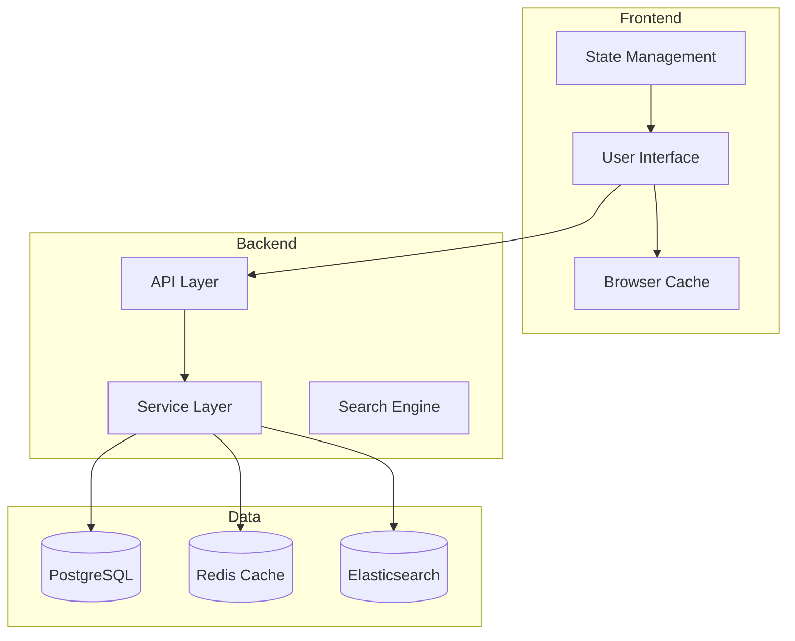
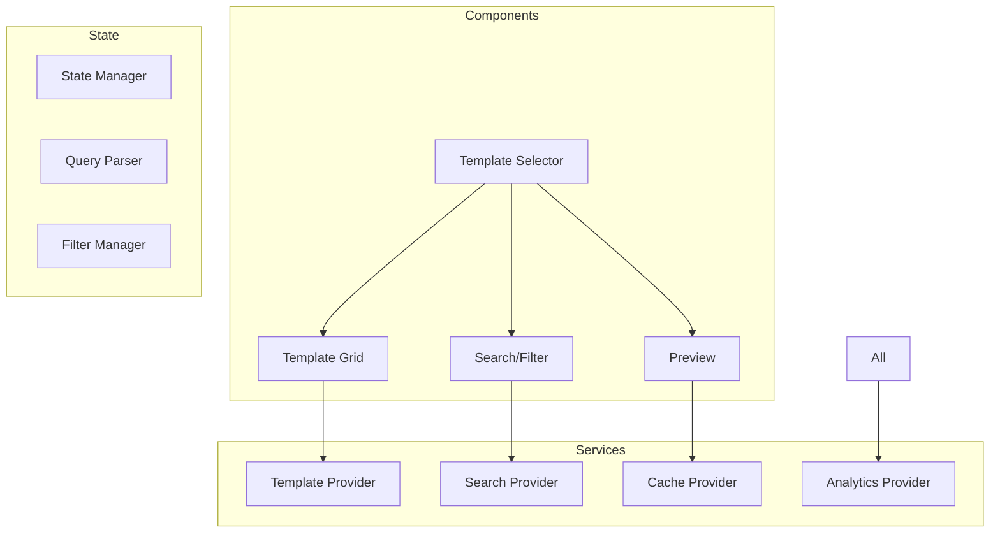
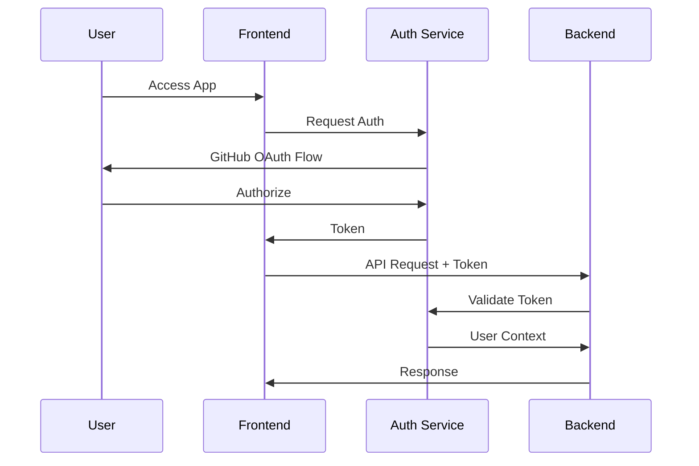
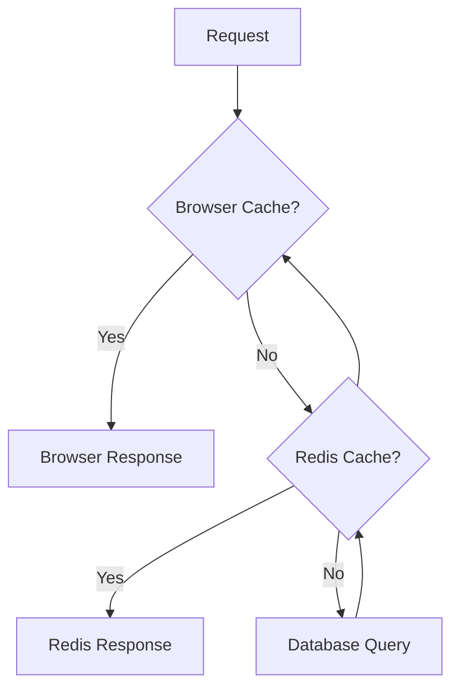
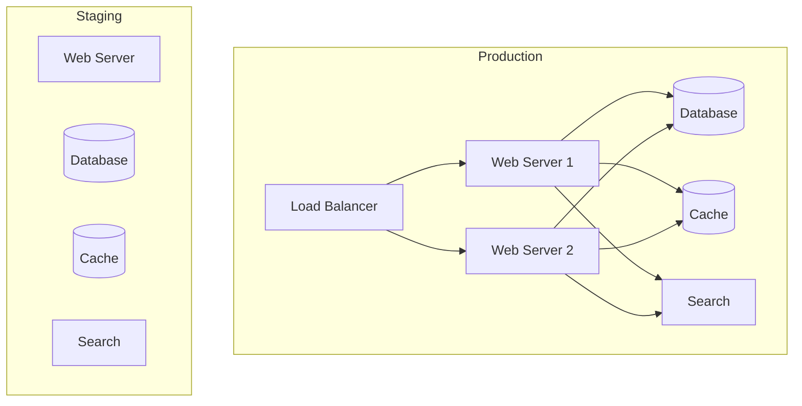
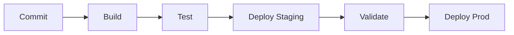

# Technical Architecture Document
## Template Selector System - Q3 2025 Delivery Cycle

### 1. System Overview

#### 1.1 Purpose
The Template Selector system provides an intuitive, efficient interface for discovering and selecting project management templates, reducing selection time from 15+ minutes to under 3 minutes.

#### 1.2 Architecture Goals
- Scalable component-based architecture
- Responsive, real-time user experience
- Efficient template discovery and search
- Secure, performant API integration
- Maintainable, testable codebase

#### 1.3 Key Technical Decisions
- React + TypeScript for frontend
- Node.js + Express for backend
- PostgreSQL for structured data
- Redis for caching
- Elasticsearch for search

### 2. System Architecture

#### 2.1 High-Level Architecture


#### 2.2 Component Architecture


### 3. Frontend Architecture

#### 3.1 Component Structure
```
src/
├── components/
│   ├── TemplateSelector/
│   │   ├── index.tsx
│   │   ├── styles.css
│   │   └── types.ts
│   ├── TemplateGrid/
│   ├── SearchFilter/
│   └── Preview/
├── services/
│   ├── templateService.ts
│   ├── searchService.ts
│   └── analyticsService.ts
├── hooks/
│   ├── useTemplates.ts
│   ├── useSearch.ts
│   └── useAnalytics.ts
└── utils/
    ├── cache.ts
    ├── api.ts
    └── analytics.ts
```

#### 3.2 State Management
```typescript
interface TemplateState {
  templates: Template[];
  selectedTemplate: Template | null;
  filters: FilterState;
  search: SearchState;
  loading: boolean;
  error: Error | null;
}

interface FilterState {
  methodology: string[];
  category: string[];
  complexity: string[];
  tags: string[];
}

interface SearchState {
  query: string;
  results: SearchResult[];
  suggestions: string[];
  history: string[];
}
```

### 4. Backend Architecture

#### 4.1 Service Layer
```typescript
interface TemplateService {
  findTemplates(filters: FilterCriteria): Promise<Template[]>;
  getTemplateById(id: string): Promise<Template>;
  searchTemplates(query: string): Promise<SearchResult[]>;
  getRecommendations(criteria: RecommendationCriteria): Promise<Template[]>;
}

interface CacheService {
  get(key: string): Promise<any>;
  set(key: string, value: any, ttl?: number): Promise<void>;
  invalidate(pattern: string): Promise<void>;
}

interface SearchService {
  index(template: Template): Promise<void>;
  search(query: string): Promise<SearchResult[]>;
  suggest(partial: string): Promise<string[]>;
}
```

#### 4.2 Data Models
```typescript
interface Template {
  id: string;
  name: string;
  description: string;
  methodology: string;
  category: string;
  complexity: string;
  content: string;
  metadata: TemplateMetadata;
}

interface TemplateMetadata {
  author: string;
  lastUpdated: Date;
  version: string;
  rating: number;
  usageCount: number;
}
```

### 5. Data Architecture

#### 5.1 Database Schema
```sql
CREATE TABLE templates (
  id UUID PRIMARY KEY,
  name VARCHAR(255) NOT NULL,
  description TEXT,
  methodology VARCHAR(50),
  category VARCHAR(50),
  complexity VARCHAR(20),
  content TEXT,
  metadata JSONB,
  created_at TIMESTAMP,
  updated_at TIMESTAMP
);

CREATE TABLE template_tags (
  template_id UUID REFERENCES templates(id),
  tag VARCHAR(50),
  PRIMARY KEY (template_id, tag)
);

CREATE TABLE template_stats (
  template_id UUID REFERENCES templates(id),
  views INTEGER DEFAULT 0,
  downloads INTEGER DEFAULT 0,
  rating DECIMAL(3,2),
  rating_count INTEGER,
  PRIMARY KEY (template_id)
);
```

#### 5.2 Cache Structure
```typescript
interface CacheStructure {
  // Template cache
  `template:${id}`: Template;
  `template:list:${filter}`: Template[];
  
  // Search cache
  `search:${query}`: SearchResult[];
  `suggestions:${partial}`: string[];
  
  // Metadata cache
  'metadata:methodologies': string[];
  'metadata:categories': string[];
  'metadata:tags': string[];
}
```

#### 5.3 Search Index
```json
{
  "settings": {
    "analysis": {
      "analyzer": {
        "template_analyzer": {
          "type": "custom",
          "tokenizer": "standard",
          "filter": ["lowercase", "snowball"]
        }
      }
    }
  },
  "mappings": {
    "properties": {
      "name": {
        "type": "text",
        "analyzer": "template_analyzer",
        "boost": 2.0
      },
      "description": {
        "type": "text",
        "analyzer": "template_analyzer"
      },
      "methodology": {
        "type": "keyword"
      },
      "category": {
        "type": "keyword"
      },
      "tags": {
        "type": "keyword"
      }
    }
  }
}
```

### 6. Security Architecture

#### 6.1 Authentication Flow


#### 6.2 Security Measures
- HTTPS enforcement
- CORS configuration
- Rate limiting
- Input validation
- XSS prevention
- CSRF protection

### 7. Performance Architecture

#### 7.1 Caching Strategy


#### 7.2 Performance Optimizations
- Component code splitting
- Image optimization
- Lazy loading
- Cache management
- Query optimization
- Connection pooling

### 8. Monitoring Architecture

#### 8.1 Metrics Collection
```typescript
interface Metrics {
  // Performance metrics
  responseTime: number;
  loadTime: number;
  renderTime: number;
  
  // Business metrics
  searchSuccess: boolean;
  selectionTime: number;
  userSatisfaction: number;
  
  // System metrics
  errorRate: number;
  cacheHitRate: number;
  apiLatency: number;
}
```

#### 8.2 Logging Strategy
- Request/response logging
- Error tracking
- Performance monitoring
- User analytics
- System health

### 9. Deployment Architecture

#### 9.1 Infrastructure


#### 9.2 CI/CD Pipeline


### 10. Testing Architecture

#### 10.1 Test Strategy
- Unit tests
- Integration tests
- End-to-end tests
- Performance tests
- Security tests

#### 10.2 Test Infrastructure
```typescript
interface TestSuite {
  // Unit tests
  components: ComponentTests[];
  services: ServiceTests[];
  utils: UtilTests[];
  
  // Integration tests
  api: ApiTests[];
  database: DatabaseTests[];
  cache: CacheTests[];
  
  // E2E tests
  workflows: WorkflowTests[];
  scenarios: ScenarioTests[];
}
```

### 11. Future Considerations

#### 11.1 Scalability
- Horizontal scaling
- Database sharding
- Cache distribution
- Search cluster

#### 11.2 Extensions
- AI recommendations
- Real-time collaboration
- Template versioning
- Advanced analytics

### 12. Implementation Plan

#### 12.1 Phase 1: Foundation
- Base components
- Core services
- Essential APIs
- Basic search

#### 12.2 Phase 2: Enhancement
- Advanced search
- Caching system
- Analytics integration
- Performance optimization

#### 12.3 Phase 3: Polish
- UI refinements
- Performance tuning
- Security hardening
- Documentation
