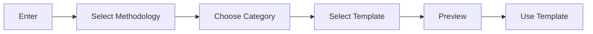
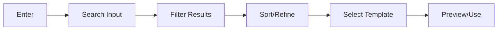
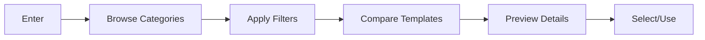

# UX Design Document: Template Selector
## PM Tools Templates - Q3 2025 Delivery Cycle

### Overview
The Template Selector is a core component of our navigation overhaul, designed to reduce template selection time from 15+ minutes to under 3 minutes through intuitive interface and progressive disclosure.

### User Research

#### Primary Personas
1. **New Project Manager**
   - Limited PM experience
   - Needs guidance and context
   - Values: Clear explanations, examples

2. **Experienced PM**
   - Knows what they need
   - Values: Quick access, advanced filters
   - Needs: Efficient search, customization

3. **Enterprise PMO**
   - Managing multiple projects
   - Values: Consistency, governance
   - Needs: Template standards, bulk operations

#### Key User Needs
1. Quick template discovery
2. Methodology alignment
3. Complexity assessment
4. Use case examples
5. Customization options

### Design Principles

1. **Progressive Disclosure**
   - Show basic options first
   - Reveal advanced features progressively
   - Maintain clear navigation path

2. **Visual Hierarchy**
   - Emphasize key selection criteria
   - Clear category grouping
   - Prominent preview capabilities

3. **Efficient Interaction**
   - Maximum 3 clicks to template
   - Quick filters and search
   - Smart defaults

4. **Responsive Design**
   - Mobile-first approach
   - Adaptive layouts
   - Touch-friendly interfaces

### User Flows

#### 1. Quick Selection Flow


#### 2. Search Flow


#### 3. Browse Flow


### Interface Components

#### 1. Navigation Bar
- Methodology selector
- Search bar
- View toggles
- Filter access

#### 2. Template Grid
- Template cards
- Quick preview
- Status indicators
- Usage metrics

#### 3. Preview Panel
- Template details
- Example content
- Usage guidelines
- Related templates

#### 4. Filter Panel
- Methodology filters
- Complexity levels
- Use case categories
- Feature requirements

### Interaction Patterns

#### 1. Template Selection
- Single-click preview
- Double-click select
- Drag-drop reorder
- Keyboard navigation

#### 2. Search Behavior
- Real-time results
- Smart suggestions
- Recent searches
- Popular templates

#### 3. Filter Interaction
- Quick filters
- Combined filters
- Save preferences
- Clear all

### Visual Design

#### 1. Color System
```css
/* Primary Colors */
--primary-blue: #0969DA;
--primary-green: #2EA44F;
--primary-red: #CF222E;

/* Secondary Colors */
--secondary-yellow: #D29922;
--secondary-purple: #8957E5;

/* Neutral Colors */
--neutral-100: #F6F8FA;
--neutral-200: #E1E4E8;
--neutral-300: #D1D5DA;
--neutral-400: #959DA5;
--neutral-500: #6A737D;
--neutral-600: #586069;
--neutral-700: #444D56;
--neutral-800: #2F363D;
--neutral-900: #24292E;
```

#### 2. Typography
```css
/* Headings */
--heading-font: -apple-system, BlinkMacSystemFont, 'Segoe UI', Helvetica, Arial, sans-serif;
--body-font: -apple-system, BlinkMacSystemFont, 'Segoe UI', Helvetica, Arial, sans-serif;

/* Sizes */
--text-xs: 0.75rem;
--text-sm: 0.875rem;
--text-base: 1rem;
--text-lg: 1.125rem;
--text-xl: 1.25rem;
--text-2xl: 1.5rem;
```

#### 3. Spacing System
```css
--space-1: 0.25rem;
--space-2: 0.5rem;
--space-3: 0.75rem;
--space-4: 1rem;
--space-6: 1.5rem;
--space-8: 2rem;
--space-12: 3rem;
--space-16: 4rem;
```

### Responsive Design

#### 1. Breakpoints
```css
--bp-sm: 640px;
--bp-md: 768px;
--bp-lg: 1024px;
--bp-xl: 1280px;
--bp-2xl: 1536px;
```

#### 2. Grid System
- Mobile: 1 column
- Tablet: 2 columns
- Desktop: 3-4 columns
- Wide: 4-5 columns

#### 3. Component Adaptation
- Stack on mobile
- Side panels on desktop
- Responsive typography
- Touch targets

### Accessibility

#### 1. Standards
- WCAG 2.1 Level AA
- Keyboard navigation
- Screen reader support
- High contrast mode

#### 2. Implementation
- ARIA labels
- Focus management
- Color contrast
- Error handling

### Performance

#### 1. Loading States
- Skeleton screens
- Progressive loading
- Lazy preview loading
- Cached results

#### 2. Optimization
- Image optimization
- Code splitting
- Route-based chunking
- State management

### Metrics & Analytics

#### 1. User Metrics
- Time to selection
- Search success rate
- Filter usage
- Preview engagement

#### 2. Performance Metrics
- Load time
- Interaction time
- Error rate
- Conversion rate

### Testing Strategy

#### 1. Usability Testing
- Task completion
- Error tracking
- User satisfaction
- Time on task

#### 2. A/B Testing
- Layout variations
- Filter placement
- Preview styles
- Search behavior

### Implementation Guidelines

#### 1. Component Library
- Atomic design
- Shared components
- Style guide
- Documentation

#### 2. State Management
- User preferences
- Search history
- Filter state
- View settings

#### 3. API Integration
- Template metadata
- Search indexing
- User analytics
- Cache management

### Next Steps

1. **Design Tasks**
   - [ ] Create wireframes
   - [ ] Design component library
   - [ ] Build interactive prototype
   - [ ] Document patterns

2. **Development Tasks**
   - [ ] Implement core components
   - [ ] Build search system
   - [ ] Create filter system
   - [ ] Add analytics

3. **Testing Tasks**
   - [ ] Usability testing
   - [ ] Performance testing
   - [ ] Accessibility audit
   - [ ] Browser testing
