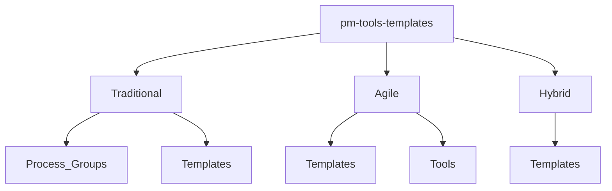

# Project Management Tools & Templates

> A curated collection of 170+ battle-tested, open-source templates for project and program managers. Practical, vendor-agnostic, and ready to customize.

[](https://opensource.org/licenses/MIT)
[](https://github.com/mirichard/pm-tools-templates/blob/main/CONTRIBUTING.md)
[](https://securityscorecards.dev/viewer/?uri=github.com/mirichard/pm-tools-templates)

---

## Get Started in 2 Minutes

1.  **Clone the repository:**
    ```bash
    git clone https://github.com/mirichard/pm-tools-templates.git
    ```
2.  **Find your template:**
    Use the high-level index below or browse the full [`TEMPLATE_INDEX.md`](TEMPLATE_INDEX.md).

3.  **Customize and go:**
    Open a template in your favorite editor and adapt it to your project.

---

## Core Templates Index

This is a curated list of the most frequently used templates.

| Template | Purpose & Methodology | Complexity |
| :--- | :--- | :--- |
| [Project Charter](Traditional/Process_Groups/Initiating/project_charter_template.md) | Formally authorize a project (Traditional) | Beginner |
| [Work Breakdown Structure](Traditional/Process_Groups/Planning/work_breakdown_structure_template.md) | Decompose deliverables into tasks (Traditional) | Intermediate |
| [Risk Register](Traditional/Templates/risk_register_template.md) | Track and mitigate project risks (All) | Intermediate |
| [Sprint Planning](Agile/Templates/sprint_planning_template.md) | Plan sprint goals and backlog (Agile) | Beginner |
| [Hybrid Project Charter](Hybrid/Templates/hybrid_project_charter_template.md) | Kick off a project with mixed methodologies (Hybrid) | Intermediate |
| [Executive Dashboard](business-stakeholder-suite/executive-dashboards/Excel/Executive-Dashboard-Workbook.md) | Report project progress to leadership (All) | Intermediate |

---

## How This Repository is Organized

The templates are organized by project management methodology.



*   **`/Traditional`**: For waterfall projects, organized by PMBOK Process Groups.
*   **`/Agile`**: For iterative projects, with templates for Scrum, Kanban, etc.
*   **`/Hybrid`**: For projects that blend Traditional and Agile approaches.
*   **See the full [folder guide](GUIDE.md) for more details.**

---

## Contributing

This is a community-driven repository. We welcome your contributions! Please see our [**Contributing Guidelines**](CONTRIBUTING.md) to get started.

---

## Frequently Asked Questions

**1. Can I use these templates for commercial purposes?**
*   Yes. All templates are under the MIT license, which allows for commercial use.

**2. How do I find a specific template?**
*   Start with the Core Templates Index above. If you don't find what you need, check the full [`TEMPLATE_INDEX.md`](TEMPLATE_INDEX.md).

**3. How do I get help?**
*   For questions or suggestions, please [**open an issue**](https://github.com/mirichard/pm-tools-templates/issues) or join our [**Discussions**](https://github.com/mirichard/pm-tools-templates/discussions).
