# Project Management Tools & Templates

[](https://opensource.org/licenses/MIT)
[](TEMPLATE_INDEX.md)
[](CONTRIBUTING.md)
[](templates/index.html)
[](https://github.com/mirichard/pm-tools-templates/issues)
[](https://github.com/mirichard/pm-tools-templates/commits/main)
[](https://github.com/mirichard/pm-tools-templates/releases/latest)
[](docs/reorg/STATUS.md)

> A curated collection of 154+ battle-tested, open-source templates for project and program managers. Practical, vendor-agnostic, and ready to customize.

---

## Quick Start

1.  **Clone the repository:**
    ```bash
    git clone https://github.com/mirichard/pm-tools-templates.git
    ```
2.  **Find your template:**
    Browse the `/templates` directory or explore curated [Examples  Sample Artifacts](docs/examples/library.md).

3.  **Customize and go:**
    Open a template in your favorite editor and adapt it to your project.

4.  **Use CLI tools (optional):**
    See the consolidated [CLI Usage Guide](docs/cli/README.md) for link checks, metadata enrichment, and maintenance scripts.

---

## 🚀 Latest Release

[](https://github.com/mirichard/pm-tools-templates/releases/latest)

**What's New in v0.4.0:**
- 🔬 **AI Data Science**: Advanced analytics and consolidation analysis tools
- 🛡️ **Security**: Resolved 11 vulnerabilities with comprehensive fixes
- 🎨 **UX Improvements**: Enhanced dashboard with modern design principles
- 📚 **Enhanced Toolkits**: Expanded program manager resources and templates
- 🔧 **100+ Commits**: Continuous improvements and feature additions

[**→ View Release Notes**](https://github.com/mirichard/pm-tools-templates/releases/latest) | [**→ Download Latest**](https://github.com/mirichard/pm-tools-templates/archive/refs/tags/v0.4.0.zip)

---

## Templates Index

📋 **[Browse All 154 Templates →](TEMPLATE_INDEX.md)**

### Quick Access

| Category | Count | Link |
|----------|-------|------|
| **Traditional** | 25 templates | [Browse Traditional](TEMPLATE_INDEX.md#traditional-templates) |
| **Agile** | 39 templates | [Browse Agile](TEMPLATE_INDEX.md#agile-templates) |
| **Hybrid** | 7 templates | [Browse Hybrid](TEMPLATE_INDEX.md#hybrid-templates) |
| **Universal** | 83 templates | [Browse Universal](TEMPLATE_INDEX.md#universal-templates) |

### Most Popular Templates

- [Project Charter Template](templates/all/project_charter_template.md) - Start any project
- [Sprint Planning Template](templates/all/sprint_planning_template.md) - Plan agile sprints  
- [Risk Register Template](templates/all/risk_register_template.md) - Manage project risks
- [Status Report Template](templates/all/status_report_template.md) - Report progress
- [Stakeholder Register Template](templates/all/stakeholder-register.md) - Manage stakeholders

### Popular Tags

- [Risk Management (126)](templates/index.html?search=risk-management)
- [Stakeholder Management (116)](templates/index.html?search=stakeholder-management)
- [Planning (102)](templates/index.html?search=planning)
- [Communication (101)](templates/index.html?search=communication)
- [Quality (110)](templates/index.html?search=quality)
- [Monitoring (89)](templates/index.html?search=monitoring)
- [Technology (85)](templates/index.html?search=technology)

---

## Repository Structure

The templates are organized by methodology and use case:

```mermaid
graph TD
    A[pm-tools-templates] --> B[📁 templates/]
    A --> C[📁 templates/project-lifecycle/]
    A --> D[📁 templates/role-based/]
    A --> E[📁 industry-specializations/]
    A --> F[📁 methodology-frameworks/]
    A --> G[📁 integration-guides/]
    A --> H[📁 examples/]
    
    B --> B1[📂 traditional/ - 25 templates]
    B --> B2[📂 agile/ - 39 templates]
    B --> B3[📂 hybrid/ - 7 templates]
    B --> B4[📂 universal/ - 83 templates]
    
    C --> C1[📂 01-initiation/]
    C --> C2[📂 02-planning/]
    C --> C3[📂 03-execution/]
    C --> C4[📂 04-monitoring-control/]
    C --> C5[📂 05-closure/]
    
    D --> D1[📂 program-managers/]
    D --> D2[📂 project-managers/]
    D --> D3[📂 scrum-masters/]
    D --> D4[📂 product-owners/]
    
    E --> E1[📂 healthcare/]
    E --> E2[📂 fintech/]
    E --> E3[📂 manufacturing/]
    E --> E4[📂 construction/]
    
    G --> G1[📂 jira/]
    G --> G2[📂 github/]
    G --> G3[📂 asana/]
    G --> G4[📂 microsoft-project/]
```



---

## Contributing

We welcome contributions! Please see our [Contributing Guidelines](CONTRIBUTING.md) to get started.

Looking for where to begin? Start here:
- 🚀 New? Read the [Quick Start for Contributors](docs/community/QUICK_START.md) and [Contribution Pathways](docs/community/contribution-pathways.md)
- 🧭 Browse [good first issues](https://github.com/mirichard/pm-tools-templates/issues?q=is%3Aissue+is%3Aopen+label%3A%22good+first+issue%22) and [help wanted](https://github.com/mirichard/pm-tools-templates/issues?q=is%3Aissue+is%3Aopen+label%3A%22help+wanted%22)
- 🧱 Use our [Templates for contributions](COMMUNITY_FEEDBACK.md) (bugs, enhancements, template requests)

**Quick ways to contribute:**
- 🐛 [Report issues](https://github.com/mirichard/pm-tools-templates/issues)
- 💡 [Suggest improvements](https://github.com/mirichard/pm-tools-templates/issues)
- 📝 [Submit new templates](CONTRIBUTING.md)
- ⭐ Star this repository to show support

---

## Frequently Asked Questions

**Q: Can I use these templates commercially?**  
A: Yes! All templates are under the MIT License.

**Q: How do I find templates for my specific industry?**  
A: Check the [industry-specializations](industry-specializations/) folder or use the [Template Index](TEMPLATE_INDEX.md).

**Q: Are there examples of completed templates?**  
A: Yes, see the [examples](examples/) folder for real-world examples.

**Q: How often are templates updated?**  
A: Templates are continuously improved based on community feedback and industry best practices.

---

## Support

Need help? We're here for you:

- 📚 [Browse all templates](TEMPLATE_INDEX.md)
- 💬 [Join discussions](https://github.com/mirichard/pm-tools-templates/discussions)
- 🐛 [Report issues](https://github.com/mirichard/pm-tools-templates/issues)

---


