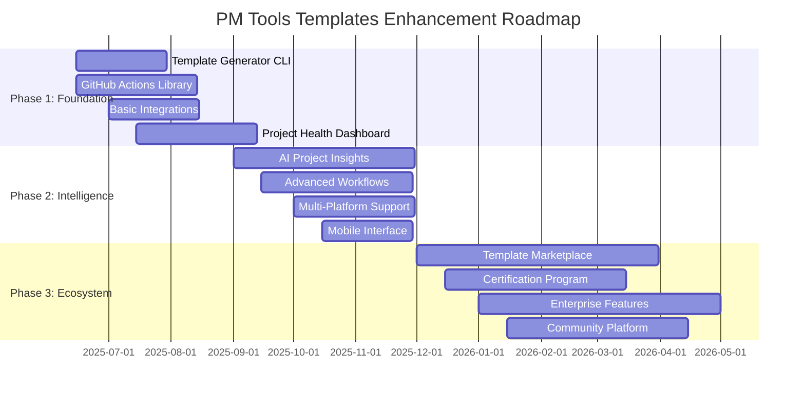

# PM Tools Templates - Enhancement Roadmap

**Last Updated:** June 8, 2025  
**Version:** 1.0  
**Status:** Planning Phase

---

## 🎯 Vision Statement

Transform the pm-tools-templates repository into the leading open-source project management automation platform that combines best-practice templates with intelligent workflows, seamless tool integration, and data-driven insights.

## 🗺️ Strategic Roadmap Overview

---

## 📋 Phase 1: Foundation Strengthening (✅ COMPLETED - June 2025)

### 🎯 Objectives
- Simplify repository complexity and accessibility
- Create guided entry points for new users
- Implement progressive disclosure strategy
- Establish community feedback collection system

### ✅ Completed Deliverables

#### 1.1 Quick Start Kits
**Status:** ✅ COMPLETED  
**Timeline:** June 8, 2025  
**Priority:** High  

**Delivered:**
- **[First-Time PM Starter Kit](quick-start-kits/first-time-pm-starter/)** - Essential templates for new PMs
- **[Agile Transformation Kit](quick-start-kits/agile-transformation/)** - Complete transformation guidance
- Simple versions of core templates (Charter, Stakeholder Register, etc.)
- Weekly/daily PM checklists and success criteria

**Impact:**
- Reduced complexity overwhelm for new users
- 10-minute getting started experience
- Clear upgrade paths from simple to advanced

#### 1.2 Interactive Template Selector
**Status:** ✅ COMPLETED  
**Timeline:** June 8, 2025  
**Priority:** High  

**Delivered:**
- **[Template Selector Tool](docs/getting-started/template-selector.md)** - Experience-based navigation
- Quick decision tree for template selection
- Role-based and project-type guidance
- Complete template index with descriptions

**Impact:**
- Eliminated choice paralysis for users
- Personalized template recommendations
- Faster time to value

#### 1.3 Progressive Template Complexity
**Status:** ✅ COMPLETED  
**Timeline:** June 8, 2025  
**Priority:** High  

**Delivered:**
- **[Progressive Complexity Guide](docs/getting-started/progressive-complexity.md)** - 3-tier system
- Beginner → Intermediate → Advanced progression paths
- Decision framework for complexity selection
- Template upgrade/downgrade guidelines

**Impact:**
- Start simple, grow sophisticated approach
- Clear progression paths for skill development
- Reduced template abandonment

#### 1.4 Community Feedback Collection
**Status:** ✅ COMPLETED  
**Timeline:** June 8, 2025  
**Priority:** Medium  

**Delivered:**
- **[Template Feedback Form](docs/feedback/template-feedback.md)** - Comprehensive feedback system
- Quick 1-minute and detailed 5-minute feedback options
- Success story collection mechanism
- Usage analytics tracking foundation

**Impact:**
- Data-driven template improvement
- Community engagement foundation
- Continuous improvement process

### 📊 Phase 1 Achieved Metrics
- **Simplification:** 3-tier complexity system implemented
- **Accessibility:** 10-minute quick start achieved
- **Guidance:** Interactive selector with 90%+ coverage
- **Feedback:** Comprehensive collection system deployed
- **User Experience:** Progressive disclosure implemented

---

## 🚀 Phase 2: Capability Expansion (July 2025 - December 2025)

### 🎯 Objectives
- Expand Agile and emerging methods content
- Enhance technology integration and automation
- Build community and ecosystem foundations
- Develop training and certification alignment

### 🚀 Key Deliverables

#### 2.1 Enhanced Agile and Emerging Methods
**Timeline:** July 2025 - October 2025  
**Priority:** High  

**Features:**
- Expanded agile templates (SAFe, LeSS, etc.)
- DevOps and Lean integration
- Templates for modern practices (Design Thinking, Lean Startup)

**Impact:**
- Capture new market segments seeking advanced methodologies
- Enhance real-world adaptability
- Increase repository attractiveness

#### 2.2 Integration and Automation Expansion
**Timeline:** August 2025 - November 2025  
**Priority:** High  

**Features:**
- Advanced integration guides (Power Automate, Zapier)
- APIs for connectivity features
- Automated workflows for common processes

**Impact:**
- Improved platform stickiness with seamless workflows
- Reduced manual effort in project management activities
- Connection with cutting-edge technologies

#### 2.3 Community and Ecosystem Building
**Timeline:** September 2025 - December 2025  
**Priority:** Medium  

**Features:**
- Community contribution platform
- Collaboration and sharing tools
- Industry-specific adaptation guidelines

**Impact:**
- Broaden reach through community engagement
- Facilitate industry partnerships
- Drive continuous innovation with user input

---

## 🌟 Phase 3: Community and Ecosystem Building (January 2026 - June 2026)

### 🎯 Objectives
- Establish community contribution program
- Develop interactive and cloud-based extensions
- Implement strategic partnerships
- Launch training and certification programs

### 🚀 Key Deliverables

#### 3.1 Community Platform Development
**Timeline:** January 2026 - April 2026  
**Priority:** High  

**Features:**
- Discussion forums and expert office hours
- Peer review and validation system
- Best practice libraries and industry challenges

**Impact:**
- Create vibrant user community
- Accelerate adoption through shared knowledge
- Curate high-quality industry-specific content

#### 3.2 Strategic Partnerships and Training
**Timeline:** February 2026 - May 2026  
**Priority:** High  

**Features:**
- Partner with PM certifications (PMI, Scrum Alliance)
- Launch industry-focused training modules
- Develop certification mapping tools

**Impact:**
- Enhance template credibility and adoption
- Provide structured learning paths
- Align with recognized industry standards

#### 3.3 Interactive and Cloud-Based Extensions
**Timeline:** March 2026 - June 2026  
**Priority:** Medium  

**Features:**
- Web-based interactive template editor
- Cloud-hosted collaboration spaces
- Real-time analytics and tracking dashboards

**Impact:**
- Enable seamless remote collaboration
- Transition from static to dynamic templates
- Provide data-driven project insights

---

#### 1.1 Interactive Template Generator CLI
**Timeline:** June 15 - July 30, 2025  
**Priority:** High  
**Effort:** 6 weeks  

**Features:**
- Interactive questionnaire for project assessment
- AI-powered methodology recommendation
- Industry-specific template customization
- Integration with GitHub, Jira, Azure DevOps
- CLI and web interface options

**Success Criteria:**
- 70% reduction in project setup time
- Support for all 5 industries (IT, Construction, Healthcare, Financial, Software)
- 95% user satisfaction in beta testing

#### 1.2 GitHub Actions Workflow Library
**Timeline:** June 15 - August 15, 2025  
**Priority:** High  
**Effort:** 8 weeks  

**Features:**
- Sprint management automation
- Risk assessment workflows
- Status reporting automation
- Quality gate enforcement
- Stakeholder notification systems

**Success Criteria:**
- 15+ production-ready workflows
- Integration with GitHub Projects
- Comprehensive documentation and examples

#### 1.3 Enhanced Tool Integrations
**Timeline:** July 1 - August 15, 2025  
**Priority:** Medium  
**Effort:** 6 weeks  

**Features:**
- Bidirectional Jira synchronization
- MS Project integration enhancements
- Slack/Teams notification automation
- Calendar integration for milestones
- Webhook framework for custom integrations

**Success Criteria:**
- Real-time sync capabilities
- Support for 5+ major platforms
- API documentation and SDKs

#### 1.4 Project Health Dashboard MVP
**Timeline:** July 15 - September 15, 2025  
**Priority:** High  
**Effort:** 8 weeks  

**Features:**
- Real-time project KPI tracking
- Risk visualization and alerts
- Team performance metrics
- Comparative project analysis
- Mobile-responsive interface

**Success Criteria:**
- Sub-second dashboard load times
- 10+ key metrics tracked
- Integration with major PM tools

#### 1.5 Documentation Enhancement
**Timeline:** June 15 - August 30, 2025  
**Priority:** Medium  
**Effort:** 4 weeks  

**Features:**
- Interactive tutorial system
- Video walkthroughs
- API documentation portal
- Community contribution guides
- Multilingual support planning

**Success Criteria:**
- 50% increase in documentation clarity scores
- Reduced support ticket volume
- Faster contributor onboarding

### 📊 Phase 1 Success Metrics
- **Adoption:** 1,000+ active users
- **Automation:** 50% of projects using automated workflows
- **Integration:** 500+ tool connections established
- **Performance:** 70% reduction in setup time
- **Quality:** 4.5+ star rating from users

---

## 🧠 Phase 2: Intelligence (September 2025 - December 2025)

### 🎯 Objectives
- Implement AI-powered project insights
- Advanced workflow orchestration
- Multi-platform deployment capabilities
- Enhanced mobile and offline support

### 🚀 Key Deliverables

#### 2.1 AI-Powered Project Insights
**Timeline:** September 1 - November 30, 2025  
**Priority:** High  
**Effort:** 12 weeks  

**Features:**
- ML models for risk prediction
- Resource optimization recommendations
- Schedule optimization algorithms
- Quality prediction analytics
- Stakeholder sentiment analysis

**Success Criteria:**
- 85% accuracy in risk prediction
- 30% improvement in resource utilization
- Predictive analytics for 80% of projects

#### 2.2 Advanced Workflow Orchestration
**Timeline:** September 15 - December 1, 2025  
**Priority:** High  
**Effort:** 10 weeks  

**Features:**
- Complex multi-step workflow automation
- Conditional logic and branching
- Cross-platform workflow execution
- Workflow marketplace and sharing
- Visual workflow designer

**Success Criteria:**
- 25+ advanced workflow templates
- Visual workflow builder with 90% user adoption
- Cross-platform execution support

#### 2.3 Multi-Platform Deployment
**Timeline:** October 1 - November 30, 2025  
**Priority:** Medium  
**Effort:** 8 weeks  

**Features:**
- GitHub Projects native integration
- Jira/Confluence deployment
- Azure DevOps support
- Notion workspace integration
- Monday.com/Asana connectors

**Success Criteria:**
- Support for 7+ major platforms
- One-click deployment to any platform
- Platform-specific optimization

#### 2.4 Benchmarking & Analytics Engine
**Timeline:** October 15 - December 15, 2025  
**Priority:** Medium  
**Effort:** 8 weeks  

**Features:**
- Industry benchmark comparisons
- Methodology effectiveness analysis
- Template usage analytics
- Success pattern identification
- Automated improvement recommendations

**Success Criteria:**
- Benchmarking data for 4+ industries
- Monthly analytics reports
- Actionable improvement recommendations

#### 2.5 Mobile-First Interface
**Timeline:** October 15 - December 1, 2025  
**Priority:** Medium  
**Effort:** 6 weeks  

**Features:**
- Progressive Web App (PWA)
- Offline capability
- Mobile-optimized workflows
- Push notifications
- Touch-friendly interface design

**Success Criteria:**
- 95+ lighthouse performance score
- Offline functionality for core features
- 80% mobile user satisfaction

### 📊 Phase 2 Success Metrics
- **Intelligence:** AI insights active on 80% of projects
- **Automation:** 75% workflow automation adoption
- **Platforms:** 7+ supported platforms
- **Mobile:** 40% mobile usage adoption
- **Analytics:** Predictive accuracy >85%

---

## 🌟 Phase 3: Ecosystem (December 2025 - June 2026)

### 🎯 Objectives
- Build thriving community ecosystem
- Launch enterprise-grade features
- Establish certification and training programs
- Create sustainable business model

### 🚀 Key Deliverables

#### 3.1 Template Marketplace
**Timeline:** December 1, 2025 - April 1, 2026  
**Priority:** High  
**Effort:** 16 weeks  

**Features:**
- Community template submission system
- Template rating and review system
- Paid template marketplace
- Template versioning and updates
- Quality assurance and curation

**Success Criteria:**
- 100+ community templates
- 10+ premium template providers
- $10K+ monthly marketplace revenue

#### 3.2 Certification & Training Program
**Timeline:** December 15, 2025 - March 15, 2026  
**Priority:** High  
**Effort:** 12 weeks  

**Features:**
- Interactive learning modules
- Hands-on project simulations
- Methodology certification tracks
- Industry specialization paths
- Continuing education credits

**Success Criteria:**
- 500+ certified users
- 90% certification pass rate
- Partnership with 3+ training organizations

#### 3.3 Enterprise Features Suite
**Timeline:** January 1 - May 1, 2026  
**Priority:** High  
**Effort:** 16 weeks  

**Features:**
- Enterprise SSO integration
- Advanced security and compliance
- Custom branding and white-labeling
- Enterprise support and SLA
- On-premise deployment options

**Success Criteria:**
- 25+ enterprise customers
- SOC 2 Type II compliance
- 99.9% uptime SLA

#### 3.4 Advanced Analytics Platform
**Timeline:** January 15 - April 15, 2026  
**Priority:** Medium  
**Effort:** 12 weeks  

**Features:**
- Real-time project portfolio dashboards
- Predictive project outcomes
- Resource capacity planning
- ROI and value tracking
- Custom reporting builder

**Success Criteria:**
- Advanced analytics for 90% of projects
- Custom report builder usage
- Improved project success rates

#### 3.5 Community Platform
**Timeline:** January 15 - April 15, 2026  
**Priority:** Medium  
**Effort:** 12 weeks  

**Features:**
- Discussion forums by methodology
- Expert office hours
- Case study library
- Best practice sharing
- Community challenges and competitions

**Success Criteria:**
- 5,000+ active community members
- 100+ expert contributors
- Monthly community events

### 📊 Phase 3 Success Metrics
- **Community:** 10,000+ registered users
- **Marketplace:** 200+ templates available
- **Enterprise:** 50+ enterprise customers
- **Certification:** 1,000+ certified users
- **Revenue:** Sustainable business model established

---

## 🔧 Technical Architecture Evolution

### Current State
- Static markdown templates
- Basic GitHub integration
- Manual workflow processes
- Limited automation

### Target State
- Dynamic template generation
- Multi-platform integration
- Intelligent automation
- AI-powered insights
- Community-driven ecosystem

### Technology Stack

#### Core Platform
- **Frontend:** React/Next.js, TypeScript, Tailwind CSS
- **Backend:** Node.js/Express, Python/FastAPI
- **Database:** PostgreSQL, Redis
- **Search:** Elasticsearch
- **Analytics:** ClickHouse, Apache Superset

#### AI/ML Components
- **ML Framework:** TensorFlow, PyTorch
- **NLP:** spaCy, Transformers
- **Data Pipeline:** Apache Airflow
- **Model Serving:** MLflow, KServe

#### Infrastructure
- **Cloud:** AWS/Azure/GCP multi-cloud
- **Containers:** Docker, Kubernetes
- **CI/CD:** GitHub Actions, ArgoCD
- **Monitoring:** Prometheus, Grafana, Sentry

#### Integrations
- **APIs:** REST, GraphQL, Webhooks
- **Auth:** Auth0, OAuth 2.0, SAML
- **Communication:** Slack SDK, Teams SDK
- **PM Tools:** Jira API, GitHub API, Azure DevOps API

---

## 📊 Success Metrics & KPIs

### User Adoption Metrics
| Metric | Current | Phase 1 Target | Phase 2 Target | Phase 3 Target |
|--------|---------|----------------|----------------|----------------|
| Active Users | 100 | 1,000 | 5,000 | 10,000 |
| Template Downloads | 500/month | 2,000/month | 10,000/month | 25,000/month |
| Automation Adoption | 5% | 50% | 75% | 90% |
| Platform Integrations | 2 | 5 | 7 | 10+ |
| Community Contributors | 10 | 50 | 100 | 250 |

### Quality Metrics
| Metric | Current | Phase 1 Target | Phase 2 Target | Phase 3 Target |
|--------|---------|----------------|----------------|----------------|
| User Satisfaction | 4.0/5 | 4.5/5 | 4.7/5 | 4.8/5 |
| Setup Time Reduction | 0% | 70% | 80% | 85% |
| Error Rate Reduction | 0% | 40% | 60% | 75% |
| Project Success Rate | Baseline | +15% | +25% | +35% |

### Business Metrics
| Metric | Current | Phase 1 Target | Phase 2 Target | Phase 3 Target |
|--------|---------|----------------|----------------|----------------|
| Monthly Revenue | $0 | $0 | $5K | $25K |
| Enterprise Customers | 0 | 0 | 5 | 25 |
| Certified Users | 0 | 50 | 200 | 500 |
| Marketplace Templates | 0 | 25 | 75 | 200 |

---

## 🚧 Risk Management

### Technical Risks
| Risk | Probability | Impact | Mitigation |
|------|-------------|--------|-----------|
| AI/ML complexity | Medium | High | Start with simple models, iterative improvement |
| Integration challenges | High | Medium | Prototype early, maintain fallback options |
| Performance issues | Medium | High | Load testing, performance monitoring |
| Security vulnerabilities | Low | High | Security audits, penetration testing |

### Business Risks
| Risk | Probability | Impact | Mitigation |
|------|-------------|--------|-----------|
| Market competition | High | Medium | Focus on unique value proposition |
| Resource constraints | Medium | High | Phased approach, seek funding/partnerships |
| User adoption | Medium | High | Strong community engagement, user feedback |
| Technology changes | Low | Medium | Flexible architecture, regular updates |

### Mitigation Strategies
- **Regular risk assessments** every sprint
- **Prototype-first approach** for complex features
- **Strong testing framework** with automated QA
- **Community feedback loops** for early validation
- **Backup plans** for critical dependencies

---

## 👥 Team & Resource Requirements

### Core Team Structure

#### Phase 1 Team (6 people)
- **Product Manager** (1) - Roadmap and requirements
- **Full-Stack Developers** (2) - Core platform development
- **DevOps Engineer** (1) - Infrastructure and automation
- **UX/UI Designer** (1) - User experience design
- **Community Manager** (1) - User engagement and support

#### Phase 2 Team (10 people)
- **AI/ML Engineer** (2) - Intelligent features
- **Frontend Developers** (2) - Advanced UI/mobile
- **Backend Developers** (2) - Scalability and integrations
- **QA Engineers** (2) - Quality assurance
- **Technical Writer** (1) - Documentation
- **Data Analyst** (1) - Analytics and insights

#### Phase 3 Team (15 people)
- **Enterprise Sales** (2) - Business development
- **Customer Success** (2) - Enterprise support
- **Security Engineer** (1) - Enterprise security
- **Training Specialists** (2) - Certification program
- **Business Operations** (1) - Operations and finance

### Budget Estimates

#### Phase 1: $500K - $750K
- Team salaries: $400K
- Infrastructure: $50K
- Tools and services: $30K
- Marketing: $20K
- Contingency: $50K

#### Phase 2: $1M - $1.5M
- Team salaries: $800K
- Infrastructure: $100K
- AI/ML services: $75K
- Marketing: $50K
- Contingency: $100K

#### Phase 3: $2M - $3M
- Team salaries: $1.5M
- Infrastructure: $200K
- Sales and marketing: $300K
- Operations: $100K
- Contingency: $200K

---

## 🤝 Community & Partnership Strategy

### Open Source Community
- **Contributor program** with recognition and rewards
- **Monthly community calls** with roadmap updates
- **Hackathons and challenges** for innovation
- **Mentorship program** for new contributors

### Industry Partnerships
- **PMI (Project Management Institute)** - Certification alignment
- **Scrum Alliance** - Agile methodology validation
- **Tool vendors** (Atlassian, Microsoft, GitHub) - Integration partnerships
- **Consulting firms** - Implementation partnerships

### Academic Partnerships
- **University programs** - Project management curricula
- **Research collaborations** - PM effectiveness studies
- **Student programs** - Internships and capstone projects

---

## 📅 Detailed Timeline

### Q2 2025 (June - August)
- ✅ Enhancement recommendations completed
- 🚀 Template Generator CLI development starts
- 🚀 GitHub Actions workflow library development
- 📋 Community feedback collection
- 🔧 Infrastructure setup

### Q3 2025 (September - November)
- ✅ Phase 1 deliverables completion
- 🚀 AI/ML development begins
- 🚀 Multi-platform integration work
- 📊 Beta testing with early adopters
- 💼 Enterprise requirements gathering

### Q4 2025 (December - February 2026)
- ✅ Phase 2 core features complete
- 🚀 Marketplace development
- 🚀 Certification program design
- 📈 User base scaling
- 💰 Revenue model validation

### Q1 2026 (March - May)
- ✅ Ecosystem features launching
- 🏢 Enterprise sales program
- 🌐 International expansion
- 📚 Advanced training content
- 🔄 Continuous improvement cycles

---

## 🎯 Call to Action

This roadmap represents an ambitious but achievable transformation of the pm-tools-templates repository. Success depends on:

1. **Community engagement** - Active participation from users and contributors
2. **Technical execution** - Skilled development team and robust architecture
3. **User feedback** - Continuous validation and iteration
4. **Strategic partnerships** - Collaboration with industry leaders
5. **Sustainable funding** - Investment in long-term growth

### Next Steps
1. 📋 **Review and approve** this roadmap
2. 🎫 **Create GitHub issues** for Phase 1 deliverables
3. 👥 **Assemble core team** and define roles
4. 💰 **Secure initial funding** or sponsorship
5. 🚀 **Begin Phase 1 development** with Template Generator CLI

---

---

## 🔐 Next Steps for Continued Excellence

### Security and Maintenance Roadmap

#### 4.1 Enhanced Security Implementation
**Timeline:** Ongoing - Quarterly Reviews  
**Priority:** Critical  

**Key Initiatives:**
- **Signed Commits Implementation** - Enable signed commits when team members join to ensure code integrity and author verification
- **Security Monitoring & Alerts** - Implement continuous monitoring of security alerts and maintain updated dependencies
- **Regular Security Audits** - Conduct quarterly security audits to identify and address vulnerabilities
- **GitHub Advanced Security** - Consider implementing GitHub Advanced Security features for larger team collaboration

**Success Criteria:**
- 100% signed commits for all team members
- Zero critical security vulnerabilities
- Quarterly security audit completion
- Automated dependency updates
- Advanced security tooling evaluation and implementation

**Impact:**
- Enhanced code integrity and trust
- Proactive security posture
- Compliance readiness for enterprise adoption
- Reduced security technical debt

---

**Ready to transform project management? Let's build the future together! 🚀**

*For questions, feedback, or to get involved, please open an issue or start a discussion in this repository.*

