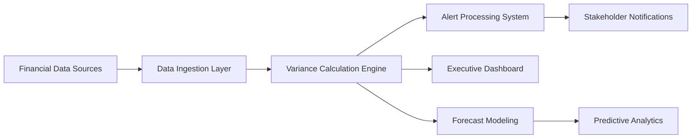

# Real-Time Budget Variance Analysis System

## 📊 Overview

**Purpose:** Automated real-time budget tracking with variance analysis and executive alerting  
**Integration:** ERP systems, financial databases, project management tools  
**Update Frequency:** Real-time with 5-minute refresh cycles  
**Target Users:** CFO, Finance Directors, Project Sponsors, Executive Team  

---

## 🏗️ System Architecture

### Core Components

```
┌─────────────────┐    ┌──────────────────┐    ┌─────────────────┐
│   Data Sources  │────│  Variance Engine │────│ Executive Alerts│
│                 │    │                  │    │                 │
│ • ERP Systems   │    │ • Real-time Calc │    │ • Email Alerts  │
│ • Financial DB  │    │ • Trend Analysis │    │ • SMS Escalation│
│ • PM Tools      │    │ • Forecasting    │    │ • Dashboard Msgs│
│ • Time Tracking │    │ • Alerting Logic │    │ • Mobile Push   │
└─────────────────┘    └──────────────────┘    └─────────────────┘
```

### Data Flow Pipeline



---

## 💰 Budget Variance Calculation Engine

### Core Variance Metrics

#### 1. Budget Performance Index (BPI)
```javascript
// Real-time Budget Performance Calculation
function calculateBudgetPerformance(projectData) {
    const {
        approvedBudget,
        actualSpend,
        earnedValue,
        timeElapsed,
        totalDuration,
        forecastAtCompletion
    } = projectData;
    
    // Core Variance Calculations
    const budgetVariance = approvedBudget - actualSpend;
    const budgetVariancePercent = (budgetVariance / approvedBudget) * 100;
    
    // Cost Performance Index
    const costPerformanceIndex = earnedValue / actualSpend;
    
    // Budget Performance Index (custom metric)
    const plannedSpendToDate = (approvedBudget * timeElapsed) / totalDuration;
    const budgetPerformanceIndex = plannedSpendToDate / actualSpend;
    
    // Variance Trend Analysis
    const varianceTrend = calculateVarianceTrend(projectData.historicalSpend);
    
    // Risk-Adjusted Forecast
    const estimateAtCompletion = actualSpend + (approvedBudget - earnedValue) / costPerformanceIndex;
    const varianceAtCompletion = approvedBudget - estimateAtCompletion;
    
    return {
        budgetVariance,
        budgetVariancePercent,
        costPerformanceIndex,
        budgetPerformanceIndex,
        varianceTrend,
        estimateAtCompletion,
        varianceAtCompletion,
        healthStatus: getBudgetHealthStatus(budgetVariancePercent),
        alertLevel: getAlertLevel(budgetVariancePercent, varianceTrend),
        lastCalculated: new Date().toISOString()
    };
}

// Budget Health Status Classification
function getBudgetHealthStatus(variancePercent) {
    const absVariance = Math.abs(variancePercent);
    
    if (absVariance <= 2) return { status: 'EXCELLENT', color: '#27ae60', icon: '🟢' };
    if (absVariance <= 5) return { status: 'GOOD', color: '#2ecc71', icon: '🟢' };
    if (absVariance <= 10) return { status: 'CAUTION', color: '#f39c12', icon: '🟡' };
    if (absVariance <= 15) return { status: 'WARNING', color: '#e67e22', icon: '🟠' };
    return { status: 'CRITICAL', color: '#e74c3c', icon: '🔴' };
}

// Variance Trend Analysis
function calculateVarianceTrend(historicalSpend) {
    if (historicalSpend.length < 3) return 'INSUFFICIENT_DATA';
    
    const recent = historicalSpend.slice(-4); // Last 4 data points
    const variances = recent.map(period => period.variance);
    
    // Linear regression to determine trend
    const trend = linearRegression(variances);
    
    if (trend.slope > 0.02) return 'IMPROVING';
    if (trend.slope < -0.02) return 'DETERIORATING';
    return 'STABLE';
}
```

#### 2. Multi-Dimensional Variance Analysis
```javascript
// Category-Based Variance Analysis
function analyzeCategoryVariances(budgetData) {
    const categories = ['labor', 'vendor', 'infrastructure', 'training', 'contingency'];
    const analysis = {};
    
    categories.forEach(category => {
        const categoryData = budgetData[category];
        
        analysis[category] = {
            approved: categoryData.approved,
            actual: categoryData.actual,
            forecast: categoryData.forecast,
            variance: categoryData.approved - categoryData.actual,
            variancePercent: ((categoryData.approved - categoryData.actual) / categoryData.approved) * 100,
            trend: calculateCategoryTrend(categoryData.historical),
            driverAnalysis: identifyVarianceDrivers(categoryData),
            recommendations: generateCategoryRecommendations(categoryData)
        };
    });
    
    return {
        categories: analysis,
        topVariances: getTopVariances(analysis),
        riskFactors: identifyBudgetRisks(analysis),
        executiveSummary: generateExecutiveSummary(analysis)
    };
}

// Variance Driver Identification
function identifyVarianceDrivers(categoryData) {
    const drivers = [];
    
    // Rate variance analysis
    if (categoryData.actualRate && categoryData.plannedRate) {
        const rateVariance = categoryData.actualRate - categoryData.plannedRate;
        if (Math.abs(rateVariance) > categoryData.plannedRate * 0.05) {
            drivers.push({
                type: 'RATE_VARIANCE',
                impact: rateVariance * categoryData.actualQuantity,
                description: `Rate variance: ${rateVariance > 0 ? '+' : ''}${(rateVariance/categoryData.plannedRate*100).toFixed(1)}%`
            });
        }
    }
    
    // Quantity variance analysis
    if (categoryData.actualQuantity && categoryData.plannedQuantity) {
        const quantityVariance = categoryData.actualQuantity - categoryData.plannedQuantity;
        if (Math.abs(quantityVariance) > categoryData.plannedQuantity * 0.05) {
            drivers.push({
                type: 'QUANTITY_VARIANCE',
                impact: quantityVariance * categoryData.plannedRate,
                description: `Quantity variance: ${quantityVariance > 0 ? '+' : ''}${(quantityVariance/categoryData.plannedQuantity*100).toFixed(1)}%`
            });
        }
    }
    
    // Timing variance analysis
    if (categoryData.actualTiming && categoryData.plannedTiming) {
        const timingVariance = categoryData.actualTiming - categoryData.plannedTiming;
        if (Math.abs(timingVariance) > 7) { // More than 1 week variance
            drivers.push({
                type: 'TIMING_VARIANCE',
                impact: calculateTimingImpact(timingVariance, categoryData),
                description: `Timing variance: ${timingVariance > 0 ? '+' : ''}${timingVariance} days`
            });
        }
    }
    
    return drivers.sort((a, b) => Math.abs(b.impact) - Math.abs(a.impact));
}
```

---

## 📈 Advanced Forecasting Models

### Earned Value Management Integration
```javascript
// Advanced EVM-Based Forecasting
function generateAdvancedForecast(projectData) {
    const {
        plannedValue,      // PV - Budgeted Cost of Work Scheduled
        earnedValue,       // EV - Budgeted Cost of Work Performed  
        actualCost,        // AC - Actual Cost of Work Performed
        budgetAtCompletion // BAC - Budget at Completion
    } = projectData;
    
    // Core EVM Calculations
    const scheduleVariance = earnedValue - plannedValue;          // SV
    const costVariance = earnedValue - actualCost;               // CV
    const schedulePerformanceIndex = earnedValue / plannedValue; // SPI
    const costPerformanceIndex = earnedValue / actualCost;       // CPI
    
    // Forecast Calculations
    const estimateAtCompletion = actualCost + (budgetAtCompletion - earnedValue) / costPerformanceIndex;
    const estimateToComplete = estimateAtCompletion - actualCost;
    const varianceAtCompletion = budgetAtCompletion - estimateAtCompletion;
    const toCompletePerformanceIndex = (budgetAtCompletion - earnedValue) / (budgetAtCompletion - actualCost);
    
    // Advanced Forecasting Models
    const forecasts = {
        // Model 1: CPI-based forecast (assumes current efficiency continues)
        cpiBasedForecast: {
            estimateAtCompletion: actualCost + (budgetAtCompletion - earnedValue) / costPerformanceIndex,
            confidence: calculateForecastConfidence(costPerformanceIndex, 'CPI'),
            scenario: 'Current cost efficiency continues'
        },
        
        // Model 2: SPI*CPI-based forecast (considers both schedule and cost performance)
        combinedForecast: {
            estimateAtCompletion: actualCost + (budgetAtCompletion - earnedValue) / (schedulePerformanceIndex * costPerformanceIndex),
            confidence: calculateForecastConfidence([schedulePerformanceIndex, costPerformanceIndex], 'COMBINED'),
            scenario: 'Both schedule and cost efficiency factors considered'
        },
        
        // Model 3: TCPI-based forecast (required performance for remaining work)
        tcpiBasedForecast: {
            estimateAtCompletion: budgetAtCompletion / toCompletePerformanceIndex,
            confidence: calculateForecastConfidence(toCompletePerformanceIndex, 'TCPI'),
            scenario: 'Required future performance to meet budget'
        },
        
        // Model 4: Monte Carlo simulation (probabilistic forecast)
        monteCarloForecast: generateMonteCarloForecast(projectData),
        
        // Model 5: Machine Learning prediction (based on similar projects)
        mlBasedForecast: generateMLForecast(projectData)
    };
    
    // Consensus Forecast (weighted average of models)
    const consensusForecast = calculateConsensusForecast(forecasts);
    
    return {
        currentMetrics: {
            scheduleVariance,
            costVariance,
            schedulePerformanceIndex,
            costPerformanceIndex,
            estimateAtCompletion,
            varianceAtCompletion
        },
        forecasts,
        consensusForecast,
        riskAnalysis: analyzeForecastRisks(forecasts),
        recommendations: generateForecastRecommendations(forecasts)
    };
}

// Monte Carlo Simulation for Budget Forecasting
function generateMonteCarloForecast(projectData, iterations = 10000) {
    const results = [];
    
    for (let i = 0; i < iterations; i++) {
        // Simulate variations in key parameters
        const costVariation = normalRandom(1, 0.1);  // ±10% cost variation
        const scheduleVariation = normalRandom(1, 0.15); // ±15% schedule variation
        const riskImpact = exponentialRandom(0.05); // Risk impact (5% expected)
        
        // Calculate simulated final cost
        const simulatedCost = projectData.actualCost * costVariation * scheduleVariation * (1 + riskImpact);
        results.push(simulatedCost);
    }
    
    // Statistical analysis of results
    results.sort((a, b) => a - b);
    
    return {
        mean: results.reduce((sum, val) => sum + val, 0) / results.length,
        median: results[Math.floor(results.length / 2)],
        percentiles: {
            p10: results[Math.floor(results.length * 0.1)],
            p25: results[Math.floor(results.length * 0.25)],
            p75: results[Math.floor(results.length * 0.75)],
            p90: results[Math.floor(results.length * 0.9)]
        },
        probabilityOfOverrun: results.filter(cost => cost > projectData.budgetAtCompletion).length / results.length,
        confidenceInterval: {
            lower: results[Math.floor(results.length * 0.025)],
            upper: results[Math.floor(results.length * 0.975)]
        }
    };
}
```

---

## 🚨 Real-Time Alerting System

### Alert Configuration Framework
```javascript
// Executive Alert System Configuration
const alertConfig = {
    // Budget Variance Thresholds
    budgetVariance: {
        WARNING: { threshold: 5, escalation: ['PM', 'FinanceManager'] },
        CRITICAL: { threshold: 10, escalation: ['CFO', 'ExecutiveSponsor'] },
        EMERGENCY: { threshold: 15, escalation: ['CEO', 'Board'] }
    },
    
    // Trend-Based Alerts
    trendAlerts: {
        DETERIORATING_3_PERIODS: { escalation: ['PM', 'FinanceManager'] },
        DETERIORATING_5_PERIODS: { escalation: ['CFO', 'ExecutiveSponsor'] },
        FORECAST_OVERRUN_LIKELY: { escalation: ['CFO', 'CEO'] }
    },
    
    // Velocity-Based Alerts
    velocityAlerts: {
        BURN_RATE_EXCEEDED: { threshold: 1.2, escalation: ['PM', 'CFO'] },
        RUNWAY_CRITICAL: { threshold: 30, escalation: ['CFO', 'CEO'] } // 30 days
    }
};

// Real-Time Alert Processing
function processRealTimeAlerts(budgetData, historicalData) {
    const alerts = [];
    const currentTime = new Date();
    
    // Budget Variance Alerts
    const variancePercent = Math.abs(budgetData.budgetVariancePercent);
    
    if (variancePercent >= alertConfig.budgetVariance.EMERGENCY.threshold) {
        alerts.push({
            level: 'EMERGENCY',
            type: 'BUDGET_VARIANCE',
            message: `Budget variance of ${variancePercent.toFixed(1)}% requires immediate executive action`,
            impact: `$${Math.abs(budgetData.budgetVariance).toLocaleString()} over budget`,
            escalation: alertConfig.budgetVariance.EMERGENCY.escalation,
            deadline: new Date(currentTime.getTime() + 4 * 60 * 60 * 1000), // 4 hours
            actions: [
                'Immediate budget review meeting',
                'Scope reduction analysis', 
                'Vendor renegotiation',
                'Board notification'
            ]
        });
    } else if (variancePercent >= alertConfig.budgetVariance.CRITICAL.threshold) {
        alerts.push({
            level: 'CRITICAL',
            type: 'BUDGET_VARIANCE',
            message: `Budget variance of ${variancePercent.toFixed(1)}% requires CFO attention`,
            impact: `$${Math.abs(budgetData.budgetVariance).toLocaleString()} variance detected`,
            escalation: alertConfig.budgetVariance.CRITICAL.escalation,
            deadline: new Date(currentTime.getTime() + 24 * 60 * 60 * 1000), // 24 hours
            actions: [
                'Schedule CFO review',
                'Prepare variance analysis',
                'Evaluate corrective actions'
            ]
        });
    }
    
    // Trend-Based Alerts
    const trendAnalysis = analyzeBudgetTrend(historicalData);
    if (trendAnalysis.isDeterioriating && trendAnalysis.periodsDeteriotiating >= 5) {
        alerts.push({
            level: 'CRITICAL',
            type: 'TREND_DETERIORATION',
            message: `Budget performance deteriorating for ${trendAnalysis.periodsDeteriotiating} consecutive periods`,
            impact: `Forecast overrun probability: ${trendAnalysis.overrunProbability}%`,
            escalation: alertConfig.trendAlerts.DETERIORATING_5_PERIODS.escalation,
            trend: trendAnalysis.trendData,
            actions: [
                'Root cause analysis',
                'Process improvement initiative',
                'Resource reallocation review'
            ]
        });
    }
    
    // Burn Rate Alerts
    const burnRateRatio = budgetData.actualBurnRate / budgetData.plannedBurnRate;
    if (burnRateRatio >= alertConfig.velocityAlerts.BURN_RATE_EXCEEDED.threshold) {
        const runway = budgetData.remainingBudget / budgetData.actualBurnRate;
        
        alerts.push({
            level: runway <= 30 ? 'EMERGENCY' : 'WARNING',
            type: 'BURN_RATE_EXCEEDED',
            message: `Burn rate ${((burnRateRatio - 1) * 100).toFixed(1)}% above plan`,
            impact: `Budget runway: ${runway.toFixed(0)} days at current rate`,
            escalation: alertConfig.velocityAlerts.BURN_RATE_EXCEEDED.escalation,
            burnRateData: {
                planned: budgetData.plannedBurnRate,
                actual: budgetData.actualBurnRate,
                ratio: burnRateRatio,
                runway: runway
            },
            actions: [
                'Immediate spend freeze on non-critical items',
                'Resource utilization review',
                'Vendor payment schedule renegotiation'
            ]
        });
    }
    
    return {
        alerts,
        alertSummary: generateAlertSummary(alerts),
        recommendedActions: prioritizeActions(alerts),
        escalationMatrix: buildEscalationMatrix(alerts)
    };
}

// Automated Alert Distribution
function distributeAlerts(alerts) {
    alerts.forEach(alert => {
        // Email notifications
        sendEmailAlert(alert);
        
        // SMS for critical/emergency alerts
        if (['CRITICAL', 'EMERGENCY'].includes(alert.level)) {
            sendSMSAlert(alert);
        }
        
        // Dashboard notifications
        updateDashboardAlert(alert);
        
        // Mobile push notifications
        sendMobilePushNotification(alert);
        
        // Slack/Teams integration
        sendTeamsNotification(alert);
        
        // Log alert for audit trail
        logAlert(alert);
    });
}
```

---

## 📊 Executive Dashboard Integration

### Real-Time Dashboard Components
```html
<!-- Executive Budget Variance Dashboard -->
<div class="executive-budget-dashboard">
    <!-- Overall Budget Health -->
    <div class="budget-health-card">
        <div class="health-indicator" id="budgetHealthIndicator">
            <div class="health-score">85</div>
            <div class="health-status">GOOD</div>
        </div>
        <div class="variance-summary">
            <div class="variance-amount">+$150K</div>
            <div class="variance-percent">+4.2%</div>
            <div class="variance-trend">↗️ Improving</div>
        </div>
    </div>
    
    <!-- Category Breakdown -->
    <div class="category-variances">
        <div class="category-card" data-category="labor">
            <div class="category-name">Labor</div>
            <div class="category-variance">+$75K</div>
            <div class="category-impact">High</div>
        </div>
        <div class="category-card" data-category="vendor">
            <div class="category-name">Vendor Services</div>
            <div class="category-variance">+$120K</div>
            <div class="category-impact">Critical</div>
        </div>
        <!-- Additional categories... -->
    </div>
    
    <!-- Forecast Chart -->
    <div class="forecast-chart-container">
        <canvas id="budgetForecastChart"></canvas>
    </div>
    
    <!-- Alert Panel -->
    <div class="alert-panel" id="budgetAlerts">
        <!-- Dynamic alert content -->
    </div>
</div>
```

### JavaScript Dashboard Controller
```javascript
// Executive Budget Dashboard Controller
class ExecutiveBudgetDashboard {
    constructor(containerId, apiEndpoint) {
        this.container = document.getElementById(containerId);
        this.apiEndpoint = apiEndpoint;
        this.refreshInterval = 5 * 60 * 1000; // 5 minutes
        this.chart = null;
        
        this.initializeDashboard();
        this.startRealTimeUpdates();
    }
    
    async initializeDashboard() {
        try {
            const budgetData = await this.fetchBudgetData();
            this.renderBudgetHealth(budgetData);
            this.renderCategoryBreakdown(budgetData.categories);
            this.renderForecastChart(budgetData.forecast);
            this.renderAlerts(budgetData.alerts);
        } catch (error) {
            this.handleError(error);
        }
    }
    
    renderBudgetHealth(budgetData) {
        const healthIndicator = document.getElementById('budgetHealthIndicator');
        const healthScore = this.calculateHealthScore(budgetData);
        
        healthIndicator.querySelector('.health-score').textContent = healthScore.score;
        healthIndicator.querySelector('.health-status').textContent = healthScore.status;
        healthIndicator.className = `health-indicator ${healthScore.level}`;
        
        // Update variance summary
        const varianceSummary = healthIndicator.parentElement.querySelector('.variance-summary');
        varianceSummary.querySelector('.variance-amount').textContent = 
            `${budgetData.budgetVariance >= 0 ? '+' : ''}$${Math.abs(budgetData.budgetVariance / 1000).toFixed(0)}K`;
        varianceSummary.querySelector('.variance-percent').textContent = 
            `${budgetData.budgetVariancePercent >= 0 ? '+' : ''}${budgetData.budgetVariancePercent.toFixed(1)}%`;
        varianceSummary.querySelector('.variance-trend').textContent = 
            `${this.getTrendIcon(budgetData.trend)} ${budgetData.trend}`;
    }
    
    renderForecastChart(forecastData) {
        const ctx = document.getElementById('budgetForecastChart').getContext('2d');
        
        if (this.chart) {
            this.chart.destroy();
        }
        
        this.chart = new Chart(ctx, {
            type: 'line',
            data: {
                labels: forecastData.periods,
                datasets: [
                    {
                        label: 'Approved Budget',
                        data: forecastData.approvedBudget,
                        borderColor: '#3498db',
                        backgroundColor: 'transparent',
                        borderWidth: 2
                    },
                    {
                        label: 'Actual Spend',
                        data: forecastData.actualSpend,
                        borderColor: '#e74c3c',
                        backgroundColor: 'rgba(231, 76, 60, 0.1)',
                        borderWidth: 2
                    },
                    {
                        label: 'Forecast',
                        data: forecastData.forecast,
                        borderColor: '#f39c12',
                        backgroundColor: 'transparent',
                        borderWidth: 2,
                        borderDash: [5, 5]
                    }
                ]
            },
            options: {
                responsive: true,
                interaction: {
                    mode: 'index',
                    intersect: false,
                },
                scales: {
                    y: {
                        beginAtZero: true,
                        ticks: {
                            callback: function(value) {
                                return '$' + (value / 1000) + 'K';
                            }
                        }
                    }
                },
                plugins: {
                    tooltip: {
                        callbacks: {
                            label: function(context) {
                                return context.dataset.label + ': $' + 
                                       (context.parsed.y / 1000).toFixed(0) + 'K';
                            }
                        }
                    }
                }
            }
        });
    }
    
    async startRealTimeUpdates() {
        setInterval(async () => {
            try {
                const budgetData = await this.fetchBudgetData();
                this.updateDashboard(budgetData);
                this.showUpdateIndicator();
            } catch (error) {
                console.error('Failed to update budget data:', error);
            }
        }, this.refreshInterval);
    }
    
    showUpdateIndicator() {
        const indicator = document.createElement('div');
        indicator.className = 'update-indicator';
        indicator.textContent = '🔄 Budget data updated';
        document.body.appendChild(indicator);
        
        setTimeout(() => {
            indicator.remove();
        }, 3000);
    }
}

// Initialize dashboard
document.addEventListener('DOMContentLoaded', () => {
    const dashboard = new ExecutiveBudgetDashboard(
        'executiveBudgetDashboard',
        '/api/v1/budget/variance-analysis'
    );
});
```

---

## 📱 Mobile Executive Interface

### Mobile-Optimized Budget View
```css
/* Mobile Executive Budget Dashboard */
.mobile-budget-view {
    display: flex;
    flex-direction: column;
    gap: 15px;
    padding: 20px;
}

.mobile-budget-card {
    background: white;
    border-radius: 12px;
    padding: 20px;
    box-shadow: 0 2px 10px rgba(0, 0, 0, 0.1);
}

.mobile-budget-header {
    display: flex;
    justify-content: space-between;
    align-items: center;
    margin-bottom: 15px;
}

.mobile-variance-indicator {
    width: 60px;
    height: 60px;
    border-radius: 50%;
    display: flex;
    align-items: center;
    justify-content: center;
    font-weight: bold;
    color: white;
}

.mobile-variance-indicator.good { background: #27ae60; }
.mobile-variance-indicator.caution { background: #f39c12; }
.mobile-variance-indicator.critical { background: #e74c3c; }

.mobile-quick-actions {
    display: flex;
    gap: 10px;
    margin-top: 20px;
}

.mobile-action-button {
    flex: 1;
    padding: 12px;
    border: none;
    border-radius: 8px;
    font-weight: 600;
    cursor: pointer;
    transition: all 0.3s ease;
}

.mobile-action-button.primary {
    background: #3498db;
    color: white;
}

.mobile-action-button.secondary {
    background: #ecf0f1;
    color: #2c3e50;
}

@media (max-width: 768px) {
    .category-variances {
        display: block;
    }
    
    .category-card {
        margin-bottom: 10px;
    }
    
    .forecast-chart-container {
        height: 250px;
    }
}
```

---

## 🔗 ERP Integration Examples

### SAP Integration
```javascript
// SAP ERP Budget Data Integration
class SAPBudgetIntegration {
    constructor(config) {
        this.sapHost = config.sapHost;
        this.client = config.client;
        this.apiKey = config.apiKey;
    }
    
    async fetchBudgetData(projectCode) {
        const sapQuery = {
            service: 'ZBUDGET_VARIANCE_SRV',
            entity: 'ProjectBudgetSet',
            filter: `ProjectCode eq '${projectCode}'`
        };
        
        try {
            const response = await fetch(`${this.sapHost}/sap/opu/odata/sap/${sapQuery.service}/${sapQuery.entity}?$filter=${sapQuery.filter}`, {
                headers: {
                    'Authorization': `Bearer ${this.apiKey}`,
                    'Content-Type': 'application/json',
                    'X-CSRF-Token': await this.getCSRFToken()
                }
            });
            
            const data = await response.json();
            return this.transformSAPData(data);
        } catch (error) {
            throw new Error(`SAP integration failed: ${error.message}`);
        }
    }
    
    transformSAPData(sapData) {
        return {
            approvedBudget: sapData.d.results[0].ApprovedBudget,
            actualSpend: sapData.d.results[0].ActualCost,
            committedCosts: sapData.d.results[0].CommittedCosts,
            availableBudget: sapData.d.results[0].AvailableBudget,
            budgetVariance: sapData.d.results[0].BudgetVariance,
            lastUpdated: new Date(sapData.d.results[0].LastChanged)
        };
    }
}
```

### Oracle ERP Integration
```javascript
// Oracle ERP Budget Integration
class OracleBudgetIntegration {
    constructor(config) {
        this.oracleHost = config.oracleHost;
        this.username = config.username;
        this.password = config.password;
    }
    
    async fetchBudgetData(projectId) {
        const sqlQuery = `
            SELECT 
                p.PROJECT_ID,
                p.PROJECT_NUMBER,
                b.APPROVED_BUDGET_AMOUNT,
                a.ACTUAL_COST_AMOUNT,
                c.COMMITTED_COST_AMOUNT,
                f.FORECAST_AMOUNT,
                (b.APPROVED_BUDGET_AMOUNT - a.ACTUAL_COST_AMOUNT) as BUDGET_VARIANCE
            FROM 
                PA_PROJECTS_ALL p,
                PA_BUDGET_VERSIONS b,
                PA_ACTUAL_COSTS a,
                PA_COMMITMENTS c,
                PA_FORECASTS f
            WHERE 
                p.PROJECT_ID = ${projectId}
                AND p.PROJECT_ID = b.PROJECT_ID
                AND p.PROJECT_ID = a.PROJECT_ID
                AND p.PROJECT_ID = c.PROJECT_ID
                AND p.PROJECT_ID = f.PROJECT_ID
        `;
        
        try {
            const connection = await this.getOracleConnection();
            const result = await connection.execute(sqlQuery);
            return this.transformOracleData(result.rows[0]);
        } catch (error) {
            throw new Error(`Oracle integration failed: ${error.message}`);
        }
    }
}
```

---

## 📧 Executive Reporting

### Automated Executive Summary
```javascript
// Executive Budget Summary Generator
function generateExecutiveBudgetSummary(budgetData, historicalData) {
    const summary = {
        executiveSummary: generateNarrativeSummary(budgetData),
        keyMetrics: extractKeyMetrics(budgetData),
        alerts: prioritizeExecutiveAlerts(budgetData.alerts),
        recommendations: generateExecutiveRecommendations(budgetData),
        forecast: generateExecutiveForecast(budgetData.forecast),
        attachments: generateSupportingDocuments(budgetData)
    };
    
    return summary;
}

function generateNarrativeSummary(budgetData) {
    const variancePercent = budgetData.budgetVariancePercent;
    const trend = budgetData.trend;
    
    let narrative = `**Project Budget Status - ${new Date().toLocaleDateString()}**\n\n`;
    
    if (Math.abs(variancePercent) <= 2) {
        narrative += `✅ **Budget Performance: EXCELLENT**\nThe project is tracking within ±2% of approved budget with strong financial controls in place.\n\n`;
    } else if (Math.abs(variancePercent) <= 5) {
        narrative += `🟢 **Budget Performance: GOOD**\nThe project maintains good budget discipline with ${Math.abs(variancePercent).toFixed(1)}% variance from approved budget.\n\n`;
    } else if (Math.abs(variancePercent) <= 10) {
        narrative += `🟡 **Budget Performance: CAUTION**\nThe project shows a ${Math.abs(variancePercent).toFixed(1)}% budget variance requiring management attention.\n\n`;
    } else {
        narrative += `🔴 **Budget Performance: CRITICAL**\nThe project has a significant ${Math.abs(variancePercent).toFixed(1)}% budget variance requiring immediate executive intervention.\n\n`;
    }
    
    // Add trend analysis
    if (trend === 'IMPROVING') {
        narrative += `📈 **Positive Trend**: Budget performance has been improving over recent periods.\n\n`;
    } else if (trend === 'DETERIORATING') {
        narrative += `📉 **Concerning Trend**: Budget performance has been deteriorating and requires corrective action.\n\n`;
    } else {
        narrative += `➡️ **Stable Trend**: Budget performance remains consistent with recent historical patterns.\n\n`;
    }
    
    return narrative;
}
```

---

## 🎯 Success Metrics & KPIs

### Budget Management KPIs
- **Budget Variance Accuracy**: ±2% target variance
- **Forecast Accuracy**: 95% accuracy within ±5% at completion
- **Alert Response Time**: <4 hours for critical budget alerts
- **Executive Satisfaction**: 4.5+ rating on budget visibility
- **Process Efficiency**: 60% reduction in manual budget reporting time

### Technical Performance Metrics
- **Data Refresh Latency**: <5 minutes from source system updates
- **Dashboard Load Time**: <3 seconds for executive budget views
- **Mobile Responsiveness**: 100% functionality on executive mobile devices
- **System Availability**: 99.9% uptime for budget tracking systems

---

*This real-time budget variance analysis system provides comprehensive financial oversight with automated alerting, predictive forecasting, and executive-grade reporting - essential for proactive budget management and strategic decision-making.*
