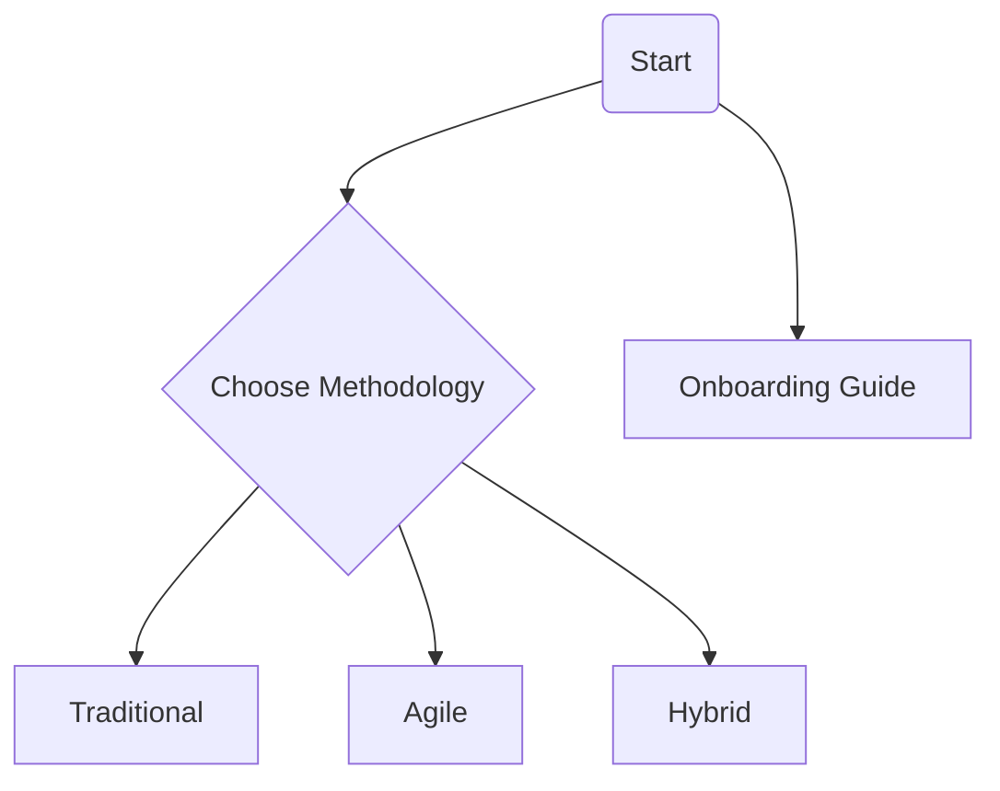

# Project Management Tools & Templates

> A curated collection of 170+ battle-tested, open-source templates for project and program managers. Practical, vendor-agnostic, and ready to customize.

## 🆕 What's New in Production

**Latest Release: Template Curation Dashboard & Community Systems** *(August 2025)*

### 🎯 **Template Marketplace Infrastructure**
- **📊 Interactive Curation Dashboard** - Real-time analytics for 200+ templates with tier-based classification
- **⭐ Rating & Review System** - 5-star scoring with automated quality assessment across UX, Functionality, and Documentation
- **🔍 Quality Assurance Automation** - GitHub workflows for template validation, expert review, and peer assignment
- **💰 Monetization Framework** - Complete pricing models with revenue sharing (70/30 split) and subscription tiers

### 🤝 **Community Engagement Platform**
- **🎪 Community Events Program** - Monthly calls, workshops, expert office hours, and networking events
- **🏆 Gamification System** - Points, badges, leaderboards, and recognition for community contributors
- **🔄 Feedback Processing** - Automated classification and routing of community feedback with deduplication
- **👥 Expert Review Workflows** - Peer review assignment and validation processes

### 🚀 **Production-Ready Features**
- **Backend API** - Template metadata extraction and scoring algorithms
- **GitHub Integration** - Analytics workflows and automated quality assurance
- **Local Development** - Complete setup with `npm run dev` (Dashboard at localhost:8080)
- **Documentation** - Comprehensive guides for setup, usage, and contribution

### 🎯 **Try It Now**
**👉 [5-Minute Quick Start](docs/community/QUICK_START.md)** - Get the dashboard running locally  
**👉 [Complete Setup Guide](docs/community/community-platform-guide.md)** - Full deployment documentation  
**👉 [Community Hub](docs/community/README.md)** - Join our community platform

*Ready for community launch with scalable infrastructure supporting template contribution, curation, and monetization.*

---

### Change Log
- Added audience introduction and accessibility badge.
- Created quick reference table and table of contents.
- Fixed broken links and removed outdated references.
- Added Getting Started and Support sections.

## Table of Contents
- [What's New in Production](#whats-new-in-production)
- [Quick Start Guide](#quick-start-guide)
- [Getting Started](#getting-started)
- [Core Template Collections](#choose-your-path)
- [Specialized Collections](#industry-specific-templates)
- [Template Index](TEMPLATE_INDEX.md)
- [Help \u0026 Support](#help-support)
- [Repository Statistics](#featured-resources)
- [Next-Generation Features & Roadmap](#next-generation-features-roadmap)
- [Community \u0026 Contributions](#community-contributions)

## Quick Reference
| Template | Scenario / Methodology | Phase | Complexity |
| --- | --- | --- | --- |
| [Project Charter Template](/templates/traditional/Process_Groups/Initiating/project_charter_template.md) | Formal project initiation (Traditional) | Initiating | Beginner |
| [Stakeholder Register](templates/project-lifecycle/01-initiation/stakeholder-analysis/stakeholder-register-template.md) | Identify and analyze stakeholders (Traditional) | Initiating | Beginner |
| [Work Breakdown Structure](/templates/traditional/Process_Groups/Planning/work_breakdown_structure_template.md) | Decompose deliverables into tasks (Traditional) | Planning | Intermediate |
| [Sprint Planning Template](/templates/agile/Templates/sprint_planning_template.md) | Plan sprint goals and backlog (Agile) | Executing | Beginner |
| [Hybrid Project Charter](/templates/hybrid/Templates/hybrid-project-charter-metadata-template.md) | Kick off a hybrid project (Hybrid) | Initiating | Intermediate |
| [CI/CD Pipeline Planning](templates/all/cicd_pipeline_planning_template.md) | Design automated delivery pipeline (DevOps) | Planning | Advanced |
| [Executive Dashboard Workbook](templates/business-stakeholder/executive-dashboards/Excel/Executive-Dashboard-Workbook.md) | Report progress to leadership | Monitoring & Controlling | Intermediate |

| [Risk Register](/templates/traditional/Templates/risk_register_template.md) | Track and mitigate risks | Planning | Intermediate |

See the [Template Index](TEMPLATE_INDEX.md) for a full alphabetical list of templates.
🌌 The world's most intelligent project management ecosystem 

**From Templates to Revolutionary Intelligence:** We're transforming from a simple template library into a comprehensive project management platform that combines 80+ proven templates with cutting-edge AI, machine learning, blockchain technology, digital twins, knowledge graphs, and immersive AR/VR experiences.

🎯 **Current Status:** Production-ready templates with AI-powered insights (Phase 2: 40% complete)  
🚀 **Roadmap:** 31 revolutionary enhancements across 5 phases (2025-2027)  
💡 **Vision:** Pioneer the future of project management through revolutionary technologies  
🌟 **Target:** Complete ecosystem transformation by 2027 with next-generation PM intelligence

---

## 🚀 Quick Start

### New to Project Management?
👉 **[Start Here: Getting Started Guide](docs/getting-started/README.md)**

### Need Templates Now?
👉 **[Find Templates: Template Selector](docs/getting-started/template-selector.md)**

### Choosing Your Methodology?
👉 **[Decide: Methodology Selector](docs/getting-started/methodology-selector.md)**

---

## 🚀 Quick Start Guide

### 👋 New to Project Management?
**[📖 Getting Started Guide](docs/getting-started/README.md)** - Complete beginner's roadmap

### 🎯 Need Templates Now?

**[🔍 Template Selector Tool](docs/getting-started/template-selector.md)** - Find templates for your specific needs

### 🤔 Which Methodology?
**[⚖️ Methodology Decision Guide](docs/getting-started/methodology-selector.md)** - Traditional vs Agile vs Hybrid comparison

### 📊 Executive Communication?

**[💼 Business Stakeholder Suite](templates/business-stakeholder/README.md)** - Professional dashboards and reports

=======
**[Dashboard MVP Demo](docs/dashboard-mvp-demo.md)** - Run the interactive project health dashboard

## Getting Started
1. **Clone or Download** - Click the **Code** button or run `git clone https://github.com/mirichard/pm-tools-templates.git`.
2. **Choose a Template** - Use the [Template Selector Tool](docs/getting-started/template-selector.md) or the quick reference table.
3. **Download a Single Template** - Open the template link and select **Raw** > **Download**.
4. **Download All Templates** - [Download ZIP](https://github.com/mirichard/pm-tools-templates/archive/refs/heads/main.zip) or `git clone` for the latest.
5. **Customize & Use** - Edit templates to fit your project. See the [Getting Started Guide](docs/getting-started/README.md).
6. **Expert Workflow** - Automate with GitHub Actions or integrate with your toolchain.
7. **Export to Word/Excel/PowerPoint** - See [Exporting Templates](docs/exporting-templates.md).

### 🧠 Need AI-Powered Insights?

**[🤖 AI-Powered Project Intelligence](ai-insights/README.md)** - Advanced project analytics and predictive insights

---

## 📚 Library Organization

This library is organized around **how project managers actually work**, not just methodology theory:

#### Project Phases & Key Templates:

**Initiating**
 - [Project Charter Template](/templates/traditional/Process_Groups/Initiating/project_charter_template.md) - Professional project authorization
 - [Stakeholder Register](templates/project-lifecycle/01-initiation/stakeholder-analysis/stakeholder-register-template.md) - Stakeholder identification & analysis

**Planning**
 - [Work Breakdown Structure](/templates/traditional/Process_Groups/Planning/work_breakdown_structure_template.md) - Project decomposition
 - [Project Schedule Template](/templates/traditional/Process_Groups/Planning/project_schedule_template.md) - Timeline & milestone planning
 - [Project Management Plan](/templates/traditional/Process_Groups/Planning/project_management_plan_template.md) - Comprehensive planning document
 - [Stakeholder Communication Planning](/templates/traditional/Process_Groups/Planning/stakeholder_communication_planning.md) - Communication strategy

**Executing**
 - [Project Execution Status Report](/templates/traditional/Process_Groups/Executing/project_execution_status_report_template.md) - Execution tracking
 - [Requirements Traceability Matrix](/templates/traditional/Process_Groups/Executing/requirements_traceability_matrix_template.md) - Requirements tracking
- [Team Performance Assessment](/templates/traditional/Process_Groups/Executing/team_performance_assessment_template.md) - Team evaluation

**Monitoring & Controlling**
 - [Project Performance Monitoring](/templates/traditional/Process_Groups/Monitoring_and_Controlling/project_performance_monitoring_template.md) - Performance tracking
- [Status Report Template](/templates/traditional/Templates/status_report_template.md) - Progress reporting
- [Change Request Template](/templates/traditional/Templates/change_request_template.md) - Change management
- [Issue Log Template](/templates/traditional/Templates/issue_log_template.md) - Issue tracking

**Closing**
 - [Project Closure Report](/templates/traditional/Process_Groups/Closing/project_closure_report_template.md) - Project finalization

**Additional Templates**
- [Risk Register](/templates/traditional/Templates/risk_register_template.md) - Risk management
- [Communication Plan](/templates/traditional/Templates/communication_plan_template.md) - Communication strategy
- [Change Management Plan](/templates/traditional/Templates/change_management_plan_template.md) - Change strategy
- [UAT Strategy Template](/Traditional/Templates/uat_strategy_template.md) | Strategy Development | Advanced | Strategic planning framework for large programs |
- [UAT Plan Template](/Traditional/Templates/uat_plan_template.md) | Tactical Planning | Intermediate | Detailed execution planning for UAT implementation |
- [Project Roadmap](/templates/traditional/Templates/project_roadmap_template.md) - High-level timeline
=======
| Template | Phase | Complexity | Summary |
| --- | --- | --- | --- |
| [Project Charter Template](/templates/traditional/Process_Groups/Initiating/project_charter_template.md) | Initiating | Beginner | Formal project authorization |
| [Stakeholder Register](templates/project-lifecycle/01-initiation/stakeholder-analysis/stakeholder-register-template.md) | Initiating | Beginner | Stakeholder identification & analysis |
| [Work Breakdown Structure](/templates/traditional/Process_Groups/Planning/work_breakdown_structure_template.md) | Planning | Intermediate | Project decomposition |
| [Project Schedule Template](/templates/traditional/Process_Groups/Planning/project_schedule_template.md) | Planning | Intermediate | Timeline & milestone planning |
| [Project Management Plan](/templates/traditional/Process_Groups/Planning/project_management_plan_template.md) | Planning | Advanced | Comprehensive planning document |
| [Stakeholder Communication Planning](/templates/traditional/Process_Groups/Planning/stakeholder_communication_planning.md) | Planning | Intermediate | Communication strategy |
| [Project Execution Status Report](/templates/traditional/Process_Groups/Executing/project_execution_status_report_template.md) | Executing | Intermediate | Execution tracking |
| [Requirements Traceability Matrix](/templates/traditional/Process_Groups/Executing/requirements_traceability_matrix_template.md) | Executing | Advanced | Requirements tracking |
| [Project Performance Monitoring](/templates/traditional/Process_Groups/Monitoring_and_Controlling/project_performance_monitoring_template.md) | Monitoring & Controlling | Advanced | Performance tracking |
| [Status Report Template](/templates/traditional/Templates/status_report_template.md) | Monitoring & Controlling | Beginner | Progress reporting |
| [Change Request Template](/templates/traditional/Templates/change_request_template.md) | Monitoring & Controlling | Intermediate | Change management |
| [Issue Log Template](/templates/traditional/Templates/issue_log_template.md) | Monitoring & Controlling | Beginner | Issue tracking |
| [Project Closure Report](/templates/traditional/Process_Groups/Closing/project_closure_report_template.md) | Closing | Intermediate | Project finalization |
| [Risk Register](/templates/traditional/Templates/risk_register_template.md) | Planning | Intermediate | Risk management |
| [Communication Plan](/templates/traditional/Templates/communication_plan_template.md) | Planning | Intermediate | Communication strategy |
| [Change Management Plan](/templates/traditional/Templates/change_management_plan_template.md) | Planning | Advanced | Change strategy |
| [UAT Plan](/templates/traditional/Templates/uat_plan_template.md) | Executing | Intermediate | User acceptance testing |
| [Project Roadmap](/templates/traditional/Templates/project_roadmap_template.md) | Planning | Beginner | High-level timeline |

### 🌀 Agile Templates

**Iterative and adaptive project management**

| Template | Phase | Complexity | Summary |
| --- | --- | --- | --- |
| [Product Backlog Template](/templates/agile/Templates/product_backlog_template.md) | Planning | Beginner | Feature & requirement management |
| [Sprint Planning Template](/templates/agile/Templates/sprint_planning_template.md) | Executing | Beginner | Sprint initiation & goal setting |
| [Sprint Review Template](/templates/agile/Templates/sprint_review_template.md) | Executing | Beginner | Sprint demonstration & feedback |
| [Sprint Retrospective Template](/templates/agile/Templates/sprint_retrospective_template.md) | Monitoring & Controlling | Beginner | Team improvement |
| [Stakeholder Communication Planning](/templates/agile/Templates/stakeholder_communication_planning.md) | Planning | Intermediate | Agile communication |
| [Change Vision Canvas](/templates/agile/Tools/change_vision_canvas.md) | Initiating | Intermediate | Organizational change visualization |
| [UAT Feedback Canvas](/templates/agile/Tools/uat_feedback_canvas.md) | Monitoring & Controlling | Intermediate | User acceptance feedback |
### 🔄 Hybrid Templates
**Combined traditional and agile approaches**

#### Hybrid Project Templates:

| Template | Phase | Complexity | Summary |
| --- | --- | --- | --- |
| [Hybrid Project Charter](/templates/hybrid/Templates/hybrid-project-charter-metadata-template.md) | Initiating | Intermediate | Flexible project initiation |
| [Hybrid Release Planning](/templates/hybrid/Templates/hybrid-release-planning-template.md) | Planning | Intermediate | Multi-methodology release planning |
| [Hybrid Team Management](/templates/hybrid/Templates/hybrid-team-management-template.md) | Executing | Intermediate | Cross-methodology team leadership |
| [Hybrid Quality Management](/templates/hybrid/Templates/hybrid-quality-management-template.md) | Executing | Intermediate | Quality across methodologies |
| [Integrated Change Strategy](/templates/hybrid/Templates/integrated_change_strategy_template.md) | Executing | Advanced | Change management |
| [Progressive Acceptance Plan](/templates/hybrid/Templates/progressive_acceptance_plan_template.md) | Closing | Intermediate | Iterative acceptance |
| [Stakeholder Communication Planning](/templates/hybrid/Templates/stakeholder_communication_planning.md) | Planning | Intermediate | Hybrid communication |

#### Tool Integration:
#### [Agile Scaling Frameworks](methodology-frameworks/agile-scrum/README.md)
**Large-scale agile implementation patterns**

**SAFe (Scaled Agile Framework):**
- [SAFe Program Increment Planning](templates/all/safe-program-increment-planning-template.md) - PI planning and coordination
- [SAFe Portfolio Kanban](templates/all/safe-portfolio-kanban-template.md) - Portfolio-level management
- [SAFe ART Coordination](templates/all/safe-art-coordination-template.md) - Agile Release Train management
- [SAFe Metrics Dashboard](templates/all/safe-metrics-reporting-template.md) - Scaled metrics and reporting

**LeSS (Large-Scale Scrum):**

- [LeSS Sprint Planning](templates/all/less-sprint-planning-template.md) - Multi-team sprint planning
- [Overall Product Backlog Management](templates/all/overall_product_backlog_template.md) - Large-scale backlog coordination
- [LeSS Retrospective](templates/all/less-retrospective-template.md) - Organization-wide improvement
- [Cross-Team Coordination](templates/all/cross_team_coordination_template.md) - Team synchronization

- [LeSS Adoption Roadmap](quick-start-kits/less-adoption/README.md) - Transformation planning

#### [DevOps Integration](methodology-frameworks/emerging-methods/devops/README.md)
**Modern software delivery and operations practices**

**Core DevOps Templates:**
- [CI/CD Pipeline Planning](templates/all/cicd_pipeline_planning_template.md) - Automated delivery pipelines
- [Release Management Workflow](templates/all/release_management_template.md) - Release orchestration and coordination
- [DevOps Monitoring and Alerting](templates/all/monitoring_alerting_template.md) - Observability and incident response

- [Infrastructure as Code](templates/all/infrastructure_as_code_template.md) - Infrastructure automation and management
- [DevSecOps Integration](templates/all/devsecops_template.md) - Security-first development practices

---

## 🎯 Choose Your Path

### By Experience Level

**👋 New Project Manager**
1. Read [Getting Started Guide](docs/getting-started/README.md)
2. Use [Template Selector](docs/getting-started/template-selector.md)
3. Start with [Project Charter](templates/project-lifecycle/01-initiation/project-charter/)
4. Build skills with [Project Manager Toolkit](templates/role-based/project-manager/)

**🔥 Experienced PM**
- Browse [Role-Based Toolkits](templates/role-based/) for advanced templates
2. Explore [Business Stakeholder Suite](templates/business-stakeholder/) for executive communication
3. Check [Industry Specializations](industry_templates/) for your field
4. Use [Integration Guides](integration_guides/) for tool automation

**🎯 Executive/Sponsor**
1. Go directly to [Business Stakeholder Suite](templates/business-stakeholder/)
2. Use [Executive Dashboards](templates/business-stakeholder/executive-dashboards/) for reporting
3. Implement [Financial Governance](templates/business-stakeholder/financial-governance/) for oversight
4. Check [Strategic Alignment](templates/business-stakeholder/strategic-alignment/) tools

### By Project Type

**🏗️ Traditional/Waterfall Project**
- Start: [Methodology Selector](docs/getting-started/methodology-selector.md) → Traditional
- Templates: [Project Lifecycle](templates/project-lifecycle/) + [Project Manager Toolkit](templates/role-based/project-manager/)
- Governance: [Executive Dashboards](templates/business-stakeholder/executive-dashboards/)

**🌀 Agile/Scrum Project**
- Start: [Methodology Selector](docs/getting-started/methodology-selector.md) → Agile
- Templates: [Agile Templates](/templates/agile/) + [Scrum Resources](templates/role-based/)
- Metrics: [Agile-Adapted Dashboards](templates/business-stakeholder/executive-dashboards/)

### 🔍 Project Assessment Suite
**Systematic project health monitoring and corrective action framework**

[**Project Assessment Suite Overview**](project-assessment-suite/README.md)

**For Program Managers assessing projects in motion:**
- [Project Health Assessment Template](templates/all/project-health-assessment-template.md) - Comprehensive 10-dimension project evaluation
- [Gap Analysis Matrix](templates/all/gap-analysis-matrix-template.md) - Current vs. future state analysis with prioritization
- [Remediation Action Plan](templates/all/remediation-action-plan-template.md) - Structured improvement planning and tracking
- [Assessment Planning Guide](project-assessment-suite/assessment-planning-guide.md) - Step-by-step assessment methodology
- [Executive Summary Template](templates/all/executive-summary-template.md) - Leadership reporting format

**Key Features:**
✅ **Systematic Assessment Framework** - 5-phase methodology from current state to remediation tracking  
✅ **Leading Practice Integration** - Built on Industry Standard, Agile, and industry best practices  
✅ **Evidence-Based Evaluation** - Structured scoring and gap prioritization  
✅ **Actionable Outcomes** - Prioritized improvement plans with resource requirements  
✅ **Executive Communication** - Professional reporting for all stakeholder levels  
✅ **Methodology Agnostic** - Works with Agile, Waterfall, or Hybrid approaches  

*Ideal for program managers conducting health checks, investigating issues, or implementing systematic improvements across project portfolios.*

### 🏭 Industry-Specific Templates
**Specialized templates for industry requirements**

#### [Information Technology](industry_templates/information_technology/README.md)
- [IT Project Charter](industry_templates/information_technology/it_project_charter.md)
- [IT Risk Register](industry_templates/information_technology/it_risk_register.md)

#### [Healthcare & Pharmaceutical](industry_templates/healthcare_pharmaceutical/README.md)
- [Clinical Trial Project Charter](industry_templates/healthcare_pharmaceutical/clinical_trial_project_charter.md)
- [GxP Compliance Checklist](industry_templates/healthcare_pharmaceutical/gxp_compliance_checklist.md)
- [Healthcare Risk Register](industry_templates/healthcare_pharmaceutical/healthcare_risk_register.md)

- [Validation Master Plan](industry_templates/healthcare_pharmaceutical/validation_master_plan.md)

#### [Financial Services](industry_templates/financial_services/README.md)
- [Financial Services Project Charter](industry_templates/financial_services/financial_services_project_charter.md)

#### [Construction](industry_templates/construction/README.md)

- [Construction Project Charter](industry_templates/construction/construction_project_charter.md)

- [Construction Risk Register](industry_templates/construction/construction_risk_register.md)
- [Construction Work Breakdown Structure](industry_templates/construction/construction_wbs.md)

#### [Software Development](industry_templates/software_development/README.md)
- [Software Project Charter](industry_templates/software_development/software_project_charter.md)
- [Software Risk Register](industry_templates/software_development/software_risk_register.md)
- [Software Test Plan](industry_templates/software_development/software_test_plan.md)
- [User Story Template](industry_templates/software_development/user_story_template.md)
- [Architecture Decision Record](industry_templates/software_development/architecture_decision_record.md)
- [CI/CD Pipeline Definition](industry_templates/software_development/ci_cd_pipeline_definition.md)
- [Technical Debt Log](industry_templates/software_development/technical_debt_log.md)

### 🔧 Tool Integration Guides

**Setup guides for popular PM tools**

- [Microsoft Project Integration](integration_guides/microsoft_project_integration/README.md)
- [Jira Integration](integration_guides/jira_integration/README.md)
- [GitHub Projects Integration](integration_guides/github_projects_integration/README.md)

- [Trello Integration](integration_guides/trello_integration/README.md)
- [Integration Examples](integration-examples/README.md)

#### GitHub Integration Templates:
- [Agile GitHub Templates](integration_guides/github_integration/agile-github-templates-template.md)
- [Traditional GitHub Templates](integration_guides/github_integration/traditional-github-templates-template.md)
- [Hybrid GitHub Templates](integration_guides/github_integration/hybrid-github-templates-template.md)

- [GitHub Project Management Integration](integration_guides/github_integration/github_project_management_integration.md)

### 🚀 Quick Start Kits
**Everything you need to get started immediately**

#### [First-Time PM Starter Kit](quick-start-kits/first-time-pm-starter/README.md)

- [Simple Project Charter](quick-start-kits/first-time-pm-starter/project-charter-simple.md)
- [Simple Stakeholder Register](quick-start-kits/first-time-pm-starter/stakeholder-register-simple.md)
- [PM Checklist](quick-start-kits/first-time-pm-starter/pm-checklist.md)

#### [Agile Transformation Kit](quick-start-kits/agile-transformation/README.md)

### 🎭 Role-Based Toolkits
**Curated collections for specific roles**

- [Role-Based Toolkits Overview](templates/role-based/README.md)
- [Project Manager Toolkit](templates/role-based/project-manager/README.md)
  - [Essential Templates](templates/role-based/project-manager/essential-templates/README.md)

  - [Reporting Dashboards](templates/role-based/project-manager/reporting-dashboards/README.md)
  - [Governance Tools](templates/role-based/project-manager/governance-tools/README.md)
  - [Stakeholder Engagement](templates/role-based/project-manager/stakeholder-engagement/README.md)

---

## 🌟 Featured Resources

### 📊 Most Popular Templates
1. **[Project Charter](templates/project-lifecycle/01-initiation/project-charter/)** - Start any project right
2. **[Executive Dashboard](templates/business-stakeholder/executive-dashboards/)** - Keep leadership informed
3. **[Communication Plan](templates/project-lifecycle/02-planning/communication-planning/)** - Stakeholder engagement
4. **[Risk Register](templates/project-lifecycle/02-planning/risk-management/)** - Identify and manage risks
5. **[Status Reports](templates/role-based/project-manager/reporting-dashboards/)** - Regular progress updates

### 🔧 Ready-to-Use Kits
- **[First-Time PM Starter Kit](quick-start-kits/first-time-pm-starter/)** - Everything for new project managers
- **[Agile Transformation Kit](quick-start-kits/agile-transformation/)** - Change management + templates
- **[Business Stakeholder Suite](templates/business-stakeholder/)** - Executive communication tools
- **[Integration Guides](integration_guides/)** - Tool-specific templates

### 🏭 Industry Specializations
- **[Information Technology](industry_templates/information_technology/)** - Software and systems
- **[Healthcare & Pharmaceutical](industry_templates/healthcare_pharmaceutical/)** - Regulated environments
- **[Financial Services](industry_templates/financial_services/)** - Banking and fintech
- **[Construction & Engineering](industry_templates/construction/)** - Physical projects

---

## 🎓 Learning & Development

### Progressive Learning Paths

### 🔥 **Experienced PM (2+ years)**
1. [Methodology Decision Guide](docs/getting-started/methodology-selector.md)
2. [Business Stakeholder Suite](templates/business-stakeholder/README.md)
3. [Industry-Specific Templates](industry_templates/)
4. [Role-Based Toolkits](templates/role-based/README.md)

**Advanced PM Practice**
1. [Program Management](templates/role-based/)
2. [Hybrid Methodologies](/templates/hybrid/)
3. [Executive Communication](templates/business-stakeholder/)
4. [Organizational Change Management](organizational_change_management_framework.md)

**Agile Specialization**
1. [Scrum Master Skills](templates/role-based/)
2. [Product Owner Practice](templates/role-based/)
3. [Agile Templates](/templates/agile/)
4. [Agile Tools](/templates/agile/Tools/)

### Implementation Support
- **[Change Management](organizational_change_management_framework.md)** - Rolling out new practices
- **[Training Programs](docs/implementation/)** - Skill development
- **[Repository Status](REPOSITORY_STATUS.md)** - Current implementation status
- **[Implementation Guide](IMPLEMENTATION_STATUS.md)** - Building PM capability

---

## 🔗 Integration & Tools

### Popular Tool Integrations
- **[Microsoft Project](integration_guides/microsoft_project_integration/)** - Traditional planning
- **[Jira & Confluence](integration_guides/jira_integration/)** - Agile delivery
- **[GitHub Projects](integration_guides/github_projects_integration/)** - Development workflows
- **[Trello Integration](integration_guides/trello_integration/)** - Simple project tracking

### Automation Options
- **[GitHub Integration Templates](integration_guides/github_integration/)** - Development workflows
- **[Email Templates](templates/business-stakeholder/communication-automation/email-templates/)** - Stakeholder updates (coming soon)
- **[Automated Reporting](integration_guides/)** - Dashboard automation
- **[Custom Templates](docs/implementation/)** - Tailored solutions

---

## 🆘 Help & Support

### Getting Started
1. **Start simple** - Choose 3-5 core templates initially
2. **Know your methodology** - Use the [Methodology Selector](docs/getting-started/methodology-selector.md)
3. **Focus on communication** - Most failures are communication failures
4. **Iterate and improve** - Adapt templates to your organization

### Need more help?
- [Open an Issue](https://github.com/mirichard/pm-tools-templates/issues/new) for bug reports or questions.
- Participate in our [Discussions](https://github.com/mirichard/pm-tools-templates/discussions) to share tips or request new templates.

### 🔗 **Documentation & Reference**
- [📚 Complete Documentation](docs/README.md)
- [📝 Navigation Guide](NAVIGATION_GUIDE.md)

- [📈 Repository Status](REPOSITORY_STATUS.md)
- [🗺️ Roadmap](ROADMAP.md)
- [📋 Template Feedback](docs/feedback/template-feedback.md)

---

## 🆘 Need Help?

### Common Questions
1. **"Which methodology should I use?"** → [Methodology Selector](docs/getting-started/methodology-selector.md)
2. **"What templates do I need?"** → [Template Selector](docs/getting-started/template-selector.md)
3. **"How do I implement this?"** → [Implementation Guide](docs/implementation/)
4. **"How do I report to executives?"** → [Business Stakeholder Suite](templates/business-stakeholder/)

### Quick Links
- [📚 Full Documentation](docs/)
- [🎯 Template Index](docs/getting-started/template-selector.md#template-index)
- [📊 Examples & Case Studies](examples-case-studies/)
- [🔧 Tool Integration Guides](integration_guides/)

---

## 🚀 Next-Generation Features & Roadmap

- **150+ Templates** across all methodologies and roles
- **5 Major Toolkits** for different PM roles
- **7 Industry Specializations** with adapted templates
- **20+ Tool Integrations** for popular PM software
- **Methodology-Agnostic** design for maximum flexibility

---

## 🤝 Community & Contributions

### 📝 Share Your Experience
Help us improve these templates by sharing your experience:

- **[Template Feedback Form](docs/feedback/template-feedback.md)** - Rate and review templates you've used
- **[Success Stories](docs/feedback/success-stories.md)** - Share how templates helped your projects
- **[Improvement Suggestions](docs/feedback/improvement-suggestions.md)** - Suggest enhancements
- **[New Template Requests](docs/feedback/template-requests.md)** - Request templates for specific needs

### 🔄 Continuous Improvement
We use your feedback to:
- **Simplify** complex templates based on usage patterns
- **Enhance** templates with real-world learnings
- **Create** new templates for emerging needs
- **Prioritize** development based on community demand

### 🚀 Contributing Templates
We welcome contributions that help the PM community! Please:
- Follow existing template structures and naming conventions
- Include clear documentation and usage guidance
- Test templates in real project scenarios
- Ensure content is original or properly licensed

See our [Contributing Guidelines](docs/implementation/) for details.

### 📊 Usage Analytics
We track (anonymously) which templates are most valuable:
- **Most Downloaded:** Project Charter, Executive Dashboard, Communication Plan
- **Highest Rated:** First-Time PM Kit, Agile Transformation Kit, Risk Register
- **Growing Demand:** Hybrid templates, Remote team tools, DevOps integration

*Your feedback directly influences our development priorities!*

---

*This library represents years of project management practice and follows industry standards from Industry Standard, Scrum Alliance, and SAFe. It's designed to be practical, scalable, and immediately useful for project managers at all experience levels.*

**Last Updated:** June 2025 | **Version:** 2.0 | **Reorganization:** User-Centric Design

# Trigger GitHub Actions update
# Trigger workflow refresh
