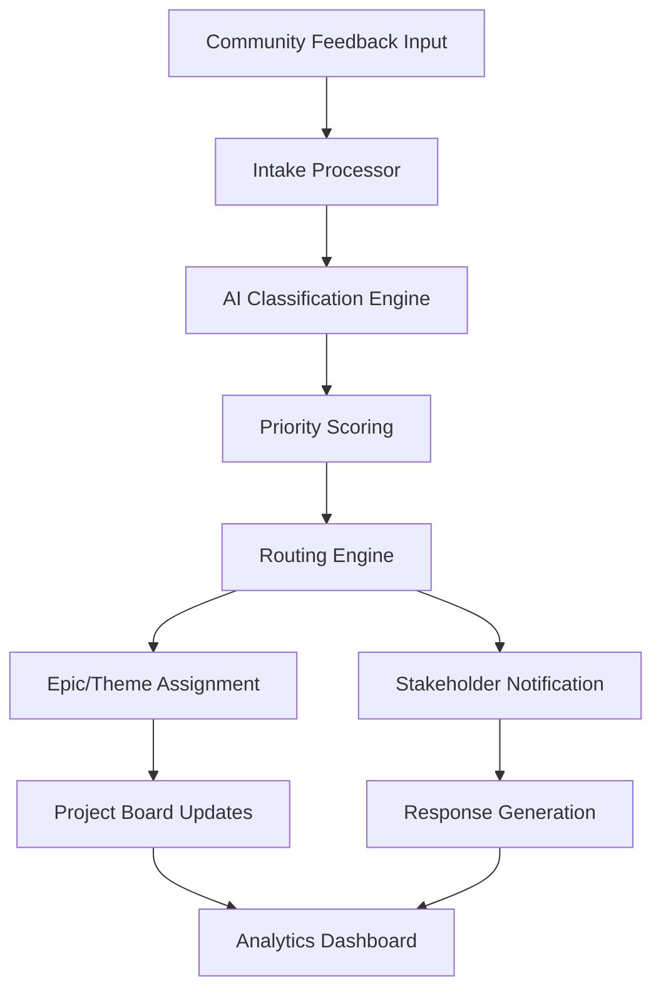

# Community Feedback Processing System
**Design Document v1.0**

**Status:** Active Development  
**Issue Reference:** #198  
**Q3 Delivery Cycle Integration:** ✅ Active  
**Leading Practices Alignment:** ITIL, Agile/DevOps, Community Management

---

## 🎯 System Overview

### **Purpose**
Automated system for collecting, processing, and routing community feedback from repository users directly into development workflows and roadmap planning.

### **Scope**
- **Feedback Collection**: Structured templates and automated intake
- **Processing Automation**: Categorization, priority scoring, and routing
- **Integration**: Direct connection to Q3 Delivery Cycle and project boards
- **Analytics**: Feedback trends and impact measurement

### **Success Criteria**
- 90% of feedback automatically categorized within 5 minutes
- 100% of feedback routed to appropriate development themes
- Monthly feedback analytics integrated into roadmap planning
- <24 hour response time for high-priority feedback

---

## 🏗️ System Architecture

### **Component Overview**


### **Core Components**

#### 1. **Feedback Intake Processor**
- **Trigger**: Comments on Issue #198 or new feedback issues
- **Function**: Parse structured feedback using templates
- **Output**: Normalized feedback data structure

#### 2. **AI Classification Engine**
- **Technology**: GitHub Copilot/OpenAI integration
- **Function**: Categorize feedback into predefined categories
- **Categories**:
  - 🎯 Template Requests
  - 🔧 Process Improvements  
  - 🐛 Bug Reports
  - 💡 Feature Ideas
  - 📚 Documentation Issues
  - 🚀 Performance/Automation
  - 🎨 UX/Usability
  - 🔗 Integration Requests

#### 3. **Priority Scoring Algorithm**
- **Business Impact**: High/Medium/Low
- **Implementation Effort**: E1-E4 (T-shirt sizing)
- **Community Demand**: Vote count, +1 reactions
- **Strategic Alignment**: Roadmap theme match
- **Final Score**: S1-S4 severity classification

#### 4. **Routing Engine**
- **Epic Assignment**: Auto-assign to relevant epic based on category
- **Stakeholder Notification**: Alert epic owners and theme leads
- **Board Updates**: Create/update corresponding project board items

---

## 🤖 Automation Workflows

### **Workflow 1: Feedback Processing Pipeline**

**File**: `.github/workflows/feedback-processor.yml`

```yaml
name: Community Feedback Processor
on:
  issue_comment:
    types: [created]
  issues:
    types: [opened]

jobs:
  process-feedback:
    if: >
      github.event.issue.number == 198 || 
      contains(github.event.issue.labels.*.name, 'community-feedback')
    runs-on: ubuntu-latest
    steps:
      - name: Parse Feedback Content
        uses: actions/github-script@v7
        with:
          script: |
            // Extract structured feedback using templates
            const feedbackData = await parseFeedbackContent(context.payload)
            
      - name: AI Classification
        uses: actions/github-script@v7
        with:
          script: |
            // Use GitHub Copilot to categorize feedback
            const category = await classifyFeedback(feedbackData)
            const priority = await calculatePriorityScore(feedbackData)
            
      - name: Route to Epic
        uses: actions/github-script@v7
        with:
          script: |
            // Find matching epic and assign
            const epic = await findMatchingEpic(category)
            await assignToEpic(feedbackData, epic)
            await notifyStakeholders(epic.owner, feedbackData)
```

### **Workflow 2: Analytics Generation**

**File**: `.github/workflows/feedback-analytics.yml`

```yaml
name: Feedback Analytics Generator
on:
  schedule:
    - cron: '0 0 * * 1'  # Weekly on Monday
  workflow_dispatch:

jobs:
  generate-analytics:
    runs-on: ubuntu-latest
    steps:
      - name: Collect Feedback Data
        # Aggregate all feedback from past week
      - name: Create Analytics Report
        # Generate trends, categories, priority distribution
      - name: Update Dashboard
        # Update project dashboard with insights
      - name: Roadmap Integration
        # Create roadmap planning inputs
```

---

## 📊 Data Model

### **Feedback Entry Structure**
```json
{
  "id": "feedback-{timestamp}",
  "source": "issue-198-comment",
  "author": "github-username",
  "timestamp": "2025-08-05T00:34:11Z",
  "type": "improvement-suggestion",
  "category": "template-requests",
  "priority": "S2",
  "content": {
    "title": "Enhanced Risk Register Template",
    "description": "Need better Monte Carlo integration",
    "impact": "Medium",
    "effort": "E2"
  },
  "routing": {
    "epic": "#324-ai-risk-prediction",
    "theme": "ai-data-science",
    "assigned_to": "product-owner"
  },
  "status": "routed",
  "response_required": true
}
```

### **Analytics Schema**
```json
{
  "period": "2025-08-01/2025-08-07",
  "metrics": {
    "total_feedback": 15,
    "categories": {
      "template-requests": 6,
      "improvements": 4,
      "bugs": 2,
      "features": 3
    },
    "priorities": {
      "S1": 1,
      "S2": 8,
      "S3": 5,
      "S4": 1
    },
    "response_times": {
      "avg_hours": 4.2,
      "sla_compliance": 0.93
    }
  }
}
```

---

## 🎯 Integration Points

### **Q3 Delivery Cycle Integration**

#### **Sprint Planning Integration**
- **Feedback Backlog**: Auto-generated backlog items from community feedback
- **Priority Input**: Community demand scores influence sprint priorities
- **Epic Updates**: Feedback automatically updates epic descriptions and requirements

#### **Roadmap Planning**
- **Monthly Analytics**: Feedback trends inform quarterly roadmap adjustments
- **Community Demand Signals**: High-vote feedback items flagged for roadmap consideration
- **Strategic Alignment**: Feedback categorization maps to roadmap themes

### **Project Board Updates**
- **Kanban Integration**: Feedback items appear on project boards automatically
- **Status Tracking**: Feedback resolution tracked through board columns
- **Stakeholder Visibility**: Epic owners see pending feedback in their queues

---

## 🚀 Implementation Plan

### **Phase 1: Core Infrastructure (Week 1)**
- [ ] Create feedback processing GitHub Action
- [ ] Implement AI classification engine
- [ ] Set up data storage and retrieval
- [ ] Basic routing to existing epics

### **Phase 2: Advanced Features (Week 2)**
- [ ] Priority scoring algorithm
- [ ] Automated stakeholder notifications
- [ ] Project board integration
- [ ] Response template generation

### **Phase 3: Analytics & Optimization (Week 3)**
- [ ] Analytics dashboard implementation
- [ ] Weekly/monthly reporting automation
- [ ] Roadmap planning integration
- [ ] Performance monitoring and optimization

### **Phase 4: Testing & Deployment (Week 4)**
- [ ] End-to-end testing with mock feedback
- [ ] Community beta testing
- [ ] Performance optimization
- [ ] Production deployment

---

## 📋 Leading Practice Alignment

### **ITIL Service Management**
- **Incident Classification**: Structured categorization (Priority, Impact, Urgency)
- **Service Request Routing**: Automated assignment to appropriate teams
- **SLA Management**: Response time tracking and compliance monitoring
- **Knowledge Management**: Feedback patterns inform knowledge base improvements

### **Agile/DevOps Practices**
- **Continuous Feedback**: Real-time integration with development workflows
- **Customer Voice**: Direct community input into product backlogs
- **Rapid Response**: Automated processing reduces feedback-to-action time
- **Retrospective Integration**: Feedback analytics inform retrospective discussions

### **Community Management Best Practices**
- **Structured Engagement**: Clear templates and processes for feedback
- **Transparent Communication**: Public tracking of feedback status and resolution
- **Recognition**: Community contributors acknowledged in analytics reports
- **Feedback Loops**: Community members see impact of their suggestions

---

## 🎯 Success Metrics

### **Process Efficiency**
- **Processing Time**: <5 minutes from submission to routing
- **Classification Accuracy**: >90% correct categorization
- **Routing Accuracy**: >95% assigned to correct epic/theme
- **Response Time**: <24 hours for initial acknowledgment

### **Community Engagement**
- **Feedback Volume**: Target 10+ feedback items per month
- **Response Rate**: 100% feedback receives response
- **Resolution Rate**: 70% of actionable feedback implemented
- **Community Satisfaction**: >4.5/5 satisfaction score

### **Business Impact**
- **Roadmap Influence**: 25% of roadmap items influenced by community feedback
- **Quality Improvement**: Measurable template/tool improvements
- **Community Growth**: Increased repository engagement and contributions
- **Decision Speed**: Faster product decisions with community input

---

## 🔧 Technical Requirements

### **Dependencies**
- GitHub Actions (automation)
- GitHub API (issue management)
- GitHub Copilot/OpenAI (AI classification)
- Node.js (processing scripts)
- JSON storage (lightweight data persistence)

### **Permissions Required**
- Repository read/write access
- Issue creation and modification
- Project board updates
- GitHub API access tokens
- Notification permissions

### **Infrastructure**
- GitHub-hosted runners (no external infrastructure)
- Secrets management for API tokens
- Artifact storage for analytics data
- Webhook configuration for real-time processing

---

## 📚 Documentation & Training

### **User Documentation**
- **Feedback Submission Guide**: How to provide effective feedback
- **Template Library**: Examples of well-structured feedback
- **Process Overview**: What happens after feedback submission
- **FAQ**: Common questions about the feedback process

### **Administrator Documentation**
- **System Configuration**: Setup and maintenance procedures
- **Analytics Interpretation**: How to read and act on feedback analytics
- **Troubleshooting Guide**: Common issues and solutions
- **Performance Monitoring**: System health and optimization

---

## 🔄 Future Enhancements

### **Phase 2 Features**
- **Feedback Voting**: Community voting on submitted feedback
- **Advanced Analytics**: ML-powered trend analysis and prediction
- **Integration Expansion**: Connect with external project management tools
- **Mobile Optimization**: Mobile-friendly feedback submission

### **Community Features**
- **Feedback Leaderboards**: Recognition for valuable community contributors
- **Feedback Status Dashboard**: Public view of feedback processing status
- **Community Moderators**: Volunteer community members help triage feedback
- **Feedback Clustering**: Group similar feedback for efficient processing

---

**Document Owner**: Product Owner  
**Last Updated**: August 5, 2025  
**Review Cycle**: Bi-weekly during development, monthly after deployment  
**Approval Required**: Technical Lead, Community Manager

---

*This system transforms ad-hoc community feedback into a structured, automated process that directly improves the product while maintaining high community engagement and satisfaction.*
