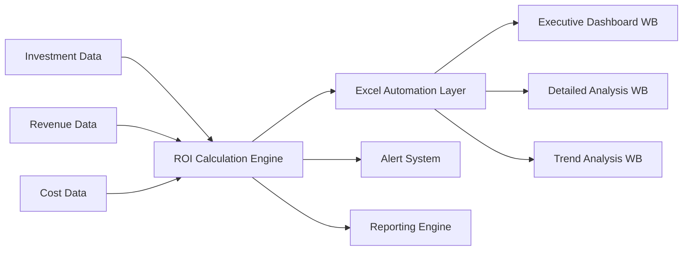

# ROI Tracking Automation System

## 📈 Overview

**Purpose:** Automated ROI calculation and tracking system with Excel integration  
**Integration:** Excel workbooks, financial systems, project management tools  
**Update Frequency:** Real-time with automated data refresh  
**Target Users:** CFO, Finance Directors, Investment Committee, Executive Team  

---

## 🏗️ System Architecture

### Core Components

```
┌─────────────────┐    ┌──────────────────┐    ┌─────────────────┐
│  Data Sources   │────│   ROI Engine     │────│ Excel Workbooks │
│                 │    │                  │    │                 │
│ • Financial DB  │    │ • ROI Calculator │    │ • Dashboard WB  │
│ • Project Data  │    │ • Trend Analysis │    │ • Detail WB     │
│ • Cost Centers  │    │ • Forecasting    │    │ • Summary WB    │
│ • Revenue Data  │    │ • Benchmarking   │    │ • Executive WB  │
└─────────────────┘    └──────────────────┘    └─────────────────┘
```

### Data Flow Pipeline



---

## 💰 ROI Calculation Framework

### Core ROI Metrics

#### 1. Standard ROI Calculations
```vba
' VBA Function for ROI Calculation
Function CalculateROI(Investment As Double, Returns As Double, Period As Integer) As Double
    ' Simple ROI: (Returns - Investment) / Investment * 100
    CalculateROI = ((Returns - Investment) / Investment) * 100
End Function

Function CalculateAnnualizedROI(Investment As Double, Returns As Double, Years As Double) As Double
    ' Annualized ROI: ((Returns / Investment) ^ (1 / Years)) - 1
    If Years > 0 And Investment > 0 Then
        CalculateAnnualizedROI = (((Returns / Investment) ^ (1 / Years)) - 1) * 100
    Else
        CalculateAnnualizedROI = 0
    End If
End Function

Function CalculateNPV(CashFlows As Range, DiscountRate As Double) As Double
    ' Net Present Value calculation
    Dim i As Integer
    Dim NPV As Double
    NPV = 0
    
    For i = 1 To CashFlows.Count
        NPV = NPV + (CashFlows.Cells(i, 1).Value / ((1 + DiscountRate) ^ (i - 1)))
    Next i
    
    CalculateNPV = NPV
End Function

Function CalculateIRR(CashFlows As Range) As Double
    ' Internal Rate of Return using Excel's built-in IRR function
    CalculateIRR = WorksheetFunction.IRR(CashFlows) * 100
End Function
```

#### 2. Advanced ROI Metrics
```vba
Function CalculateROAS(Revenue As Double, AdSpend As Double) As Double
    ' Return on Ad Spend: Revenue / Ad Spend
    If AdSpend > 0 Then
        CalculateROAS = Revenue / AdSpend
    Else
        CalculateROAS = 0
    End If
End Function

Function CalculateROCE(EBIT As Double, CapitalEmployed As Double) As Double
    ' Return on Capital Employed: EBIT / Capital Employed * 100
    If CapitalEmployed > 0 Then
        CalculateROCE = (EBIT / CapitalEmployed) * 100
    Else
        CalculateROCE = 0
    End If
End Function

Function CalculatePaybackPeriod(Investment As Double, AnnualCashFlow As Double) As Double
    ' Simple Payback Period: Investment / Annual Cash Flow
    If AnnualCashFlow > 0 Then
        CalculatePaybackPeriod = Investment / AnnualCashFlow
    Else
        CalculatePaybackPeriod = 0
    End If
End Function

Function CalculateDiscountedPayback(Investment As Double, CashFlows As Range, DiscountRate As Double) As Double
    ' Discounted Payback Period calculation
    Dim i As Integer
    Dim CumulativeNPV As Double
    CumulativeNPV = -Investment
    
    For i = 1 To CashFlows.Count
        CumulativeNPV = CumulativeNPV + (CashFlows.Cells(i, 1).Value / ((1 + DiscountRate) ^ i))
        If CumulativeNPV >= 0 Then
            CalculateDiscountedPayback = i
            Exit Function
        End If
    Next i
    
    CalculateDiscountedPayback = 0 ' Not recovered within period
End Function
```

---

## 📊 Automated Excel Workbook System

### 1. Executive ROI Dashboard Workbook

#### Workbook Structure
```vba
' Executive ROI Dashboard - Main Module
Option Explicit

' Global variables for data refresh
Public Const REFRESH_INTERVAL = 300000 ' 5 minutes in milliseconds
Public DataLastUpdated As Date
Public AutoRefreshEnabled As Boolean

Sub InitializeExecutiveDashboard()
    ' Initialize the executive dashboard
    Application.ScreenUpdating = False
    Application.Calculation = xlCalculationManual
    
    ' Set up worksheets
    Call SetupDashboardLayout
    Call ConfigureDataConnections
    Call EnableAutoRefresh
    Call FormatExecutiveView
    
    ' Initial data load
    Call RefreshAllROIData
    
    Application.Calculation = xlCalculationAutomatic
    Application.ScreenUpdating = True
    
    MsgBox "Executive ROI Dashboard initialized successfully!", vbInformation
End Sub

Sub SetupDashboardLayout()
    Dim ws As Worksheet
    
    ' Executive Summary Sheet
    Set ws = ThisWorkbook.Worksheets("Executive Summary")
    With ws
        .Range("A1").Value = "ROI EXECUTIVE DASHBOARD"
        .Range("A1").Font.Size = 18
        .Range("A1").Font.Bold = True
        
        ' Key metrics section
        .Range("A3").Value = "KEY METRICS"
        .Range("A4").Value = "Overall Portfolio ROI:"
        .Range("A5").Value = "Best Performing Investment:"
        .Range("A6").Value = "Worst Performing Investment:"
        .Range("A7").Value = "Total Investments:"
        .Range("A8").Value = "Total Returns:"
        .Range("A9").Value = "Net Gain/Loss:"
        
        ' Performance indicators
        .Range("D3").Value = "PERFORMANCE INDICATORS"
        .Range("D4").Value = "ROI Trend (12M):"
        .Range("D5").Value = "Risk-Adjusted Return:"
        .Range("D6").Value = "Benchmark Comparison:"
        .Range("D7").Value = "Forecast Accuracy:"
    End With
    
    ' Detailed Analysis Sheet
    Set ws = ThisWorkbook.Worksheets("Detailed Analysis")
    Call SetupDetailedAnalysisHeaders(ws)
    
    ' Trend Analysis Sheet
    Set ws = ThisWorkbook.Worksheets("Trend Analysis")
    Call SetupTrendAnalysisCharts(ws)
End Sub

Sub SetupDetailedAnalysisHeaders(ws As Worksheet)
    With ws
        ' Headers for detailed analysis
        .Range("A1:P1").Value = Array("Investment ID", "Investment Name", "Category", _
            "Initial Investment", "Current Value", "Total Returns", "ROI %", _
            "Annualized ROI %", "IRR %", "NPV", "Payback Period", "Risk Score", _
            "Status", "Start Date", "End Date", "Last Updated")
        
        ' Format headers
        With .Range("A1:P1")
            .Font.Bold = True
            .Interior.Color = RGB(68, 114, 196)
            .Font.Color = RGB(255, 255, 255)
            .Borders.LineStyle = xlContinuous
        End With
        
        ' Set column widths
        .Columns("A:P").AutoFit
    End With
End Sub
```

#### Real-Time Data Refresh System
```vba
Sub EnableAutoRefresh()
    AutoRefreshEnabled = True
    Call ScheduleRefresh
End Sub

Sub ScheduleRefresh()
    If AutoRefreshEnabled Then
        Application.OnTime Now + TimeValue("00:05:00"), "RefreshAllROIData"
    End If
End Sub

Sub RefreshAllROIData()
    On Error GoTo ErrorHandler
    
    Application.ScreenUpdating = False
    Application.StatusBar = "Refreshing ROI data..."
    
    ' Refresh data from various sources
    Call RefreshInvestmentData
    Call RefreshRevenueData
    Call RefreshCostData
    Call CalculateAllROIMetrics
    Call UpdateDashboardCharts
    Call CheckROIAlerts
    
    ' Update timestamp
    DataLastUpdated = Now
    ThisWorkbook.Worksheets("Executive Summary").Range("A12").Value = "Last Updated: " & DataLastUpdated
    
    ' Schedule next refresh
    Call ScheduleRefresh
    
    Application.StatusBar = "ROI data refresh completed at " & Format(Now, "hh:mm:ss")
    Application.ScreenUpdating = True
    Exit Sub
    
ErrorHandler:
    Application.ScreenUpdating = True
    Application.StatusBar = "Error refreshing ROI data: " & Err.Description
    Call LogError("RefreshAllROIData", Err.Description)
End Sub

Sub RefreshInvestmentData()
    ' Connect to investment database and refresh data
    Dim conn As Object
    Dim rs As Object
    Dim sql As String
    Dim ws As Worksheet
    
    Set ws = ThisWorkbook.Worksheets("Investment Data")
    Set conn = CreateObject("ADODB.Connection")
    Set rs = CreateObject("ADODB.Recordset")
    
    ' Database connection string (adjust for your database)
    conn.Open "Provider=SQLOLEDB;Data Source=your-server;Initial Catalog=InvestmentDB;Integrated Security=SSPI;"
    
    sql = "SELECT InvestmentID, InvestmentName, Category, InitialInvestment, " & _
          "CurrentValue, TotalReturns, StartDate, EndDate, RiskScore, Status " & _
          "FROM vw_ROI_Investment_Summary WHERE Status = 'Active'"
    
    rs.Open sql, conn
    
    ' Clear existing data
    ws.Range("A2:Z1000").Clear
    
    ' Copy data to worksheet
    If Not rs.EOF Then
        ws.Range("A2").CopyFromRecordset rs
    End If
    
    rs.Close
    conn.Close
    Set rs = Nothing
    Set conn = Nothing
End Sub

Sub CalculateAllROIMetrics()
    Dim ws As Worksheet
    Dim lastRow As Long
    Dim i As Long
    
    Set ws = ThisWorkbook.Worksheets("Investment Data")
    lastRow = ws.Cells(ws.Rows.Count, "A").End(xlUp).Row
    
    For i = 2 To lastRow
        ' Calculate ROI metrics for each investment
        Call CalculateInvestmentROI(ws, i)
    Next i
    
    ' Update summary metrics
    Call UpdateSummaryMetrics
End Sub

Sub CalculateInvestmentROI(ws As Worksheet, row As Long)
    Dim initialInvestment As Double
    Dim currentValue As Double
    Dim totalReturns As Double
    Dim startDate As Date
    Dim endDate As Date
    Dim years As Double
    
    ' Get values from worksheet
    initialInvestment = ws.Cells(row, 4).Value ' Column D
    currentValue = ws.Cells(row, 5).Value ' Column E
    totalReturns = ws.Cells(row, 6).Value ' Column F
    startDate = ws.Cells(row, 8).Value ' Column H
    
    If ws.Cells(row, 9).Value = "" Then
        endDate = Date
    Else
        endDate = ws.Cells(row, 9).Value ' Column I
    End If
    
    years = (endDate - startDate) / 365.25
    
    ' Calculate and populate ROI metrics
    ws.Cells(row, 7).Value = CalculateROI(initialInvestment, totalReturns, 1) ' ROI %
    ws.Cells(row, 11).Value = CalculateAnnualizedROI(initialInvestment, currentValue, years) ' Annualized ROI %
    ws.Cells(row, 13).Value = CalculatePaybackPeriod(initialInvestment, totalReturns / years) ' Payback Period
    
    ' Format cells
    ws.Range("G" & row & ":K" & row).NumberFormat = "0.00%"
    ws.Range("M" & row).NumberFormat = "0.00"
End Sub
```

### 2. Investment Portfolio Tracker

#### Portfolio Analysis Module
```vba
' Investment Portfolio Tracker - Portfolio Analysis Module
Option Explicit

Type InvestmentRecord
    ID As String
    Name As String
    Category As String
    InitialInvestment As Double
    CurrentValue As Double
    ROI As Double
    RiskScore As Double
    Status As String
End Type

Sub AnalyzePortfolioPerformance()
    Dim portfolio() As InvestmentRecord
    Dim portfolioSize As Integer
    Dim totalInvestment As Double
    Dim totalCurrentValue As Double
    Dim weightedROI As Double
    Dim riskAdjustedReturn As Double
    
    ' Load portfolio data
    portfolio = LoadPortfolioData(portfolioSize)
    
    ' Calculate portfolio metrics
    Call CalculatePortfolioMetrics(portfolio, portfolioSize, totalInvestment, _
                                  totalCurrentValue, weightedROI, riskAdjustedReturn)
    
    ' Update portfolio summary
    Call UpdatePortfolioSummary(totalInvestment, totalCurrentValue, _
                               weightedROI, riskAdjustedReturn)
    
    ' Generate portfolio analysis charts
    Call CreatePortfolioCharts(portfolio, portfolioSize)
    
    ' Check for rebalancing opportunities
    Call CheckRebalancingOpportunities(portfolio, portfolioSize)
End Sub

Function LoadPortfolioData(ByRef portfolioSize As Integer) As InvestmentRecord()
    Dim ws As Worksheet
    Dim lastRow As Long
    Dim i As Long
    Dim portfolio() As InvestmentRecord
    
    Set ws = ThisWorkbook.Worksheets("Investment Data")
    lastRow = ws.Cells(ws.Rows.Count, "A").End(xlUp).Row
    portfolioSize = lastRow - 1
    
    ReDim portfolio(1 To portfolioSize)
    
    For i = 1 To portfolioSize
        With portfolio(i)
            .ID = ws.Cells(i + 1, 1).Value
            .Name = ws.Cells(i + 1, 2).Value
            .Category = ws.Cells(i + 1, 3).Value
            .InitialInvestment = ws.Cells(i + 1, 4).Value
            .CurrentValue = ws.Cells(i + 1, 5).Value
            .ROI = ws.Cells(i + 1, 7).Value
            .RiskScore = ws.Cells(i + 1, 10).Value
            .Status = ws.Cells(i + 1, 11).Value
        End With
    Next i
    
    LoadPortfolioData = portfolio
End Function

Sub CalculatePortfolioMetrics(portfolio() As InvestmentRecord, portfolioSize As Integer, _
                             ByRef totalInvestment As Double, ByRef totalCurrentValue As Double, _
                             ByRef weightedROI As Double, ByRef riskAdjustedReturn As Double)
    Dim i As Integer
    Dim weightedROISum As Double
    Dim riskAdjustedSum As Double
    
    totalInvestment = 0
    totalCurrentValue = 0
    weightedROISum = 0
    riskAdjustedSum = 0
    
    For i = 1 To portfolioSize
        If portfolio(i).Status = "Active" Then
            totalInvestment = totalInvestment + portfolio(i).InitialInvestment
            totalCurrentValue = totalCurrentValue + portfolio(i).CurrentValue
            weightedROISum = weightedROISum + (portfolio(i).ROI * portfolio(i).InitialInvestment)
            riskAdjustedSum = riskAdjustedSum + (portfolio(i).ROI / portfolio(i).RiskScore * portfolio(i).InitialInvestment)
        End If
    Next i
    
    If totalInvestment > 0 Then
        weightedROI = weightedROISum / totalInvestment
        riskAdjustedReturn = riskAdjustedSum / totalInvestment
    End If
End Sub

Sub CreatePortfolioCharts(portfolio() As InvestmentRecord, portfolioSize As Integer)
    Dim ws As Worksheet
    Dim chartObj As ChartObject
    Dim chart As Chart
    
    Set ws = ThisWorkbook.Worksheets("Portfolio Analysis")
    
    ' Create ROI by Category Chart
    Set chartObj = ws.ChartObjects.Add(10, 50, 400, 300)
    Set chart = chartObj.Chart
    
    With chart
        .ChartType = xlColumnClustered
        .SetSourceData ws.Range("A1:C10") ' Adjust range based on your data
        .HasTitle = True
        .ChartTitle.Text = "ROI by Investment Category"
        .Axes(xlCategory).HasTitle = True
        .Axes(xlCategory).AxisTitle.Text = "Investment Category"
        .Axes(xlValue).HasTitle = True
        .Axes(xlValue).AxisTitle.Text = "ROI %"
    End With
    
    ' Create Risk vs Return Scatter Plot
    Set chartObj = ws.ChartObjects.Add(450, 50, 400, 300)
    Set chart = chartObj.Chart
    
    With chart
        .ChartType = xlXYScatter
        .HasTitle = True
        .ChartTitle.Text = "Risk vs Return Analysis"
        .Axes(xlCategory).HasTitle = True
        .Axes(xlCategory).AxisTitle.Text = "Risk Score"
        .Axes(xlValue).HasTitle = True
        .Axes(xlValue).AxisTitle.Text = "ROI %"
    End With
End Sub
```

### 3. ROI Forecasting and Projection System

#### Forecasting Module
```vba
' ROI Forecasting Module
Option Explicit

Sub GenerateROIForecasts()
    Dim ws As Worksheet
    Dim forecastWs As Worksheet
    Dim lastRow As Long
    Dim i As Long
    
    Set ws = ThisWorkbook.Worksheets("Investment Data")
    Set forecastWs = ThisWorkbook.Worksheets("ROI Forecasts")
    
    ' Clear existing forecast data
    forecastWs.Range("A2:Z1000").Clear
    
    lastRow = ws.Cells(ws.Rows.Count, "A").End(xlUp).Row
    
    ' Generate forecasts for each active investment
    For i = 2 To lastRow
        If ws.Cells(i, 11).Value = "Active" Then
            Call GenerateInvestmentForecast(ws, forecastWs, i)
        End If
    Next i
    
    ' Create forecast summary
    Call CreateForecastSummary(forecastWs)
    
    ' Generate scenario analysis
    Call GenerateScenarioAnalysis(forecastWs)
End Sub

Sub GenerateInvestmentForecast(dataWs As Worksheet, forecastWs As Worksheet, dataRow As Long)
    Dim investmentID As String
    Dim historicalROI() As Double
    Dim forecastPeriods As Integer
    Dim i As Integer
    Dim nextRow As Long
    
    investmentID = dataWs.Cells(dataRow, 1).Value
    forecastPeriods = 12 ' 12 months forecast
    
    ' Get historical ROI data (this would typically come from a historical data table)
    ReDim historicalROI(1 To 6) ' Last 6 months
    ' Populate with actual historical data...
    
    nextRow = forecastWs.Cells(forecastWs.Rows.Count, "A").End(xlUp).Row + 1
    
    ' Generate forecasts using different methods
    For i = 1 To forecastPeriods
        forecastWs.Cells(nextRow, 1).Value = investmentID
        forecastWs.Cells(nextRow, 2).Value = Date + (i * 30) ' Forecast date
        forecastWs.Cells(nextRow, 3).Value = GenerateLinearForecast(historicalROI, i)
        forecastWs.Cells(nextRow, 4).Value = GenerateExponentialForecast(historicalROI, i)
        forecastWs.Cells(nextRow, 5).Value = GenerateMonteCarloForecast(historicalROI, i)
        forecastWs.Cells(nextRow, 6).Value = (forecastWs.Cells(nextRow, 3).Value + _
                                           forecastWs.Cells(nextRow, 4).Value + _
                                           forecastWs.Cells(nextRow, 5).Value) / 3 ' Consensus
        nextRow = nextRow + 1
    Next i
End Sub

Function GenerateLinearForecast(historicalROI() As Double, period As Integer) As Double
    ' Simple linear trend forecast
    Dim trend As Double
    Dim i As Integer
    Dim sumX As Double, sumY As Double, sumXY As Double, sumX2 As Double
    Dim n As Integer
    
    n = UBound(historicalROI)
    
    ' Calculate linear regression
    For i = 1 To n
        sumX = sumX + i
        sumY = sumY + historicalROI(i)
        sumXY = sumXY + (i * historicalROI(i))
        sumX2 = sumX2 + (i * i)
    Next i
    
    trend = (n * sumXY - sumX * sumY) / (n * sumX2 - sumX * sumX)
    
    GenerateLinearForecast = historicalROI(n) + (trend * period)
End Function

Function GenerateExponentialForecast(historicalROI() As Double, period As Integer) As Double
    ' Exponential smoothing forecast
    Dim alpha As Double
    Dim forecast As Double
    Dim i As Integer
    
    alpha = 0.3 ' Smoothing factor
    forecast = historicalROI(1)
    
    For i = 2 To UBound(historicalROI)
        forecast = alpha * historicalROI(i) + (1 - alpha) * forecast
    Next i
    
    GenerateExponentialForecast = forecast
End Function

Function GenerateMonteCarloForecast(historicalROI() As Double, period As Integer) As Double
    ' Monte Carlo simulation for ROI forecast
    Dim simulations As Integer
    Dim i As Integer, j As Integer
    Dim mean As Double, stdDev As Double
    Dim randomValue As Double
    Dim simulatedROI As Double
    Dim totalSimulatedROI As Double
    
    simulations = 1000
    
    ' Calculate mean and standard deviation of historical ROI
    mean = 0
    For i = 1 To UBound(historicalROI)
        mean = mean + historicalROI(i)
    Next i
    mean = mean / UBound(historicalROI)
    
    stdDev = 0
    For i = 1 To UBound(historicalROI)
        stdDev = stdDev + (historicalROI(i) - mean) ^ 2
    Next i
    stdDev = Sqr(stdDev / UBound(historicalROI))
    
    ' Run Monte Carlo simulation
    Randomize
    totalSimulatedROI = 0
    
    For i = 1 To simulations
        ' Generate random ROI based on normal distribution
        randomValue = Rnd()
        simulatedROI = mean + stdDev * WorksheetFunction.NormSInv(randomValue)
        totalSimulatedROI = totalSimulatedROI + simulatedROI
    Next i
    
    GenerateMonteCarloForecast = totalSimulatedROI / simulations
End Function
```

### 4. Automated Reporting System

#### Executive Report Generator
```vba
' Executive Report Generator Module
Option Explicit

Sub GenerateExecutiveROIReport()
    Dim reportWs As Worksheet
    Dim reportDate As Date
    
    reportDate = Date
    
    ' Create or clear executive report worksheet
    On Error Resume Next
    Set reportWs = ThisWorkbook.Worksheets("Executive ROI Report")
    On Error GoTo 0
    
    If reportWs Is Nothing Then
        Set reportWs = ThisWorkbook.Worksheets.Add
        reportWs.Name = "Executive ROI Report"
    Else
        reportWs.Cells.Clear
    End If
    
    ' Generate report sections
    Call CreateReportHeader(reportWs, reportDate)
    Call CreateExecutiveSummary(reportWs)
    Call CreatePerformanceHighlights(reportWs)
    Call CreateRiskAnalysis(reportWs)
    Call CreateRecommendations(reportWs)
    Call CreateAppendices(reportWs)
    
    ' Format report
    Call FormatExecutiveReport(reportWs)
    
    ' Save as PDF
    Call ExportReportToPDF(reportWs, reportDate)
    
    MsgBox "Executive ROI Report generated successfully!", vbInformation
End Sub

Sub CreateReportHeader(ws As Worksheet, reportDate As Date)
    With ws
        .Range("A1").Value = "EXECUTIVE ROI PERFORMANCE REPORT"
        .Range("A1").Font.Size = 20
        .Range("A1").Font.Bold = True
        .Range("A1").HorizontalAlignment = xlCenter
        
        .Range("A2").Value = "Period Ending: " & Format(reportDate, "mmmm dd, yyyy")
        .Range("A2").Font.Size = 14
        .Range("A2").HorizontalAlignment = xlCenter
        
        .Range("A4").Value = "CONFIDENTIAL - FOR EXECUTIVE USE ONLY"
        .Range("A4").Font.Size = 10
        .Range("A4").Font.Italic = True
        .Range("A4").HorizontalAlignment = xlCenter
    End With
End Sub

Sub CreateExecutiveSummary(ws As Worksheet)
    Dim totalInvestment As Double
    Dim totalReturns As Double
    Dim portfolioROI As Double
    Dim topPerformer As String
    Dim worstPerformer As String
    
    ' Calculate summary metrics
    Call GetSummaryMetrics(totalInvestment, totalReturns, portfolioROI, topPerformer, worstPerformer)
    
    With ws
        .Range("A6").Value = "EXECUTIVE SUMMARY"
        .Range("A6").Font.Size = 16
        .Range("A6").Font.Bold = True
        
        .Range("A8").Value = "Portfolio Overview:"
        .Range("B8").Value = "Total Investment: " & Format(totalInvestment, "$#,##0")
        .Range("B9").Value = "Total Returns: " & Format(totalReturns, "$#,##0")
        .Range("B10").Value = "Overall ROI: " & Format(portfolioROI, "0.00%")
        
        .Range("A12").Value = "Key Highlights:"
        .Range("B12").Value = "• Best Performer: " & topPerformer
        .Range("B13").Value = "• Needs Attention: " & worstPerformer
        .Range("B14").Value = "• Portfolio Status: " & GetPortfolioStatus(portfolioROI)
    End With
End Sub

Sub GetSummaryMetrics(ByRef totalInvestment As Double, ByRef totalReturns As Double, _
                     ByRef portfolioROI As Double, ByRef topPerformer As String, _
                     ByRef worstPerformer As String)
    Dim ws As Worksheet
    Dim lastRow As Long
    Dim i As Long
    Dim maxROI As Double, minROI As Double
    
    Set ws = ThisWorkbook.Worksheets("Investment Data")
    lastRow = ws.Cells(ws.Rows.Count, "A").End(xlUp).Row
    
    totalInvestment = 0
    totalReturns = 0
    maxROI = -999999
    minROI = 999999
    
    For i = 2 To lastRow
        If ws.Cells(i, 11).Value = "Active" Then
            totalInvestment = totalInvestment + ws.Cells(i, 4).Value
            totalReturns = totalReturns + ws.Cells(i, 6).Value
            
            If ws.Cells(i, 7).Value > maxROI Then
                maxROI = ws.Cells(i, 7).Value
                topPerformer = ws.Cells(i, 2).Value
            End If
            
            If ws.Cells(i, 7).Value < minROI Then
                minROI = ws.Cells(i, 7).Value
                worstPerformer = ws.Cells(i, 2).Value
            End If
        End If
    Next i
    
    If totalInvestment > 0 Then
        portfolioROI = ((totalReturns - totalInvestment) / totalInvestment)
    End If
End Sub

Sub ExportReportToPDF(ws As Worksheet, reportDate As Date)
    Dim fileName As String
    Dim filePath As String
    
    fileName = "Executive_ROI_Report_" & Format(reportDate, "yyyy-mm-dd") & ".pdf"
    filePath = ThisWorkbook.Path & "\" & fileName
    
    On Error GoTo ErrorHandler
    ws.ExportAsFixedFormat Type:=xlTypePDF, fileName:=filePath, Quality:=xlQualityStandard
    Exit Sub
    
ErrorHandler:
    MsgBox "Error exporting report to PDF: " & Err.Description, vbCritical
End Sub
```

---

## 🔄 Integration Layer

### Data Source Connectors

#### SQL Server Integration
```vba
' SQL Server Data Connector
Function ConnectToSQLServer(connectionString As String) As Object
    Dim conn As Object
    Set conn = CreateObject("ADODB.Connection")
    
    On Error GoTo ErrorHandler
    conn.Open connectionString
    Set ConnectToSQLServer = conn
    Exit Function
    
ErrorHandler:
    Set ConnectToSQLServer = Nothing
    Call LogError("ConnectToSQLServer", Err.Description)
End Function

Sub RefreshFromSQLServer()
    Dim conn As Object
    Dim rs As Object
    Dim sql As String
    Dim connString As String
    
    connString = "Provider=SQLOLEDB;Data Source=your-server;Initial Catalog=ROI_Database;Integrated Security=SSPI;"
    Set conn = ConnectToSQLServer(connString)
    
    If conn Is Nothing Then Exit Sub
    
    Set rs = CreateObject("ADODB.Recordset")
    
    ' Investment data query
    sql = "EXEC sp_GetROIData @StartDate = ?, @EndDate = ?"
    rs.Open sql, conn
    
    ' Process results
    Call ProcessSQLResults(rs)
    
    rs.Close
    conn.Close
    Set rs = Nothing
    Set conn = Nothing
End Sub
```

#### REST API Integration
```vba
' REST API Data Connector
Function CallROIAPI(endpoint As String, method As String, Optional jsonData As String = "") As String
    Dim http As Object
    Dim url As String
    Dim response As String
    
    Set http = CreateObject("MSXML2.XMLHTTP")
    url = "https://api.yourcompany.com/roi/" & endpoint
    
    http.Open method, url, False
    http.setRequestHeader "Content-Type", "application/json"
    http.setRequestHeader "Authorization", "Bearer " & GetAPIToken()
    
    If method = "POST" Or method = "PUT" Then
        http.send jsonData
    Else
        http.send
    End If
    
    response = http.responseText
    CallROIAPI = response
    
    Set http = Nothing
End Function

Sub RefreshFromAPI()
    Dim response As String
    Dim jsonData As Object
    
    ' Get investment data from API
    response = CallROIAPI("investments", "GET")
    
    ' Parse JSON response
    Set jsonData = ParseJSON(response)
    
    ' Update Excel with API data
    Call UpdateExcelFromJSON(jsonData)
End Sub
```

---

## 📊 Advanced Analytics Features

### ROI Benchmarking System
```vba
' ROI Benchmarking Module
Sub PerformBenchmarkAnalysis()
    Dim ws As Worksheet
    Dim benchmarkWs As Worksheet
    Dim industryBenchmarks As Object
    
    Set ws = ThisWorkbook.Worksheets("Investment Data")
    Set benchmarkWs = ThisWorkbook.Worksheets("Benchmark Analysis")
    Set industryBenchmarks = GetIndustryBenchmarks()
    
    ' Compare against industry benchmarks
    Call CompareToIndustryBenchmarks(ws, benchmarkWs, industryBenchmarks)
    
    ' Compare against internal historical performance
    Call CompareToHistoricalPerformance(ws, benchmarkWs)
    
    ' Generate benchmark charts
    Call CreateBenchmarkCharts(benchmarkWs)
End Sub

Function GetIndustryBenchmarks() As Object
    Dim benchmarks As Object
    Set benchmarks = CreateObject("Scripting.Dictionary")
    
    ' Industry benchmark data (would typically come from external data source)
    benchmarks.Add "Technology", 0.15 ' 15% ROI
    benchmarks.Add "Healthcare", 0.12 ' 12% ROI
    benchmarks.Add "Finance", 0.10 ' 10% ROI
    benchmarks.Add "Manufacturing", 0.08 ' 8% ROI
    benchmarks.Add "Retail", 0.06 ' 6% ROI
    
    Set GetIndustryBenchmarks = benchmarks
End Function
```

### Risk-Adjusted ROI Analysis
```vba
' Risk-Adjusted ROI Analysis Module
Sub CalculateRiskAdjustedMetrics()
    Dim ws As Worksheet
    Dim lastRow As Long
    Dim i As Long
    
    Set ws = ThisWorkbook.Worksheets("Investment Data")
    lastRow = ws.Cells(ws.Rows.Count, "A").End(xlUp).Row
    
    For i = 2 To lastRow
        ' Calculate Sharpe Ratio
        ws.Cells(i, 15).Value = CalculateSharpeRatio(ws.Cells(i, 7).Value, ws.Cells(i, 10).Value)
        
        ' Calculate Treynor Ratio
        ws.Cells(i, 16).Value = CalculateTreynorRatio(ws.Cells(i, 7).Value, ws.Cells(i, 10).Value)
        
        ' Calculate Information Ratio
        ws.Cells(i, 17).Value = CalculateInformationRatio(ws.Cells(i, 7).Value, ws.Cells(i, 10).Value)
    Next i
End Sub

Function CalculateSharpeRatio(roi As Double, riskScore As Double) As Double
    Dim riskFreeRate As Double
    riskFreeRate = 0.02 ' 2% risk-free rate
    
    If riskScore > 0 Then
        CalculateSharpeRatio = (roi - riskFreeRate) / riskScore
    Else
        CalculateSharpeRatio = 0
    End If
End Function
```

---

## 🚨 Alert and Notification System

### ROI Alert Configuration
```vba
' ROI Alert System Module
Sub CheckROIAlerts()
    Dim ws As Worksheet
    Dim lastRow As Long
    Dim i As Long
    Dim alerts As Collection
    
    Set ws = ThisWorkbook.Worksheets("Investment Data")
    Set alerts = New Collection
    lastRow = ws.Cells(ws.Rows.Count, "A").End(xlUp).Row
    
    For i = 2 To lastRow
        ' Check for underperforming investments
        If ws.Cells(i, 7).Value < -0.1 Then ' ROI less than -10%
            alerts.Add CreateAlert("UNDERPERFORMING", ws.Cells(i, 2).Value, ws.Cells(i, 7).Value)
        End If
        
        ' Check for high-risk investments with poor returns
        If ws.Cells(i, 10).Value > 8 And ws.Cells(i, 7).Value < 0.05 Then
            alerts.Add CreateAlert("HIGH_RISK_LOW_RETURN", ws.Cells(i, 2).Value, ws.Cells(i, 7).Value)
        End If
        
        ' Check for investments exceeding expected returns
        If ws.Cells(i, 7).Value > 0.25 Then ' ROI greater than 25%
            alerts.Add CreateAlert("EXCEPTIONAL_PERFORMANCE", ws.Cells(i, 2).Value, ws.Cells(i, 7).Value)
        End If
    Next i
    
    ' Process and send alerts
    If alerts.Count > 0 Then
        Call ProcessROIAlerts(alerts)
    End If
End Sub

Function CreateAlert(alertType As String, investmentName As String, roi As Double) As Object
    Dim alert As Object
    Set alert = CreateObject("Scripting.Dictionary")
    
    alert.Add "Type", alertType
    alert.Add "Investment", investmentName
    alert.Add "ROI", roi
    alert.Add "Timestamp", Now
    alert.Add "Severity", GetAlertSeverity(alertType, roi)
    
    Set CreateAlert = alert
End Function

Sub ProcessROIAlerts(alerts As Collection)
    Dim alert As Object
    Dim emailBody As String
    Dim i As Integer
    
    emailBody = "ROI Alert Summary - " & Format(Now, "yyyy-mm-dd hh:mm") & vbCrLf & vbCrLf
    
    For i = 1 To alerts.Count
        Set alert = alerts(i)
        emailBody = emailBody & ProcessSingleAlert(alert) & vbCrLf
    Next i
    
    ' Send email alert
    Call SendROIAlertEmail(emailBody)
    
    ' Log alerts
    Call LogROIAlerts(alerts)
End Sub

Sub SendROIAlertEmail(body As String)
    Dim outlook As Object
    Dim mail As Object
    
    Set outlook = CreateObject("Outlook.Application")
    Set mail = outlook.CreateItem(0)
    
    With mail
        .To = "cfo@company.com;finance@company.com"
        .Subject = "ROI Performance Alert - " & Format(Date, "yyyy-mm-dd")
        .Body = body
        .Send
    End With
    
    Set mail = Nothing
    Set outlook = Nothing
End Sub
```

---

## 📈 Success Metrics & KPIs

### ROI Management KPIs
- **Portfolio ROI Target**: 12% minimum annual return
- **Risk-Adjusted Return**: Sharpe ratio > 1.0
- **Forecast Accuracy**: ±5% variance from projected returns
- **Investment Coverage**: 100% of investments tracked and analyzed
- **Alert Response Time**: <4 hours for critical ROI alerts

### Technical Performance Metrics
- **Data Refresh Frequency**: Every 5 minutes during market hours
- **Calculation Accuracy**: 99.9% precision in ROI calculations
- **Report Generation Time**: <30 seconds for executive reports
- **System Availability**: 99.95% uptime for ROI tracking system

---

*This comprehensive ROI tracking automation system provides enterprise-grade investment analysis with real-time monitoring, automated reporting, and executive-level insights - essential for strategic investment decision-making and portfolio optimization.*
