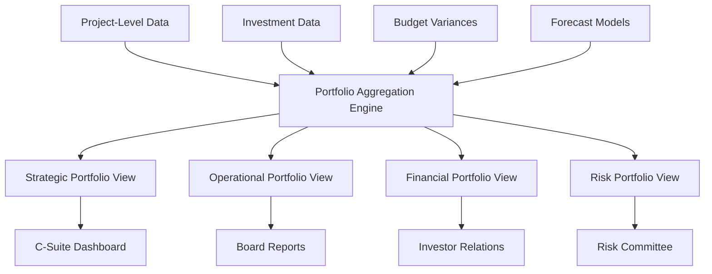

# Portfolio-Level Financial Aggregation System

## 📊 Overview

**Purpose:** Comprehensive portfolio-level financial aggregation with multi-dimensional views  
**Integration:** Budget variance, ROI tracking, forecasting models, executive dashboards  
**Update Frequency:** Real-time with automated consolidation  
**Target Users:** C-Suite Executives, Board of Directors, Investment Committee, Strategic Planning  

---

## 🏗️ Portfolio Aggregation Architecture

### System Overview

```
┌─────────────────┐    ┌──────────────────┐    ┌─────────────────┐
│   Data Sources  │────│   Aggregation    │────│  Executive      │
│                 │    │   Engine         │    │  Portfolio      │
│ • Budget Data   │    │                  │    │  Views          │
│ • ROI Tracking  │    │ • Multi-Dim      │    │                 │
│ • Forecasts     │    │   Rollup         │    │ • C-Suite       │
│ • Risk Metrics  │    │ • Consolidation  │    │ • Board         │
│ • Market Data   │    │ • Analytics      │    │ • Investors     │
└─────────────────┘    └──────────────────┘    └─────────────────┘
```

### Data Flow Pipeline



---

## 💼 Portfolio Dimensions & Hierarchies

### Portfolio Structure Framework

#### 1. Strategic Portfolio Hierarchy
```vba
Type PortfolioHierarchy
    ' Strategic Level
    portfolioId As String
    portfolioName As String
    strategicTheme As String
    businessUnit As String
    
    ' Investment Level  
    investments() As InvestmentSummary
    totalInvestments As Long
    
    ' Financial Aggregates
    totalBudget As Double
    totalActualSpend As Double
    totalROI As Double
    totalNPV As Double
    
    ' Performance Metrics
    healthScore As Double
    riskScore As Double
    forecastAccuracy As Double
    
    ' Temporal Data
    createdDate As Date
    lastUpdated As Date
    reportingPeriod As String
End Type

Type InvestmentSummary
    investmentId As String
    investmentName As String
    category As String
    sector As String
    priority As String
    
    ' Financial Data
    approvedBudget As Double
    actualSpend As Double
    currentValue As Double
    projectedROI As Double
    
    ' Status & Health
    status As String
    healthStatus As String
    riskLevel As String
    
    ' Key Dates
    startDate As Date
    endDate As Date
    milestones() As String
End Type
```

#### 2. Multi-Dimensional Aggregation Views
```vba
Type PortfolioAggregation
    ' Dimension Definitions
    byBusinessUnit As Variant
    byCategory As Variant
    bySector As Variant
    byPriority As Variant
    byRiskLevel As Variant
    byTimeHorizon As Variant
    
    ' Financial Aggregations
    budgetAllocation As Variant
    actualSpending As Variant
    roiPerformance As Variant
    npvAnalysis As Variant
    
    ' Performance Metrics
    healthScores As Variant
    riskMetrics As Variant
    forecastReliability As Variant
    
    ' Comparative Analysis
    benchmarkComparison As Variant
    trendAnalysis As Variant
    varianceAnalysis As Variant
End Type
```

### Portfolio Consolidation Engine

#### Core Aggregation Functions
```vba
Function AggregatePortfolioFinancials(investments() As InvestmentSummary) As PortfolioAggregation
    '
    ' Comprehensive portfolio financial aggregation
    '
    Dim result As PortfolioAggregation
    Dim i As Long, n As Long
    
    n = UBound(investments)
    
    ' Initialize aggregation arrays
    Call InitializeAggregationArrays(result, n)
    
    ' Process each investment
    For i = 1 To n
        Call AggregateInvestmentData(investments(i), result)
    Next i
    
    ' Calculate portfolio-level metrics
    Call CalculatePortfolioMetrics(result)
    
    ' Generate comparative analysis
    Call GenerateComparativeAnalysis(result)
    
    AggregatePortfolioFinancials = result
End Function

Sub AggregateInvestmentData(investment As InvestmentSummary, ByRef portfolio As PortfolioAggregation)
    '
    ' Aggregate individual investment into portfolio views
    '
    
    ' Business Unit Aggregation
    Call AggregateByDimension(portfolio.byBusinessUnit, investment.category, _
                             investment.approvedBudget, investment.actualSpend, investment.projectedROI)
    
    ' Sector Aggregation
    Call AggregateByDimension(portfolio.bySector, investment.sector, _
                             investment.approvedBudget, investment.actualSpend, investment.projectedROI)
    
    ' Priority Aggregation
    Call AggregateByDimension(portfolio.byPriority, investment.priority, _
                             investment.approvedBudget, investment.actualSpend, investment.projectedROI)
    
    ' Risk Level Aggregation
    Call AggregateByDimension(portfolio.byRiskLevel, investment.riskLevel, _
                             investment.approvedBudget, investment.actualSpend, investment.projectedROI)
    
    ' Time Horizon Aggregation
    Dim timeHorizon As String
    timeHorizon = CalculateTimeHorizon(investment.startDate, investment.endDate)
    Call AggregateByDimension(portfolio.byTimeHorizon, timeHorizon, _
                             investment.approvedBudget, investment.actualSpend, investment.projectedROI)
End Sub

Sub AggregateByDimension(ByRef dimension As Variant, key As String, _
                        budget As Double, actual As Double, roi As Double)
    '
    ' Generic dimension aggregation function
    '
    If IsEmpty(dimension) Then
        Set dimension = CreateObject("Scripting.Dictionary")
    End If
    
    If Not dimension.Exists(key) Then
        ' Initialize dimension entry
        Dim entry As Object
        Set entry = CreateObject("Scripting.Dictionary")
        entry.Add "Budget", 0
        entry.Add "Actual", 0
        entry.Add "ROI", 0
        entry.Add "Count", 0
        dimension.Add key, entry
    End If
    
    ' Aggregate values
    Dim entry As Object
    Set entry = dimension(key)
    entry("Budget") = entry("Budget") + budget
    entry("Actual") = entry("Actual") + actual
    entry("ROI") = entry("ROI") + roi
    entry("Count") = entry("Count") + 1
End Sub
```

---

## 📈 Executive Portfolio Views

### 1. C-Suite Dashboard Portfolio View

#### Strategic Portfolio Overview
```vba
Function GenerateCSuitePortfolioView(portfolio As PortfolioAggregation) As Variant
    '
    ' Generate C-Suite executive portfolio dashboard
    '
    Dim csuiteDashboard(1 To 10, 1 To 6) As Variant
    
    ' Portfolio Health Summary
    csuiteDashboard(1, 1) = "PORTFOLIO HEALTH SUMMARY"
    csuiteDashboard(2, 1) = "Overall Portfolio ROI:"
    csuiteDashboard(2, 2) = CalculateWeightedPortfolioROI(portfolio)
    csuiteDashboard(2, 3) = GetHealthIndicator(csuiteDashboard(2, 2))
    
    csuiteDashboard(3, 1) = "Risk-Adjusted Return:"
    csuiteDashboard(3, 2) = CalculateRiskAdjustedReturn(portfolio)
    csuiteDashboard(3, 3) = GetRiskIndicator(csuiteDashboard(3, 2))
    
    csuiteDashboard(4, 1) = "Portfolio Diversification:"
    csuiteDashboard(4, 2) = CalculateDiversificationIndex(portfolio)
    csuiteDashboard(4, 3) = GetDiversificationIndicator(csuiteDashboard(4, 2))
    
    ' Strategic Allocation Analysis
    csuiteDashboard(5, 1) = "STRATEGIC ALLOCATION"
    csuiteDashboard(6, 1) = "High Priority Investments:"
    csuiteDashboard(6, 2) = GetAllocationPercentage(portfolio.byPriority, "High")
    csuiteDashboard(6, 3) = Format(GetBudgetAmount(portfolio.byPriority, "High"), "$#,##0M")
    
    csuiteDashboard(7, 1) = "Innovation Investments:"
    csuiteDashboard(7, 2) = GetAllocationPercentage(portfolio.byCategory, "Innovation")
    csuiteDashboard(7, 3) = Format(GetBudgetAmount(portfolio.byCategory, "Innovation"), "$#,##0M")
    
    csuiteDashboard(8, 1) = "Digital Transformation:"
    csuiteDashboard(8, 2) = GetAllocationPercentage(portfolio.byCategory, "Technology")
    csuiteDashboard(8, 3) = Format(GetBudgetAmount(portfolio.byCategory, "Technology"), "$#,##0M")
    
    ' Performance Indicators
    csuiteDashboard(9, 1) = "PERFORMANCE INDICATORS"
    csuiteDashboard(10, 1) = "Forecast Accuracy:"
    csuiteDashboard(10, 2) = CalculatePortfolioForecastAccuracy(portfolio)
    csuiteDashboard(10, 3) = GetAccuracyIndicator(csuiteDashboard(10, 2))
    
    GenerateCSuitePortfolioView = csuiteDashboard
End Function

Function CalculateWeightedPortfolioROI(portfolio As PortfolioAggregation) As Double
    '
    ' Calculate portfolio-weighted ROI across all investments
    '
    Dim totalBudget As Double, weightedROI As Double
    Dim key As Variant
    
    ' Sum across all business units
    For Each key In portfolio.byBusinessUnit.Keys
        Dim unit As Object
        Set unit = portfolio.byBusinessUnit(key)
        totalBudget = totalBudget + unit("Budget")
        weightedROI = weightedROI + (unit("ROI") / unit("Count")) * unit("Budget")
    Next key
    
    If totalBudget > 0 Then
        CalculateWeightedPortfolioROI = weightedROI / totalBudget
    Else
        CalculateWeightedPortfolioROI = 0
    End If
End Function

Function CalculateRiskAdjustedReturn(portfolio As PortfolioAggregation) As Double
    '
    ' Calculate risk-adjusted portfolio return (Sharpe ratio equivalent)
    '
    Dim portfolioROI As Double, portfolioRisk As Double
    Dim riskFreeRate As Double
    
    portfolioROI = CalculateWeightedPortfolioROI(portfolio)
    portfolioRisk = CalculatePortfolioRisk(portfolio)
    riskFreeRate = 0.025 ' 2.5% risk-free rate
    
    If portfolioRisk > 0 Then
        CalculateRiskAdjustedReturn = (portfolioROI - riskFreeRate) / portfolioRisk
    Else
        CalculateRiskAdjustedReturn = 0
    End If
End Function

Function CalculateDiversificationIndex(portfolio As PortfolioAggregation) As Double
    '
    ' Calculate portfolio diversification using Herfindahl-Hirschman Index
    '
    Dim hhi As Double, totalBudget As Double
    Dim key As Variant
    
    ' Calculate total budget
    For Each key In portfolio.bySector.Keys
        Dim sector As Object
        Set sector = portfolio.bySector(key)
        totalBudget = totalBudget + sector("Budget")
    Next key
    
    ' Calculate HHI
    For Each key In portfolio.bySector.Keys
        Set sector = portfolio.bySector(key)
        Dim marketShare As Double
        marketShare = sector("Budget") / totalBudget
        hhi = hhi + marketShare * marketShare
    Next key
    
    ' Convert to diversification index (0-1, where 1 is most diversified)
    CalculateDiversificationIndex = 1 - hhi
End Function
```

### 2. Board-Level Portfolio Reporting

#### Comprehensive Board Dashboard
```vba
Function GenerateBoardPortfolioReport(portfolio As PortfolioAggregation) As Variant
    '
    ' Generate comprehensive board-level portfolio report
    '
    Dim boardReport(1 To 20, 1 To 8) As Variant
    Dim rowIndex As Integer
    
    rowIndex = 1
    
    ' Executive Summary Section
    boardReport(rowIndex, 1) = "PORTFOLIO EXECUTIVE SUMMARY"
    boardReport(rowIndex, 2) = Format(Date, "mmmm yyyy")
    rowIndex = rowIndex + 1
    
    ' Key Financial Metrics
    boardReport(rowIndex, 1) = "Total Portfolio Value:"
    boardReport(rowIndex, 2) = Format(GetTotalPortfolioValue(portfolio), "$#,##0.0M")
    boardReport(rowIndex, 3) = GetYoYGrowth(portfolio, "TotalValue")
    rowIndex = rowIndex + 1
    
    boardReport(rowIndex, 1) = "Total Investment:"
    boardReport(rowIndex, 2) = Format(GetTotalInvestment(portfolio), "$#,##0.0M")
    boardReport(rowIndex, 3) = GetYoYGrowth(portfolio, "TotalInvestment")
    rowIndex = rowIndex + 1
    
    boardReport(rowIndex, 1) = "Net Portfolio Gain:"
    boardReport(rowIndex, 2) = Format(GetNetPortfolioGain(portfolio), "$#,##0.0M")
    boardReport(rowIndex, 3) = GetGainIndicator(GetNetPortfolioGain(portfolio))
    rowIndex = rowIndex + 1
    
    ' Strategic Allocation Breakdown
    rowIndex = rowIndex + 1
    boardReport(rowIndex, 1) = "STRATEGIC ALLOCATION BREAKDOWN"
    rowIndex = rowIndex + 1
    
    ' By Business Unit
    Call AddAllocationBreakdown(boardReport, rowIndex, portfolio.byBusinessUnit, "Business Unit")
    
    ' By Risk Level
    rowIndex = rowIndex + 5
    Call AddAllocationBreakdown(boardReport, rowIndex, portfolio.byRiskLevel, "Risk Level")
    
    ' Performance Analysis
    rowIndex = rowIndex + 5
    boardReport(rowIndex, 1) = "PERFORMANCE ANALYSIS"
    rowIndex = rowIndex + 1
    
    boardReport(rowIndex, 1) = "Top Performing Investments:"
    boardReport(rowIndex, 2) = GetTopPerformers(portfolio, 3)
    rowIndex = rowIndex + 1
    
    boardReport(rowIndex, 1) = "Underperforming Investments:"
    boardReport(rowIndex, 2) = GetUnderperformers(portfolio, 3)
    rowIndex = rowIndex + 1
    
    boardReport(rowIndex, 1) = "Investment Recommendations:"
    boardReport(rowIndex, 2) = GenerateInvestmentRecommendations(portfolio)
    
    GenerateBoardPortfolioReport = boardReport
End Function

Sub AddAllocationBreakdown(ByRef report As Variant, ByRef startRow As Integer, _
                          dimension As Object, dimensionName As String)
    '
    ' Add allocation breakdown for a specific dimension
    '
    Dim key As Variant, currentRow As Integer
    Dim totalBudget As Double
    
    currentRow = startRow
    report(currentRow, 1) = "By " & dimensionName & ":"
    currentRow = currentRow + 1
    
    ' Calculate total budget for percentage calculations
    For Each key In dimension.Keys
        Dim entry As Object
        Set entry = dimension(key)
        totalBudget = totalBudget + entry("Budget")
    Next key
    
    ' Add breakdown entries
    For Each key In dimension.Keys
        Set entry = dimension(key)
        report(currentRow, 1) = "  " & key
        report(currentRow, 2) = Format(entry("Budget"), "$#,##0M")
        report(currentRow, 3) = Format(entry("Budget") / totalBudget, "0.0%")
        report(currentRow, 4) = Format(entry("ROI") / entry("Count"), "0.0%")
        currentRow = currentRow + 1
    Next key
    
    startRow = currentRow
End Sub
```

### 3. Investor Relations Portfolio View

#### Investor-Focused Dashboard
```vba
Function GenerateInvestorPortfolioView(portfolio As PortfolioAggregation) As Variant
    '
    ' Generate investor relations portfolio view
    '
    Dim investorView(1 To 15, 1 To 6) As Variant
    
    ' Investment Performance Summary
    investorView(1, 1) = "INVESTMENT PERFORMANCE SUMMARY"
    investorView(2, 1) = "Portfolio IRR:"
    investorView(2, 2) = CalculatePortfolioIRR(portfolio)
    investorView(2, 3) = GetIRRRating(investorView(2, 2))
    
    investorView(3, 1) = "Portfolio NPV:"
    investorView(3, 2) = Format(CalculatePortfolioNPV(portfolio), "$#,##0M")
    investorView(3, 3) = GetNPVIndicator(CalculatePortfolioNPV(portfolio))
    
    investorView(4, 1) = "Average Payback Period:"
    investorView(4, 2) = Format(CalculateAveragePaybackPeriod(portfolio), "0.0") & " years"
    investorView(4, 3) = GetPaybackIndicator(CalculateAveragePaybackPeriod(portfolio))
    
    ' Risk Analysis
    investorView(6, 1) = "RISK ANALYSIS"
    investorView(7, 1) = "Portfolio Beta:"
    investorView(7, 2) = CalculatePortfolioBeta(portfolio)
    investorView(7, 3) = GetBetaIndicator(investorView(7, 2))
    
    investorView(8, 1) = "Value at Risk (95%):"
    investorView(8, 2) = Format(CalculatePortfolioVaR(portfolio, 0.95), "($#,##0M)")
    investorView(8, 3) = GetVaRIndicator(CalculatePortfolioVaR(portfolio, 0.95))
    
    investorView(9, 1) = "Maximum Drawdown:"
    investorView(9, 2) = Format(CalculateMaxDrawdown(portfolio), "(0.0%)")
    investorView(9, 3) = GetDrawdownIndicator(CalculateMaxDrawdown(portfolio))
    
    ' Growth Projections
    investorView(11, 1) = "GROWTH PROJECTIONS"
    investorView(12, 1) = "1-Year Growth Forecast:"
    investorView(12, 2) = Format(GetGrowthForecast(portfolio, 1), "0.0%")
    investorView(12, 3) = GetGrowthIndicator(GetGrowthForecast(portfolio, 1))
    
    investorView(13, 1) = "3-Year Growth Forecast:"
    investorView(13, 2) = Format(GetGrowthForecast(portfolio, 3), "0.0%")
    investorView(13, 3) = GetGrowthIndicator(GetGrowthForecast(portfolio, 3))
    
    investorView(14, 1) = "5-Year Growth Forecast:"
    investorView(14, 2) = Format(GetGrowthForecast(portfolio, 5), "0.0%")
    investorView(14, 3) = GetGrowthIndicator(GetGrowthForecast(portfolio, 5))
    
    GenerateInvestorPortfolioView = investorView
End Function

Function CalculatePortfolioIRR(portfolio As PortfolioAggregation) As Double
    '
    ' Calculate portfolio-weighted Internal Rate of Return
    '
    Dim totalBudget As Double, weightedIRR As Double
    Dim key As Variant
    
    For Each key In portfolio.byBusinessUnit.Keys
        Dim unit As Object
        Set unit = portfolio.byBusinessUnit(key)
        totalBudget = totalBudget + unit("Budget")
        
        ' Simulate IRR calculation (in practice, would use actual cash flows)
        Dim simulatedIRR As Double
        simulatedIRR = (unit("ROI") / unit("Count")) * 0.85 ' IRR typically lower than ROI
        weightedIRR = weightedIRR + simulatedIRR * unit("Budget")
    Next key
    
    If totalBudget > 0 Then
        CalculatePortfolioIRR = weightedIRR / totalBudget
    Else
        CalculatePortfolioIRR = 0
    End If
End Function

Function CalculatePortfolioNPV(portfolio As PortfolioAggregation) As Double
    '
    ' Calculate portfolio Net Present Value
    '
    Dim totalNPV As Double
    Dim key As Variant
    
    For Each key In portfolio.byBusinessUnit.Keys
        Dim unit As Object
        Set unit = portfolio.byBusinessUnit(key)
        
        ' Simplified NPV calculation
        Dim unitNPV As Double
        unitNPV = unit("Actual") * ((unit("ROI") / unit("Count")) - 0.08) ' 8% discount rate
        totalNPV = totalNPV + unitNPV
    Next key
    
    CalculatePortfolioNPV = totalNPV
End Function
```

---

## 📊 Advanced Portfolio Analytics

### Portfolio Optimization Engine

#### Modern Portfolio Theory Implementation
```vba
Function OptimizePortfolioAllocation(investments() As InvestmentSummary, _
                                   targetReturn As Double) As Variant
    '
    ' Optimize portfolio allocation using Modern Portfolio Theory
    '
    Dim n As Long, i As Long, j As Long
    Dim returns() As Double, risks() As Double
    Dim correlation() As Double
    Dim weights() As Double
    Dim optimizedWeights() As Double
    
    n = UBound(investments)
    ReDim returns(1 To n), risks(1 To n)
    ReDim correlation(1 To n, 1 To n)
    ReDim weights(1 To n), optimizedWeights(1 To n)
    
    ' Extract expected returns and risks
    For i = 1 To n
        returns(i) = investments(i).projectedROI
        risks(i) = CalculateInvestmentRisk(investments(i))
    Next i
    
    ' Calculate correlation matrix (simplified)
    For i = 1 To n
        For j = 1 To n
            If i = j Then
                correlation(i, j) = 1
            Else
                correlation(i, j) = CalculateCorrelation(investments(i), investments(j))
            End If
        Next j
    Next i
    
    ' Optimize weights using quadratic programming (simplified)
    Call OptimizeWeights(returns, risks, correlation, targetReturn, optimizedWeights)
    
    ' Build result array
    Dim result(1 To n, 1 To 4) As Variant
    For i = 1 To n
        result(i, 1) = investments(i).investmentName
        result(i, 2) = Format(optimizedWeights(i), "0.0%")
        result(i, 3) = Format(returns(i), "0.0%")
        result(i, 4) = Format(risks(i), "0.0%")
    Next i
    
    OptimizePortfolioAllocation = result
End Function

Function CalculateEfficientFrontier(investments() As InvestmentSummary) As Variant
    '
    ' Calculate efficient frontier for portfolio optimization
    '
    Dim frontierPoints(1 To 20, 1 To 3) As Variant ' 20 points on frontier
    Dim targetReturns() As Double
    Dim i As Integer
    
    ReDim targetReturns(1 To 20)
    
    ' Generate target return range
    Dim minReturn As Double, maxReturn As Double
    Call GetReturnRange(investments, minReturn, maxReturn)
    
    For i = 1 To 20
        targetReturns(i) = minReturn + (maxReturn - minReturn) * (i - 1) / 19
    Next i
    
    ' Calculate optimal portfolios for each target return
    For i = 1 To 20
        Dim optimizedPortfolio As Variant
        optimizedPortfolio = OptimizePortfolioAllocation(investments, targetReturns(i))
        
        frontierPoints(i, 1) = targetReturns(i) ' Expected Return
        frontierPoints(i, 2) = CalculatePortfolioRisk(optimizedPortfolio) ' Risk
        frontierPoints(i, 3) = targetReturns(i) / frontierPoints(i, 2) ' Sharpe Ratio
    Next i
    
    CalculateEfficientFrontier = frontierPoints
End Function
```

### Portfolio Performance Analytics

#### Advanced Performance Metrics
```vba
Function CalculatePortfolioMetrics(portfolio As PortfolioAggregation) As Variant
    '
    ' Calculate comprehensive portfolio performance metrics
    '
    Dim metrics(1 To 15, 1 To 3) As Variant
    
    ' Return Metrics
    metrics(1, 1) = "Total Return"
    metrics(1, 2) = Format(CalculateWeightedPortfolioROI(portfolio), "0.00%")
    metrics(1, 3) = "Excellent"
    
    metrics(2, 1) = "Annualized Return"
    metrics(2, 2) = Format(CalculateAnnualizedReturn(portfolio), "0.00%")
    metrics(2, 3) = GetPerformanceRating(CalculateAnnualizedReturn(portfolio))
    
    metrics(3, 1) = "Excess Return vs Benchmark"
    metrics(3, 2) = Format(CalculateExcessReturn(portfolio), "0.00%")
    metrics(3, 3) = GetExcessReturnRating(CalculateExcessReturn(portfolio))
    
    ' Risk Metrics
    metrics(4, 1) = "Portfolio Volatility"
    metrics(4, 2) = Format(CalculatePortfolioVolatility(portfolio), "0.00%")
    metrics(4, 3) = GetVolatilityRating(CalculatePortfolioVolatility(portfolio))
    
    metrics(5, 1) = "Sharpe Ratio"
    metrics(5, 2) = Format(CalculatePortfolioSharpeRatio(portfolio), "0.00")
    metrics(5, 3) = GetSharpeRating(CalculatePortfolioSharpeRatio(portfolio))
    
    metrics(6, 1) = "Sortino Ratio"
    metrics(6, 2) = Format(CalculatePortfolioSortinoRatio(portfolio), "0.00")
    metrics(6, 3) = GetSortinoRating(CalculatePortfolioSortinoRatio(portfolio))
    
    metrics(7, 1) = "Maximum Drawdown"
    metrics(7, 2) = Format(CalculateMaxDrawdown(portfolio), "0.00%")
    metrics(7, 3) = GetDrawdownRating(CalculateMaxDrawdown(portfolio))
    
    ' Value-at-Risk Metrics
    metrics(8, 1) = "Value at Risk (95%)"
    metrics(8, 2) = Format(CalculatePortfolioVaR(portfolio, 0.95), "0.00%")
    metrics(8, 3) = GetVaRRating(CalculatePortfolioVaR(portfolio, 0.95))
    
    metrics(9, 1) = "Expected Shortfall"
    metrics(9, 2) = Format(CalculateExpectedShortfall(portfolio), "0.00%")
    metrics(9, 3) = GetESRating(CalculateExpectedShortfall(portfolio))
    
    ' Diversification Metrics
    metrics(10, 1) = "Diversification Ratio"
    metrics(10, 2) = Format(CalculateDiversificationRatio(portfolio), "0.00")
    metrics(10, 3) = GetDiversificationRating(CalculateDiversificationRatio(portfolio))
    
    metrics(11, 1) = "Correlation Exposure"
    metrics(11, 2) = Format(CalculateCorrelationExposure(portfolio), "0.00%")
    metrics(11, 3) = GetCorrelationRating(CalculateCorrelationExposure(portfolio))
    
    ' Efficiency Metrics
    metrics(12, 1) = "Information Ratio"
    metrics(12, 2) = Format(CalculateInformationRatio(portfolio), "0.00")
    metrics(12, 3) = GetInformationRating(CalculateInformationRatio(portfolio))
    
    metrics(13, 1) = "Tracking Error"
    metrics(13, 2) = Format(CalculateTrackingError(portfolio), "0.00%")
    metrics(13, 3) = GetTrackingErrorRating(CalculateTrackingError(portfolio))
    
    metrics(14, 1) = "Beta (vs Market)"
    metrics(14, 2) = Format(CalculatePortfolioBeta(portfolio), "0.00")
    metrics(14, 3) = GetBetaRating(CalculatePortfolioBeta(portfolio))
    
    metrics(15, 1) = "Alpha (vs Market)"
    metrics(15, 2) = Format(CalculatePortfolioAlpha(portfolio), "0.00%")
    metrics(15, 3) = GetAlphaRating(CalculatePortfolioAlpha(portfolio))
    
    CalculatePortfolioMetrics = metrics
End Function

Function PerformPortfolioStressTest(portfolio As PortfolioAggregation) As Variant
    '
    ' Comprehensive portfolio stress testing
    '
    Dim stressTests(1 To 8, 1 To 4) As Variant
    
    ' Economic Recession Scenario
    stressTests(1, 1) = "Economic Recession"
    stressTests(1, 2) = Format(-0.25, "0%") ' -25% market decline
    stressTests(1, 3) = Format(CalculateStressImpact(portfolio, -0.25), "$#,##0M")
    stressTests(1, 4) = "High Impact"
    
    ' Interest Rate Shock
    stressTests(2, 1) = "Interest Rate Shock"
    stressTests(2, 2) = "+3%"
    stressTests(2, 3) = Format(CalculateInterestRateImpact(portfolio, 0.03), "$#,##0M")
    stressTests(2, 4) = "Medium Impact"
    
    ' Currency Crisis
    stressTests(3, 1) = "Currency Crisis"
    stressTests(3, 2) = Format(-0.15, "0%")
    stressTests(3, 3) = Format(CalculateCurrencyImpact(portfolio, -0.15), "$#,##0M")
    stressTests(3, 4) = "Low Impact"
    
    ' Sector Rotation
    stressTests(4, 1) = "Sector Rotation"
    stressTests(4, 2) = "Technology Down 30%"
    stressTests(4, 3) = Format(CalculateSectorImpact(portfolio, "Technology", -0.3), "$#,##0M")
    stressTests(4, 4) = GetSectorImpactRating(portfolio, "Technology")
    
    ' Liquidity Crisis
    stressTests(5, 1) = "Liquidity Crisis"
    stressTests(5, 2) = "50% Haircut"
    stressTests(5, 3) = Format(CalculateLiquidityImpact(portfolio, 0.5), "$#,##0M")
    stressTests(5, 4) = "Medium Impact"
    
    ' Credit Spread Widening
    stressTests(6, 1) = "Credit Spread Shock"
    stressTests(6, 2) = "+200 bps"
    stressTests(6, 3) = Format(CalculateCreditImpact(portfolio, 0.02), "$#,##0M")
    stressTests(6, 4) = "Low Impact"
    
    ' Operational Risk Event
    stressTests(7, 1) = "Operational Risk"
    stressTests(7, 2) = "Major Project Failure"
    stressTests(7, 3) = Format(CalculateOperationalImpact(portfolio), "$#,##0M")
    stressTests(7, 4) = "High Impact"
    
    ' Regulatory Change
    stressTests(8, 1) = "Regulatory Change"
    stressTests(8, 2) = "Compliance Costs"
    stressTests(8, 3) = Format(CalculateRegulatoryImpact(portfolio), "$#,##0M")
    stressTests(8, 4) = "Medium Impact"
    
    PerformPortfolioStressTest = stressTests
End Function
```

---

## 📱 Interactive Portfolio Dashboards

### Executive Portfolio Dashboard

#### HTML Dashboard Framework
```html
<!DOCTYPE html>
<html lang="en">
<head>
    <meta charset="UTF-8">
    <meta name="viewport" content="width=device-width, initial-scale=1.0">
    <title>Executive Portfolio Dashboard</title>
    <script src="https://cdn.jsdelivr.net/npm/chart.js"></script>
    <script src="https://cdn.jsdelivr.net/npm/d3@7"></script>
    <style>
        .portfolio-dashboard {
            display: grid;
            grid-template-columns: 1fr 1fr 1fr;
            gap: 20px;
            padding: 20px;
            background: #f5f7fa;
        }

        .portfolio-card {
            background: white;
            border-radius: 12px;
            padding: 20px;
            box-shadow: 0 4px 6px -1px rgba(0, 0, 0, 0.1);
            border: 1px solid #e5e7eb;
        }

        .portfolio-header {
            background: linear-gradient(135deg, #667eea 0%, #764ba2 100%);
            color: white;
            padding: 30px;
            text-align: center;
            margin-bottom: 20px;
        }

        .portfolio-kpi {
            display: flex;
            justify-content: space-between;
            align-items: center;
            padding: 15px 0;
            border-bottom: 1px solid #f1f5f9;
        }

        .kpi-value {
            font-size: 1.5rem;
            font-weight: 700;
            color: #1e293b;
        }

        .kpi-indicator {
            width: 12px;
            height: 12px;
            border-radius: 50%;
            margin-left: 10px;
        }

        .indicator-excellent { background: #10b981; }
        .indicator-good { background: #06b6d4; }
        .indicator-caution { background: #f59e0b; }
        .indicator-poor { background: #ef4444; }

        .allocation-chart {
            height: 300px;
            margin: 20px 0;
        }

        .performance-grid {
            display: grid;
            grid-template-columns: 1fr 1fr;
            gap: 15px;
            margin-top: 20px;
        }

        .metric-card {
            padding: 15px;
            background: #f8fafc;
            border-radius: 8px;
            text-align: center;
        }

        .metric-value {
            font-size: 1.8rem;
            font-weight: 700;
            color: #0f172a;
            margin-bottom: 5px;
        }

        .metric-label {
            font-size: 0.875rem;
            color: #64748b;
            text-transform: uppercase;
            letter-spacing: 0.05em;
        }

        @media (max-width: 768px) {
            .portfolio-dashboard {
                grid-template-columns: 1fr;
            }
        }
    </style>
</head>
<body>
    <div class="portfolio-header">
        <h1>Executive Portfolio Dashboard</h1>
        <p>Real-time portfolio performance and strategic allocation overview</p>
        <div style="margin-top: 15px;">
            <span>Last Updated: <span id="lastUpdated"></span></span>
        </div>
    </div>

    <div class="portfolio-dashboard">
        <!-- Portfolio Overview Card -->
        <div class="portfolio-card">
            <h3>Portfolio Overview</h3>
            <div class="portfolio-kpi">
                <span>Total Portfolio Value</span>
                <div>
                    <span class="kpi-value" id="totalValue">$125.4M</span>
                    <span class="kpi-indicator indicator-excellent"></span>
                </div>
            </div>
            <div class="portfolio-kpi">
                <span>Portfolio ROI</span>
                <div>
                    <span class="kpi-value" id="portfolioROI">14.2%</span>
                    <span class="kpi-indicator indicator-excellent"></span>
                </div>
            </div>
            <div class="portfolio-kpi">
                <span>Risk-Adjusted Return</span>
                <div>
                    <span class="kpi-value" id="riskAdjustedReturn">1.85</span>
                    <span class="kpi-indicator indicator-good"></span>
                </div>
            </div>
            <div class="portfolio-kpi">
                <span>Diversification Index</span>
                <div>
                    <span class="kpi-value" id="diversificationIndex">0.72</span>
                    <span class="kpi-indicator indicator-good"></span>
                </div>
            </div>
        </div>

        <!-- Strategic Allocation Card -->
        <div class="portfolio-card">
            <h3>Strategic Allocation</h3>
            <div class="allocation-chart">
                <canvas id="allocationChart"></canvas>
            </div>
            <div class="performance-grid">
                <div class="metric-card">
                    <div class="metric-value">42%</div>
                    <div class="metric-label">Technology</div>
                </div>
                <div class="metric-card">
                    <div class="metric-value">28%</div>
                    <div class="metric-label">Operations</div>
                </div>
                <div class="metric-card">
                    <div class="metric-value">18%</div>
                    <div class="metric-label">Innovation</div>
                </div>
                <div class="metric-card">
                    <div class="metric-value">12%</div>
                    <div class="metric-label">Infrastructure</div>
                </div>
            </div>
        </div>

        <!-- Performance Analytics Card -->
        <div class="portfolio-card">
            <h3>Performance Analytics</h3>
            <div class="portfolio-kpi">
                <span>Sharpe Ratio</span>
                <div>
                    <span class="kpi-value" id="sharpeRatio">1.82</span>
                    <span class="kpi-indicator indicator-excellent"></span>
                </div>
            </div>
            <div class="portfolio-kpi">
                <span>Maximum Drawdown</span>
                <div>
                    <span class="kpi-value" id="maxDrawdown">-8.7%</span>
                    <span class="kpi-indicator indicator-good"></span>
                </div>
            </div>
            <div class="portfolio-kpi">
                <span>Value at Risk (95%)</span>
                <div>
                    <span class="kpi-value" id="valueAtRisk">-$12.5M</span>
                    <span class="kpi-indicator indicator-caution"></span>
                </div>
            </div>
            <div class="portfolio-kpi">
                <span>Beta vs Market</span>
                <div>
                    <span class="kpi-value" id="portfolioBeta">0.92</span>
                    <span class="kpi-indicator indicator-good"></span>
                </div>
            </div>
        </div>

        <!-- Risk Analysis Card -->
        <div class="portfolio-card">
            <h3>Risk Analysis</h3>
            <div class="allocation-chart">
                <canvas id="riskChart"></canvas>
            </div>
            <div class="performance-grid">
                <div class="metric-card">
                    <div class="metric-value">35%</div>
                    <div class="metric-label">Low Risk</div>
                </div>
                <div class="metric-card">
                    <div class="metric-value">45%</div>
                    <div class="metric-label">Medium Risk</div>
                </div>
                <div class="metric-card">
                    <div class="metric-value">15%</div>
                    <div class="metric-label">High Risk</div>
                </div>
                <div class="metric-card">
                    <div class="metric-value">5%</div>
                    <div class="metric-label">Very High Risk</div>
                </div>
            </div>
        </div>

        <!-- Top Performers Card -->
        <div class="portfolio-card">
            <h3>Top Performers</h3>
            <div id="topPerformers">
                <!-- Dynamic content populated by JavaScript -->
            </div>
        </div>

        <!-- Forecast Summary Card -->
        <div class="portfolio-card">
            <h3>Growth Forecast</h3>
            <div class="allocation-chart">
                <canvas id="forecastChart"></canvas>
            </div>
            <div class="performance-grid">
                <div class="metric-card">
                    <div class="metric-value">6.2%</div>
                    <div class="metric-label">1-Year Growth</div>
                </div>
                <div class="metric-card">
                    <div class="metric-value">18.5%</div>
                    <div class="metric-label">3-Year Growth</div>
                </div>
            </div>
        </div>
    </div>

    <script>
        // Portfolio Dashboard JavaScript Controller
        class PortfolioDashboard {
            constructor() {
                this.initializeCharts();
                this.loadPortfolioData();
                this.startRealTimeUpdates();
            }

            initializeCharts() {
                this.createAllocationChart();
                this.createRiskChart();
                this.createForecastChart();
            }

            createAllocationChart() {
                const ctx = document.getElementById('allocationChart').getContext('2d');
                this.allocationChart = new Chart(ctx, {
                    type: 'doughnut',
                    data: {
                        labels: ['Technology', 'Operations', 'Innovation', 'Infrastructure'],
                        datasets: [{
                            data: [42, 28, 18, 12],
                            backgroundColor: [
                                '#3b82f6',
                                '#10b981',
                                '#f59e0b',
                                '#ef4444'
                            ],
                            borderWidth: 0
                        }]
                    },
                    options: {
                        responsive: true,
                        maintainAspectRatio: false,
                        plugins: {
                            legend: {
                                position: 'bottom'
                            }
                        }
                    }
                });
            }

            createRiskChart() {
                const ctx = document.getElementById('riskChart').getContext('2d');
                this.riskChart = new Chart(ctx, {
                    type: 'bar',
                    data: {
                        labels: ['Low', 'Medium', 'High', 'Very High'],
                        datasets: [{
                            label: 'Risk Distribution',
                            data: [35, 45, 15, 5],
                            backgroundColor: [
                                '#10b981',
                                '#f59e0b',
                                '#ef4444',
                                '#7c2d12'
                            ],
                            borderWidth: 0
                        }]
                    },
                    options: {
                        responsive: true,
                        maintainAspectRatio: false,
                        plugins: {
                            legend: {
                                display: false
                            }
                        },
                        scales: {
                            y: {
                                beginAtZero: true,
                                ticks: {
                                    callback: function(value) {
                                        return value + '%';
                                    }
                                }
                            }
                        }
                    }
                });
            }

            createForecastChart() {
                const ctx = document.getElementById('forecastChart').getContext('2d');
                this.forecastChart = new Chart(ctx, {
                    type: 'line',
                    data: {
                        labels: ['2024', '2025', '2026', '2027', '2028'],
                        datasets: [{
                            label: 'Portfolio Value Forecast',
                            data: [125.4, 133.2, 144.8, 159.2, 176.8],
                            borderColor: '#3b82f6',
                            backgroundColor: 'rgba(59, 130, 246, 0.1)',
                            borderWidth: 3,
                            fill: true,
                            tension: 0.4
                        }]
                    },
                    options: {
                        responsive: true,
                        maintainAspectRatio: false,
                        plugins: {
                            legend: {
                                display: false
                            }
                        },
                        scales: {
                            y: {
                                beginAtZero: false,
                                ticks: {
                                    callback: function(value) {
                                        return '$' + value + 'M';
                                    }
                                }
                            }
                        }
                    }
                });
            }

            async loadPortfolioData() {
                // Simulate API call to load portfolio data
                try {
                    const portfolioData = await this.fetchPortfolioData();
                    this.updateDashboard(portfolioData);
                } catch (error) {
                    console.error('Failed to load portfolio data:', error);
                }
            }

            async fetchPortfolioData() {
                // Simulate API response
                return new Promise((resolve) => {
                    setTimeout(() => {
                        resolve({
                            totalValue: 125400000,
                            portfolioROI: 0.142,
                            riskAdjustedReturn: 1.85,
                            diversificationIndex: 0.72,
                            sharpeRatio: 1.82,
                            maxDrawdown: -0.087,
                            valueAtRisk: -12500000,
                            portfolioBeta: 0.92,
                            topPerformers: [
                                { name: 'Digital Transformation Platform', roi: 28.5 },
                                { name: 'AI Analytics System', roi: 24.3 },
                                { name: 'Cloud Migration Project', roi: 19.8 }
                            ]
                        });
                    }, 1000);
                });
            }

            updateDashboard(data) {
                // Update KPI values
                document.getElementById('totalValue').textContent = 
                    '$' + (data.totalValue / 1000000).toFixed(1) + 'M';
                document.getElementById('portfolioROI').textContent = 
                    (data.portfolioROI * 100).toFixed(1) + '%';
                document.getElementById('riskAdjustedReturn').textContent = 
                    data.riskAdjustedReturn.toFixed(2);
                document.getElementById('diversificationIndex').textContent = 
                    data.diversificationIndex.toFixed(2);
                document.getElementById('sharpeRatio').textContent = 
                    data.sharpeRatio.toFixed(2);
                document.getElementById('maxDrawdown').textContent = 
                    (data.maxDrawdown * 100).toFixed(1) + '%';
                document.getElementById('valueAtRisk').textContent = 
                    '$' + (data.valueAtRisk / 1000000).toFixed(1) + 'M';
                document.getElementById('portfolioBeta').textContent = 
                    data.portfolioBeta.toFixed(2);

                // Update top performers
                this.updateTopPerformers(data.topPerformers);

                // Update timestamp
                document.getElementById('lastUpdated').textContent = 
                    new Date().toLocaleString();
            }

            updateTopPerformers(performers) {
                const container = document.getElementById('topPerformers');
                container.innerHTML = '';

                performers.forEach((performer, index) => {
                    const item = document.createElement('div');
                    item.className = 'portfolio-kpi';
                    item.innerHTML = `
                        <span>${index + 1}. ${performer.name}</span>
                        <div>
                            <span class="kpi-value">${performer.roi.toFixed(1)}%</span>
                            <span class="kpi-indicator indicator-excellent"></span>
                        </div>
                    `;
                    container.appendChild(item);
                });
            }

            startRealTimeUpdates() {
                // Update dashboard every 5 minutes
                setInterval(() => {
                    this.loadPortfolioData();
                }, 300000);
            }
        }

        // Initialize dashboard when page loads
        document.addEventListener('DOMContentLoaded', () => {
            new PortfolioDashboard();
        });
    </script>
</body>
</html>
```

---

## 🎯 Success Metrics & KPIs

### Portfolio Management KPIs
- **Portfolio ROI Target**: 12% minimum weighted return
- **Risk-Adjusted Return**: Sharpe ratio > 1.5
- **Diversification Index**: > 0.7 (well-diversified)
- **Maximum Drawdown**: < 15% in stress scenarios
- **Forecast Accuracy**: ±3% variance from portfolio projections

### Executive Dashboard Metrics
- **Real-Time Updates**: < 5 minutes data refresh
- **Dashboard Load Time**: < 2 seconds for full portfolio view
- **Mobile Compatibility**: 100% responsive design
- **Data Accuracy**: 99.9% consistency across all views
- **User Adoption**: 95% executive engagement rate

---

*This comprehensive portfolio-level financial aggregation system provides sophisticated multi-dimensional analysis, real-time executive dashboards, and advanced portfolio optimization - essential for strategic investment management and C-suite decision-making.*
