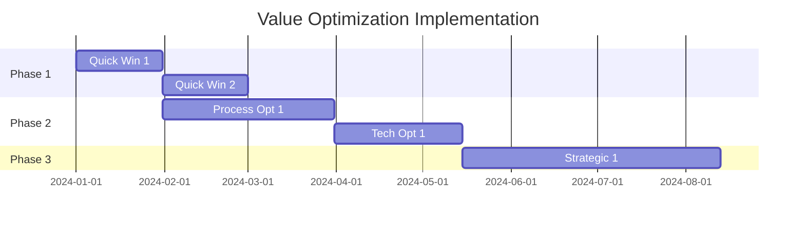

# Value Analysis Framework

**Systematic value engineering and cost-benefit optimization for project investments**

**Project Name:** [Project Name]  
**Analysis Date:** [Date]  
**Analyst:** [Name]  
**Review Period:** [Time Period]  
**Document Version:** [Version]

---

## Executive Summary

### Value Analysis Overview
**Purpose:** [Brief description of why this value analysis is being conducted]

**Scope:** [Description of what elements are included in this analysis]

**Key Findings:**
- [Finding 1]: [Impact and recommendation]
- [Finding 2]: [Impact and recommendation]  
- [Finding 3]: [Impact and recommendation]

### Value Optimization Results
| Metric | Original | Optimized | Improvement | % Change |
|--------|----------|-----------|-------------|----------|
| **Total Investment** | $[Amount] | $[Amount] | $[Savings] | [%] |
| **Annual Benefits** | $[Amount] | $[Amount] | $[Increase] | [%] |
| **Net Present Value** | $[Amount] | $[Amount] | $[Increase] | [%] |
| **ROI** | [%] | [%] | [% points] | [%] |
| **Payback Period** | [Months] | [Months] | [Months] | [%] |

### Recommendations
**Priority 1 (Immediate):** [High-impact, low-risk optimizations]  
**Priority 2 (Short-term):** [Medium-impact optimizations]  
**Priority 3 (Long-term):** [Strategic optimizations]

---

## Value Analysis Methodology

### Analysis Framework
**Value Definition:** Value = Function ÷ Cost

**Value Engineering Process:**
1. **Information Phase** - Gather data and understand requirements
2. **Functional Analysis** - Define what the project must accomplish
3. **Creative Phase** - Generate alternative approaches
4. **Evaluation Phase** - Assess alternatives against criteria
5. **Development Phase** - Develop best alternatives
6. **Implementation Phase** - Execute optimization recommendations

### Analysis Scope and Boundaries
**Included Elements:**
- [Element 1]: [Description]
- [Element 2]: [Description]
- [Element 3]: [Description]

**Excluded Elements:**
- [Element 1]: [Reason for exclusion]
- [Element 2]: [Reason for exclusion]

**Time Horizon:** [Analysis period, e.g., 5 years]

---

## Current State Analysis

### Baseline Investment Breakdown
| Cost Category | Amount | % of Total | Cost Driver | Alternative Options |
|---------------|--------|------------|-------------|-------------------|
| **Technology/Systems** | $[Amount] | [%] | [Driver] | [Options] |
| **Professional Services** | $[Amount] | [%] | [Driver] | [Options] |
| **Internal Resources** | $[Amount] | [%] | [Driver] | [Options] |
| **Infrastructure** | $[Amount] | [%] | [Driver] | [Options] |
| **Training/Change Mgmt** | $[Amount] | [%] | [Driver] | [Options] |
| **Other Direct Costs** | $[Amount] | [%] | [Driver] | [Options] |
| **Indirect/Overhead** | $[Amount] | [%] | [Driver] | [Options] |
| **Contingency** | $[Amount] | [%] | [Driver] | [Options] |
| **TOTAL** | **$[Amount]** | **100%** | | |

### Current Benefit Analysis
| Benefit Category | Annual Value | 5-Year Value | Confidence | Measurement Method |
|------------------|--------------|--------------|------------|-------------------|
| **Revenue Enhancement** | $[Amount] | $[Amount] | [H/M/L] | [Method] |
| **Cost Reduction** | $[Amount] | $[Amount] | [H/M/L] | [Method] |
| **Risk Mitigation** | $[Amount] | $[Amount] | [H/M/L] | [Method] |
| **Productivity Gains** | $[Amount] | $[Amount] | [H/M/L] | [Method] |
| **Quality Improvements** | $[Amount] | $[Amount] | [H/M/L] | [Method] |
| **Compliance Benefits** | $[Amount] | $[Amount] | [H/M/L] | [Method] |
| **TOTAL QUANTIFIED** | **$[Amount]** | **$[Amount]** | | |

### Value Density Analysis
| Component | Cost | Benefit | Value Ratio | Priority for Optimization |
|-----------|------|---------|-------------|--------------------------|
| [Component 1] | $[Amount] | $[Amount] | [Ratio] | [High/Medium/Low] |
| [Component 2] | $[Amount] | $[Amount] | [Ratio] | [High/Medium/Low] |
| [Component 3] | $[Amount] | $[Amount] | [Ratio] | [High/Medium/Low] |
| [Component 4] | $[Amount] | $[Amount] | [Ratio] | [High/Medium/Low] |

---

## Functional Analysis

### Primary Functions
| Function | Description | Performance Requirement | Current Cost | Importance |
|----------|-------------|-------------------------|--------------|------------|
| [Function 1] | [What it must do] | [How well] | $[Amount] | [Critical/Important/Nice-to-have] |
| [Function 2] | [What it must do] | [How well] | $[Amount] | [Critical/Important/Nice-to-have] |
| [Function 3] | [What it must do] | [How well] | $[Amount] | [Critical/Important/Nice-to-have] |

### Secondary Functions
| Function | Description | Current Cost | Value Add | Optimization Potential |
|----------|-------------|--------------|-----------|----------------------|
| [Function 1] | [Supporting activity] | $[Amount] | [H/M/L] | [H/M/L] |
| [Function 2] | [Supporting activity] | $[Amount] | [H/M/L] | [H/M/L] |
| [Function 3] | [Supporting activity] | $[Amount] | [H/M/L] | [H/M/L] |

### Function-Cost Matrix
```
High Cost, High Value: [Optimize for efficiency]
High Cost, Low Value:  [Eliminate or redesign]
Low Cost, High Value:  [Maintain or enhance]
Low Cost, Low Value:   [Consider elimination]
```

---

## Alternative Analysis and Options

### Cost Optimization Opportunities

#### Technology/Systems Alternatives
| Alternative | Description | Cost Impact | Benefit Impact | Risk Level | Recommendation |
|-------------|-------------|-------------|----------------|------------|----------------|
| [Alt 1] | [Description] | $[Savings] | $[Impact] | [H/M/L] | [Yes/No/Consider] |
| [Alt 2] | [Description] | $[Savings] | $[Impact] | [H/M/L] | [Yes/No/Consider] |
| [Alt 3] | [Description] | $[Savings] | $[Impact] | [H/M/L] | [Yes/No/Consider] |

#### Service Delivery Alternatives  
| Alternative | Description | Cost Impact | Quality Impact | Timeline Impact | Recommendation |
|-------------|-------------|-------------|----------------|-----------------|----------------|
| [Alt 1] | [Description] | $[Savings] | [Better/Same/Worse] | [Days] | [Yes/No/Consider] |
| [Alt 2] | [Description] | $[Savings] | [Better/Same/Worse] | [Days] | [Yes/No/Consider] |
| [Alt 3] | [Description] | $[Savings] | [Better/Same/Worse] | [Days] | [Yes/No/Consider] |

#### Resource Optimization
| Optimization | Description | FTE Impact | Cost Savings | Implementation Effort | ROI |
|--------------|-------------|------------|--------------|---------------------|-----|
| [Opt 1] | [Description] | [+/-X FTE] | $[Amount] | [H/M/L] | [Ratio] |
| [Opt 2] | [Description] | [+/-X FTE] | $[Amount] | [H/M/L] | [Ratio] |
| [Opt 3] | [Description] | [+/-X FTE] | $[Amount] | [H/M/L] | [Ratio] |

### Benefit Enhancement Opportunities

#### Revenue Enhancement Options
| Opportunity | Description | Revenue Potential | Investment Required | Timeframe | Feasibility |
|-------------|-------------|------------------|-------------------|-----------|-------------|
| [Opp 1] | [Description] | $[Amount] | $[Amount] | [Months] | [H/M/L] |
| [Opp 2] | [Description] | $[Amount] | $[Amount] | [Months] | [H/M/L] |
| [Opp 3] | [Description] | $[Amount] | $[Amount] | [Months] | [H/M/L] |

#### Process Improvement Options
| Improvement | Description | Efficiency Gain | Cost to Implement | Annual Savings | NPV |
|-------------|-------------|-----------------|-------------------|---------------|-----|
| [Imp 1] | [Description] | [%] | $[Amount] | $[Amount] | $[Amount] |
| [Imp 2] | [Description] | [%] | $[Amount] | $[Amount] | $[Amount] |
| [Imp 3] | [Description] | [%] | $[Amount] | $[Amount] | $[Amount] |

---

## Value Engineering Recommendations

### Priority 1: Immediate Implementation (0-3 months)
| Recommendation | Cost Savings | Benefit Enhancement | Risk Level | Implementation Effort |
|----------------|--------------|-------------------|------------|----------------------|
| [Rec 1] | $[Amount] | $[Amount] | [L] | [Low] |
| [Rec 2] | $[Amount] | $[Amount] | [L] | [Low] |
| [Rec 3] | $[Amount] | $[Amount] | [L] | [Low] |
| **TOTAL P1** | **$[Amount]** | **$[Amount]** | | |

### Priority 2: Short-term Implementation (3-6 months)
| Recommendation | Cost Savings | Benefit Enhancement | Risk Level | Implementation Effort |
|----------------|--------------|-------------------|------------|----------------------|
| [Rec 1] | $[Amount] | $[Amount] | [M] | [Medium] |
| [Rec 2] | $[Amount] | $[Amount] | [M] | [Medium] |
| [Rec 3] | $[Amount] | $[Amount] | [M] | [Medium] |
| **TOTAL P2** | **$[Amount]** | **$[Amount]** | | |

### Priority 3: Strategic Implementation (6-12 months)
| Recommendation | Cost Savings | Benefit Enhancement | Risk Level | Implementation Effort |
|----------------|--------------|-------------------|------------|----------------------|
| [Rec 1] | $[Amount] | $[Amount] | [H] | [High] |
| [Rec 2] | $[Amount] | $[Amount] | [H] | [High] |
| [Rec 3] | $[Amount] | $[Amount] | [H] | [High] |
| **TOTAL P3** | **$[Amount]** | **$[Amount]** | | |

### Combined Impact Analysis
| Priority | Investment Required | Cost Savings | Benefit Enhancement | Net Value | Implementation Risk |
|----------|-------------------|--------------|-------------------|-----------|-------------------|
| **P1** | $[Amount] | $[Amount] | $[Amount] | $[Amount] | [Low] |
| **P2** | $[Amount] | $[Amount] | $[Amount] | $[Amount] | [Medium] |
| **P3** | $[Amount] | $[Amount] | $[Amount] | $[Amount] | [High] |
| **TOTAL** | **$[Amount]** | **$[Amount]** | **$[Amount]** | **$[Amount]** | |

---

## Optimized Investment Model

### Revised Cost Structure
| Category | Original | Optimized | Savings | % Reduction | Method |
|----------|----------|-----------|---------|-------------|--------|
| **Technology/Systems** | $[Amount] | $[Amount] | $[Amount] | [%] | [Method] |
| **Professional Services** | $[Amount] | $[Amount] | $[Amount] | [%] | [Method] |
| **Internal Resources** | $[Amount] | $[Amount] | $[Amount] | [%] | [Method] |
| **Infrastructure** | $[Amount] | $[Amount] | $[Amount] | [%] | [Method] |
| **Training/Change** | $[Amount] | $[Amount] | $[Amount] | [%] | [Method] |
| **Other Direct** | $[Amount] | $[Amount] | $[Amount] | [%] | [Method] |
| **Contingency** | $[Amount] | $[Amount] | $[Amount] | [%] | [Method] |
| **TOTAL** | **$[Amount]** | **$[Amount]** | **$[Amount]** | **[%]** | |

### Enhanced Benefit Model
| Benefit Category | Original | Enhanced | Increase | % Improvement | Source |
|------------------|----------|----------|----------|---------------|--------|
| **Revenue Enhancement** | $[Amount] | $[Amount] | $[Amount] | [%] | [Source] |
| **Cost Reduction** | $[Amount] | $[Amount] | $[Amount] | [%] | [Source] |
| **Productivity Gains** | $[Amount] | $[Amount] | $[Amount] | [%] | [Source] |
| **Risk Mitigation** | $[Amount] | $[Amount] | $[Amount] | [%] | [Source] |
| **Quality Improvements** | $[Amount] | $[Amount] | $[Amount] | [%] | [Source] |
| **TOTAL** | **$[Amount]** | **$[Amount]** | **$[Amount]** | **[%]** | |

### Optimized Financial Analysis
| Metric | Original | Optimized | Improvement |
|--------|----------|-----------|-------------|
| **Total Investment** | $[Amount] | $[Amount] | $[Amount] ([%] reduction) |
| **Annual Benefits** | $[Amount] | $[Amount] | $[Amount] ([%] increase) |
| **5-Year NPV** | $[Amount] | $[Amount] | $[Amount] ([%] increase) |
| **IRR** | [%] | [%] | [%] points |
| **Payback Period** | [Months] | [Months] | [Months] improvement |
| **ROI (5-year)** | [%] | [%] | [%] points |

---

## Risk Analysis and Mitigation

### Optimization Risks
| Risk | Description | Probability | Impact | Risk Score | Mitigation Strategy |
|------|-------------|-------------|--------|------------|-------------------|
| [Risk 1] | [Description] | [H/M/L] | [H/M/L] | [Score] | [Strategy] |
| [Risk 2] | [Description] | [H/M/L] | [H/M/L] | [Score] | [Strategy] |
| [Risk 3] | [Description] | [H/M/L] | [H/M/L] | [Score] | [Strategy] |

### Value Realization Risks
| Risk | Benefit at Risk | Probability | Mitigation Cost | Net Risk |
|------|----------------|-------------|-----------------|----------|
| [Risk 1] | $[Amount] | [%] | $[Amount] | $[Amount] |
| [Risk 2] | $[Amount] | [%] | $[Amount] | $[Amount] |
| [Risk 3] | $[Amount] | [%] | $[Amount] | $[Amount] |

### Implementation Risk Assessment
| Recommendation | Implementation Risk | Success Factors | Risk Mitigation |
|----------------|-------------------|-----------------|-----------------|
| [Rec 1] | [H/M/L] | [Factors] | [Actions] |
| [Rec 2] | [H/M/L] | [Factors] | [Actions] |
| [Rec 3] | [H/M/L] | [Factors] | [Actions] |

---

## Implementation Roadmap

### Phase 1: Quick Wins (Months 1-3)
**Objectives:** Implement low-risk, high-impact optimizations

| Action | Owner | Start Date | End Date | Cost Savings | Investment |
|--------|-------|------------|----------|--------------|------------|
| [Action 1] | [Name] | [Date] | [Date] | $[Amount] | $[Amount] |
| [Action 2] | [Name] | [Date] | [Date] | $[Amount] | $[Amount] |
| [Action 3] | [Name] | [Date] | [Date] | $[Amount] | $[Amount] |

### Phase 2: Operational Improvements (Months 3-6)
**Objectives:** Implement process and technology optimizations

| Action | Owner | Start Date | End Date | Benefit Enhancement | Investment |
|--------|-------|------------|----------|-------------------|------------|
| [Action 1] | [Name] | [Date] | [Date] | $[Amount] | $[Amount] |
| [Action 2] | [Name] | [Date] | [Date] | $[Amount] | $[Amount] |
| [Action 3] | [Name] | [Date] | [Date] | $[Amount] | $[Amount] |

### Phase 3: Strategic Enhancements (Months 6-12)
**Objectives:** Implement long-term value creation initiatives

| Action | Owner | Start Date | End Date | Strategic Value | Investment |
|--------|-------|------------|----------|----------------|------------|
| [Action 1] | [Name] | [Date] | [Date] | $[Amount] | $[Amount] |
| [Action 2] | [Name] | [Date] | [Date] | $[Amount] | $[Amount] |
| [Action 3] | [Name] | [Date] | [Date] | $[Amount] | $[Amount] |

### Implementation Dependencies


---

## Success Metrics and Tracking

### Key Performance Indicators
| KPI | Baseline | Target | Measurement Method | Frequency | Owner |
|-----|----------|--------|-------------------|-----------|-------|
| **Total Cost Reduction** | $0 | $[Amount] | [Method] | [Monthly] | [Name] |
| **Benefit Enhancement** | $0 | $[Amount] | [Method] | [Monthly] | [Name] |
| **Value Ratio Improvement** | [Current] | [Target] | [Method] | [Quarterly] | [Name] |
| **ROI Improvement** | [%] | [%] | [Method] | [Quarterly] | [Name] |
| **Implementation Progress** | 0% | 100% | [Method] | [Weekly] | [Name] |

### Value Tracking Dashboard
| Metric | Target | Actual | Variance | Status | Trend |
|--------|--------|--------|----------|--------|-------|
| **Phase 1 Savings** | $[Amount] | $[Amount] | $[Amount] | 🔴🟡🟢 | ↗️➡️↘️ |
| **Phase 2 Benefits** | $[Amount] | $[Amount] | $[Amount] | 🔴🟡🟢 | ↗️➡️↘️ |
| **Phase 3 Value** | $[Amount] | $[Amount] | $[Amount] | 🔴🟡🟢 | ↗️➡️↘️ |
| **Overall NPV** | $[Amount] | $[Amount] | $[Amount] | 🔴🟡🟢 | ↗️➡️↘️ |

### Monthly Value Review Process
1. **Data Collection** - Gather performance metrics
2. **Variance Analysis** - Compare actual vs. target
3. **Root Cause Analysis** - Understand deviations  
4. **Corrective Actions** - Implement improvements
5. **Stakeholder Communication** - Report progress

---

## Sensitivity Analysis

### Key Variable Impact
| Variable | -20% | -10% | Base Case | +10% | +20% |
|----------|------|------|-----------|------|------|
| **Implementation Cost** | $[NPV] | $[NPV] | $[NPV] | $[NPV] | $[NPV] |
| **Benefit Realization** | $[NPV] | $[NPV] | $[NPV] | $[NPV] | $[NPV] |
| **Timeline Extension** | $[NPV] | $[NPV] | $[NPV] | $[NPV] | $[NPV] |
| **Adoption Rate** | $[NPV] | $[NPV] | $[NPV] | $[NPV] | $[NPV] |

### Scenario Planning
**Best Case (20% probability):**
- All optimizations successful
- Benefits exceed projections by 25%
- Implementation 20% faster than planned
- **Outcome:** NPV = $[Amount], ROI = [%]

**Most Likely (60% probability):**
- 85% of optimizations successful
- Benefits achieve 90% of projections
- Implementation on schedule
- **Outcome:** NPV = $[Amount], ROI = [%]

**Worst Case (20% probability):**
- 70% of optimizations successful
- Benefits achieve 75% of projections
- Implementation 30% slower than planned
- **Outcome:** NPV = $[Amount], ROI = [%]

---

## Recommendations and Next Steps

### Executive Recommendations
1. **Approve Priority 1 Optimizations** - Low risk, immediate value
2. **Pilot Priority 2 Initiatives** - Test before full implementation
3. **Plan Priority 3 Strategy** - Long-term value creation

### Investment Decision
**Recommended Action:** [Proceed/Modify/Defer]

**Rationale:** [Explanation based on analysis]

**Required Approvals:**
- Value optimization budget: $[Amount]
- Resource allocation changes: [Description]
- Timeline adjustments: [Description]

### Next Steps
| Action | Owner | Due Date | Dependencies |
|--------|-------|----------|--------------|
| [Action 1] | [Name] | [Date] | [Dependencies] |
| [Action 2] | [Name] | [Date] | [Dependencies] |
| [Action 3] | [Name] | [Date] | [Dependencies] |

---

## Appendices

### Appendix A: Detailed Cost Breakdown Models
[Reference to supporting financial models]

### Appendix B: Market Research and Benchmarking
[Reference to external validation data]

### Appendix C: Technical Analysis and Requirements
[Reference to technical optimization studies]

### Appendix D: Stakeholder Impact Assessment
[Reference to change impact analysis]

---

## Document Control

**Prepared by:**
Name: _______________________ Date: _______
[Value Analyst]

**Reviewed by:**
Name: _______________________ Date: _______
[Finance Director]

**Approved by:**
Name: _______________________ Date: _______
[Executive Sponsor]

---

*This Value Analysis Framework provides systematic optimization of project investments through rigorous cost-benefit analysis and value engineering principles. Regular updates ensure continued value realization throughout the project lifecycle.*

